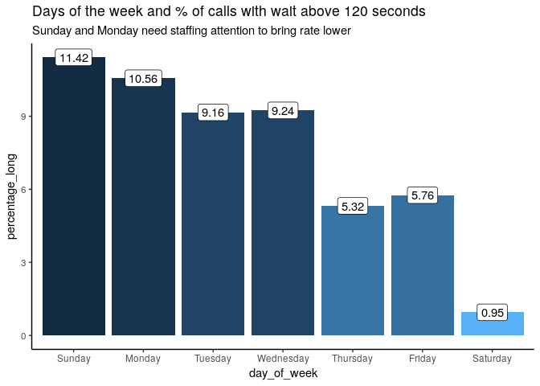

da420\_homework4
================
Jason Grahn
1/26/2019

Problem 1: Short Answers
========================

Suppose you are the bank manager and your service goal is to realize wait times of 60 seconds of less , with wait times in excess of 120 seconds being considered intolerable. Based on Figure 6.1 through 6.6 (Call Center Operations for Monday, Tuesday, Wednesday, Thursday, Friday, and Sunday) in page 69 – 71:

For each day, give an approximated percentage of the ribbons fall above the 120 seconds line.
---------------------------------------------------------------------------------------------

The percentage of calls about 120 seconds per day are:

| day\_of\_week |  % over 120|
|:--------------|-----------:|
| Sunday        |       11.42|
| Monday        |       10.56|
| Tuesday       |        9.16|
| Wednesday     |        9.24|
| Thursday      |        5.32|
| Friday        |        5.76|
| Saturday      |        0.95|

What kind of actions would you take? Please be as specific as possible.
-----------------------------------------------------------------------

Given this information, I'd first defer back to the business on what they deem an "acceptable" percentage of calls that go over 120 seconds. In my experience working with call centers, generally anything lower than 10% is an acceptable rate. If the business rules align with my previous experience, staffing efforts should focus on Sunday and Monday. Considering the other days that are borderline (Tuesday and Wednesday), I would also invest in researching technology solutions that can assist the agents with resolving their calls quicker. Additionally, I'd investgate if changes to the interactive voice response (IVR) could help customers resolve issues on their own. Perhaps we can automate answers to common questions?

All of these things involve additional measurements. For every one of those changes we'd want to track it to progress.

Problem 2: Short Answers
========================

In page 75 of the textbook (Chapter 6), the author mentioned “optimal solution”. Use your own words to answer the following questions, be sure to explain in details.

### What is the optimal solution?

We aren't provided what *the* optimal solution is for this particular call center situation. *An* optimal solution is simply the concept of one solution that operates better than all others. In this case the optimal solution involves testing each of the methods proposed to the call center through simulations. These simulations involve altering the input variables and feeding all the output back into solution analysis.

### How to find the optimal solutions?

In some other script or analysis, they've determined the poisson distribution for the center. They'll apply that poisson distribution to the current call center performance model through an elaborate model application technique. They'll run through these tests multiple times and evaluate the output to determine if the new solutions make satisfactory improvement.
