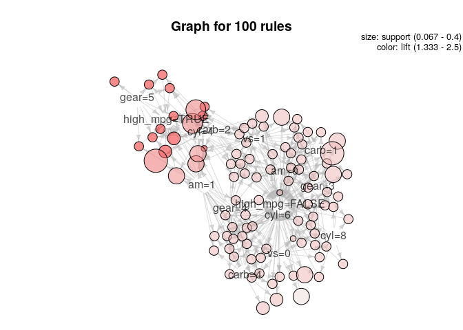

code\_for\_discussion3
================
Jason Grahn
1/21/2019

The instructor has us blindly running the code from <https://blog.revolutionanalytics.com/2015/04/association-rules-and-market-basket-analysis-with-r.html> witout any sort of explanation.

So, I'm running it. But this is a better resource: <http://www.rdatamining.com/examples/association-rules>

going to try running it on mtcars,

Have to load `MTcars` and make get the factor columns
-----------------------------------------------------

``` r
#load out mtcars and make factors
mt.mute <- mtcars %>% 
  mutate(high_mpg = if_else(mpg >= 25, TRUE, FALSE)) %>% 
  arrange(desc(high_mpg)) %>% 
  select(cyl,vs:high_mpg) %>% 
  mutate(cyl = as.factor(cyl),
         vs = as.factor(vs),
         am = as.factor(am),
         gear = as.factor(gear),
         carb = as.factor(carb),
         high_mpg = as.factor(high_mpg))

#and let's just pare down the dataset so we dont get SO MANY rules? 
mt.mute <- head(mt.mute,15)
idx <- sample(1:nrow(mt.mute), 5)

mt.mute[idx, ]
```

    ##    cyl vs am gear carb high_mpg
    ## 10   6  1  0    3    1    FALSE
    ## 12   6  1  0    3    1    FALSE
    ## 9    4  1  1    4    1    FALSE
    ## 3    4  1  1    4    1     TRUE
    ## 15   4  1  0    4    2    FALSE

``` r
summary(mt.mute)
```

    ##  cyl   vs     am    gear  carb   high_mpg
    ##  4:9   0: 5   0:6   3:4   1:6   FALSE:9  
    ##  6:4   1:10   1:9   4:9   2:6   TRUE :6  
    ##  8:2                5:2   3:0            
    ##                           4:3            
    ##                           6:0            
    ##                           8:0

Here's where we load `arules` to find those association rules
-------------------------------------------------------------

``` r
 library(arules)
```

    ## Loading required package: Matrix

    ## 
    ## Attaching package: 'Matrix'

    ## The following object is masked from 'package:tidyr':
    ## 
    ##     expand

    ## 
    ## Attaching package: 'arules'

    ## The following object is masked from 'package:dplyr':
    ## 
    ##     recode

    ## The following objects are masked from 'package:base':
    ## 
    ##     abbreviate, write

``` r
 # find association rules with default settings
rules <- apriori(mt.mute)
```

    ## Apriori
    ## 
    ## Parameter specification:
    ##  confidence minval smax arem  aval originalSupport maxtime support minlen
    ##         0.8    0.1    1 none FALSE            TRUE       5     0.1      1
    ##  maxlen target   ext
    ##      10  rules FALSE
    ## 
    ## Algorithmic control:
    ##  filter tree heap memopt load sort verbose
    ##     0.1 TRUE TRUE  FALSE TRUE    2    TRUE
    ## 
    ## Absolute minimum support count: 1 
    ## 
    ## set item appearances ...[0 item(s)] done [0.00s].
    ## set transactions ...[15 item(s), 15 transaction(s)] done [0.00s].
    ## sorting and recoding items ... [15 item(s)] done [0.00s].
    ## creating transaction tree ... done [0.00s].
    ## checking subsets of size 1 2 3 4 5 6 done [0.00s].
    ## writing ... [532 rule(s)] done [0.00s].
    ## creating S4 object  ... done [0.00s].

``` r
inspect(rules)
```

    ##       lhs                                          rhs             
    ## [1]   {gear=5}                                  => {high_mpg=TRUE} 
    ## [2]   {gear=5}                                  => {carb=2}        
    ## [3]   {gear=5}                                  => {am=1}          
    ## [4]   {gear=5}                                  => {cyl=4}         
    ## [5]   {cyl=8}                                   => {gear=3}        
    ## [6]   {cyl=8}                                   => {vs=0}          
    ## [7]   {cyl=8}                                   => {am=0}          
    ## [8]   {cyl=8}                                   => {high_mpg=FALSE}
    ## [9]   {carb=4}                                  => {vs=0}          
    ## [10]  {carb=4}                                  => {high_mpg=FALSE}
    ## [11]  {cyl=6}                                   => {high_mpg=FALSE}
    ## [12]  {gear=3}                                  => {am=0}          
    ## [13]  {gear=3}                                  => {high_mpg=FALSE}
    ## [14]  {vs=0}                                    => {high_mpg=FALSE}
    ## [15]  {carb=1}                                  => {vs=1}          
    ## [16]  {high_mpg=TRUE}                           => {am=1}          
    ## [17]  {high_mpg=TRUE}                           => {cyl=4}         
    ## [18]  {high_mpg=TRUE}                           => {vs=1}          
    ## [19]  {carb=2}                                  => {cyl=4}         
    ## [20]  {am=0}                                    => {high_mpg=FALSE}
    ## [21]  {cyl=4}                                   => {vs=1}          
    ## [22]  {vs=1}                                    => {cyl=4}         
    ## [23]  {gear=5,high_mpg=TRUE}                    => {carb=2}        
    ## [24]  {gear=5,carb=2}                           => {high_mpg=TRUE} 
    ## [25]  {gear=5,high_mpg=TRUE}                    => {am=1}          
    ## [26]  {am=1,gear=5}                             => {high_mpg=TRUE} 
    ## [27]  {gear=5,high_mpg=TRUE}                    => {cyl=4}         
    ## [28]  {cyl=4,gear=5}                            => {high_mpg=TRUE} 
    ## [29]  {gear=5,carb=2}                           => {am=1}          
    ## [30]  {am=1,gear=5}                             => {carb=2}        
    ## [31]  {gear=5,carb=2}                           => {cyl=4}         
    ## [32]  {cyl=4,gear=5}                            => {carb=2}        
    ## [33]  {am=1,gear=5}                             => {cyl=4}         
    ## [34]  {cyl=4,gear=5}                            => {am=1}          
    ## [35]  {cyl=8,gear=3}                            => {vs=0}          
    ## [36]  {cyl=8,vs=0}                              => {gear=3}        
    ## [37]  {vs=0,gear=3}                             => {cyl=8}         
    ## [38]  {cyl=8,gear=3}                            => {am=0}          
    ## [39]  {cyl=8,am=0}                              => {gear=3}        
    ## [40]  {cyl=8,gear=3}                            => {high_mpg=FALSE}
    ## [41]  {cyl=8,high_mpg=FALSE}                    => {gear=3}        
    ## [42]  {cyl=8,vs=0}                              => {am=0}          
    ## [43]  {cyl=8,am=0}                              => {vs=0}          
    ## [44]  {vs=0,am=0}                               => {cyl=8}         
    ## [45]  {cyl=8,vs=0}                              => {high_mpg=FALSE}
    ## [46]  {cyl=8,high_mpg=FALSE}                    => {vs=0}          
    ## [47]  {cyl=8,am=0}                              => {high_mpg=FALSE}
    ## [48]  {cyl=8,high_mpg=FALSE}                    => {am=0}          
    ## [49]  {cyl=6,carb=4}                            => {vs=0}          
    ## [50]  {cyl=6,vs=0}                              => {carb=4}        
    ## [51]  {cyl=6,carb=4}                            => {am=1}          
    ## [52]  {am=1,carb=4}                             => {cyl=6}         
    ## [53]  {cyl=6,am=1}                              => {carb=4}        
    ## [54]  {cyl=6,carb=4}                            => {gear=4}        
    ## [55]  {gear=4,carb=4}                           => {cyl=6}         
    ## [56]  {cyl=6,gear=4}                            => {carb=4}        
    ## [57]  {cyl=6,carb=4}                            => {high_mpg=FALSE}
    ## [58]  {am=1,carb=4}                             => {vs=0}          
    ## [59]  {gear=4,carb=4}                           => {vs=0}          
    ## [60]  {vs=0,gear=4}                             => {carb=4}        
    ## [61]  {vs=0,carb=4}                             => {high_mpg=FALSE}
    ## [62]  {carb=4,high_mpg=FALSE}                   => {vs=0}          
    ## [63]  {am=1,carb=4}                             => {gear=4}        
    ## [64]  {gear=4,carb=4}                           => {am=1}          
    ## [65]  {am=1,carb=4}                             => {high_mpg=FALSE}
    ## [66]  {gear=4,carb=4}                           => {high_mpg=FALSE}
    ## [67]  {cyl=6,gear=3}                            => {carb=1}        
    ## [68]  {cyl=6,carb=1}                            => {gear=3}        
    ## [69]  {gear=3,carb=1}                           => {cyl=6}         
    ## [70]  {cyl=6,gear=3}                            => {am=0}          
    ## [71]  {cyl=6,am=0}                              => {gear=3}        
    ## [72]  {cyl=6,gear=3}                            => {high_mpg=FALSE}
    ## [73]  {cyl=6,gear=3}                            => {vs=1}          
    ## [74]  {cyl=6,vs=1}                              => {gear=3}        
    ## [75]  {vs=1,gear=3}                             => {cyl=6}         
    ## [76]  {cyl=6,vs=0}                              => {am=1}          
    ## [77]  {cyl=6,am=1}                              => {vs=0}          
    ## [78]  {cyl=6,vs=0}                              => {gear=4}        
    ## [79]  {cyl=6,gear=4}                            => {vs=0}          
    ## [80]  {vs=0,gear=4}                             => {cyl=6}         
    ## [81]  {cyl=6,vs=0}                              => {high_mpg=FALSE}
    ## [82]  {cyl=6,carb=1}                            => {am=0}          
    ## [83]  {cyl=6,am=0}                              => {carb=1}        
    ## [84]  {am=0,carb=1}                             => {cyl=6}         
    ## [85]  {cyl=6,carb=1}                            => {high_mpg=FALSE}
    ## [86]  {cyl=6,carb=1}                            => {vs=1}          
    ## [87]  {cyl=6,vs=1}                              => {carb=1}        
    ## [88]  {cyl=6,am=0}                              => {high_mpg=FALSE}
    ## [89]  {cyl=6,am=0}                              => {vs=1}          
    ## [90]  {cyl=6,vs=1}                              => {am=0}          
    ## [91]  {cyl=6,am=1}                              => {gear=4}        
    ## [92]  {cyl=6,gear=4}                            => {am=1}          
    ## [93]  {cyl=6,am=1}                              => {high_mpg=FALSE}
    ## [94]  {cyl=6,gear=4}                            => {high_mpg=FALSE}
    ## [95]  {cyl=6,vs=1}                              => {high_mpg=FALSE}
    ## [96]  {vs=0,gear=3}                             => {am=0}          
    ## [97]  {vs=0,am=0}                               => {gear=3}        
    ## [98]  {vs=0,gear=3}                             => {high_mpg=FALSE}
    ## [99]  {gear=3,carb=1}                           => {am=0}          
    ## [100] {am=0,carb=1}                             => {gear=3}        
    ## [101] {gear=3,carb=1}                           => {high_mpg=FALSE}
    ## [102] {gear=3,carb=1}                           => {vs=1}          
    ## [103] {vs=1,gear=3}                             => {carb=1}        
    ## [104] {am=0,gear=3}                             => {high_mpg=FALSE}
    ## [105] {gear=3,high_mpg=FALSE}                   => {am=0}          
    ## [106] {vs=1,gear=3}                             => {am=0}          
    ## [107] {vs=1,gear=3}                             => {high_mpg=FALSE}
    ## [108] {vs=0,am=0}                               => {high_mpg=FALSE}
    ## [109] {vs=0,gear=4}                             => {am=1}          
    ## [110] {vs=0,gear=4}                             => {high_mpg=FALSE}
    ## [111] {carb=1,high_mpg=TRUE}                    => {am=1}          
    ## [112] {carb=1,high_mpg=TRUE}                    => {gear=4}        
    ## [113] {carb=1,high_mpg=TRUE}                    => {cyl=4}         
    ## [114] {carb=1,high_mpg=TRUE}                    => {vs=1}          
    ## [115] {am=0,carb=1}                             => {high_mpg=FALSE}
    ## [116] {am=0,carb=1}                             => {vs=1}          
    ## [117] {am=1,carb=1}                             => {gear=4}        
    ## [118] {gear=4,carb=1}                           => {am=1}          
    ## [119] {am=1,carb=1}                             => {cyl=4}         
    ## [120] {cyl=4,carb=1}                            => {am=1}          
    ## [121] {am=1,carb=1}                             => {vs=1}          
    ## [122] {gear=4,carb=1}                           => {cyl=4}         
    ## [123] {cyl=4,carb=1}                            => {gear=4}        
    ## [124] {gear=4,carb=1}                           => {vs=1}          
    ## [125] {cyl=4,carb=1}                            => {vs=1}          
    ## [126] {carb=1,high_mpg=FALSE}                   => {vs=1}          
    ## [127] {carb=2,high_mpg=TRUE}                    => {am=1}          
    ## [128] {am=1,carb=2}                             => {high_mpg=TRUE} 
    ## [129] {carb=2,high_mpg=TRUE}                    => {cyl=4}         
    ## [130] {gear=4,high_mpg=TRUE}                    => {am=1}          
    ## [131] {am=1,high_mpg=TRUE}                      => {cyl=4}         
    ## [132] {cyl=4,high_mpg=TRUE}                     => {am=1}          
    ## [133] {cyl=4,am=1}                              => {high_mpg=TRUE} 
    ## [134] {am=1,high_mpg=TRUE}                      => {vs=1}          
    ## [135] {vs=1,high_mpg=TRUE}                      => {am=1}          
    ## [136] {vs=1,am=1}                               => {high_mpg=TRUE} 
    ## [137] {gear=4,high_mpg=TRUE}                    => {cyl=4}         
    ## [138] {gear=4,high_mpg=TRUE}                    => {vs=1}          
    ## [139] {vs=1,high_mpg=TRUE}                      => {gear=4}        
    ## [140] {cyl=4,high_mpg=TRUE}                     => {vs=1}          
    ## [141] {vs=1,high_mpg=TRUE}                      => {cyl=4}         
    ## [142] {am=0,gear=4}                             => {carb=2}        
    ## [143] {cyl=4,am=0}                              => {carb=2}        
    ## [144] {am=0,carb=2}                             => {high_mpg=FALSE}
    ## [145] {carb=2,high_mpg=FALSE}                   => {am=0}          
    ## [146] {am=1,carb=2}                             => {cyl=4}         
    ## [147] {gear=4,carb=2}                           => {cyl=4}         
    ## [148] {gear=4,carb=2}                           => {vs=1}          
    ## [149] {cyl=4,carb=2}                            => {vs=1}          
    ## [150] {vs=1,carb=2}                             => {cyl=4}         
    ## [151] {am=0,gear=4}                             => {cyl=4}         
    ## [152] {cyl=4,am=0}                              => {gear=4}        
    ## [153] {am=0,gear=4}                             => {high_mpg=FALSE}
    ## [154] {am=0,gear=4}                             => {vs=1}          
    ## [155] {cyl=4,am=0}                              => {high_mpg=FALSE}
    ## [156] {cyl=4,am=0}                              => {vs=1}          
    ## [157] {vs=1,am=0}                               => {high_mpg=FALSE}
    ## [158] {vs=1,high_mpg=FALSE}                     => {am=0}          
    ## [159] {am=1,high_mpg=FALSE}                     => {gear=4}        
    ## [160] {vs=1,am=1}                               => {gear=4}        
    ## [161] {cyl=4,am=1}                              => {vs=1}          
    ## [162] {vs=1,am=1}                               => {cyl=4}         
    ## [163] {cyl=4,high_mpg=FALSE}                    => {gear=4}        
    ## [164] {cyl=4,gear=4}                            => {vs=1}          
    ## [165] {vs=1,gear=4}                             => {cyl=4}         
    ## [166] {cyl=4,vs=1}                              => {gear=4}        
    ## [167] {cyl=4,high_mpg=FALSE}                    => {vs=1}          
    ## [168] {gear=5,carb=2,high_mpg=TRUE}             => {am=1}          
    ## [169] {am=1,gear=5,high_mpg=TRUE}               => {carb=2}        
    ## [170] {am=1,gear=5,carb=2}                      => {high_mpg=TRUE} 
    ## [171] {gear=5,carb=2,high_mpg=TRUE}             => {cyl=4}         
    ## [172] {cyl=4,gear=5,high_mpg=TRUE}              => {carb=2}        
    ## [173] {cyl=4,gear=5,carb=2}                     => {high_mpg=TRUE} 
    ## [174] {am=1,gear=5,high_mpg=TRUE}               => {cyl=4}         
    ## [175] {cyl=4,gear=5,high_mpg=TRUE}              => {am=1}          
    ## [176] {cyl=4,am=1,gear=5}                       => {high_mpg=TRUE} 
    ## [177] {am=1,gear=5,carb=2}                      => {cyl=4}         
    ## [178] {cyl=4,gear=5,carb=2}                     => {am=1}          
    ## [179] {cyl=4,am=1,gear=5}                       => {carb=2}        
    ## [180] {cyl=8,vs=0,gear=3}                       => {am=0}          
    ## [181] {cyl=8,am=0,gear=3}                       => {vs=0}          
    ## [182] {cyl=8,vs=0,am=0}                         => {gear=3}        
    ## [183] {vs=0,am=0,gear=3}                        => {cyl=8}         
    ## [184] {cyl=8,vs=0,gear=3}                       => {high_mpg=FALSE}
    ## [185] {cyl=8,gear=3,high_mpg=FALSE}             => {vs=0}          
    ## [186] {cyl=8,vs=0,high_mpg=FALSE}               => {gear=3}        
    ## [187] {vs=0,gear=3,high_mpg=FALSE}              => {cyl=8}         
    ## [188] {cyl=8,am=0,gear=3}                       => {high_mpg=FALSE}
    ## [189] {cyl=8,gear=3,high_mpg=FALSE}             => {am=0}          
    ## [190] {cyl=8,am=0,high_mpg=FALSE}               => {gear=3}        
    ## [191] {cyl=8,vs=0,am=0}                         => {high_mpg=FALSE}
    ## [192] {cyl=8,vs=0,high_mpg=FALSE}               => {am=0}          
    ## [193] {cyl=8,am=0,high_mpg=FALSE}               => {vs=0}          
    ## [194] {vs=0,am=0,high_mpg=FALSE}                => {cyl=8}         
    ## [195] {cyl=6,vs=0,carb=4}                       => {am=1}          
    ## [196] {cyl=6,am=1,carb=4}                       => {vs=0}          
    ## [197] {vs=0,am=1,carb=4}                        => {cyl=6}         
    ## [198] {cyl=6,vs=0,am=1}                         => {carb=4}        
    ## [199] {cyl=6,vs=0,carb=4}                       => {gear=4}        
    ## [200] {cyl=6,gear=4,carb=4}                     => {vs=0}          
    ## [201] {vs=0,gear=4,carb=4}                      => {cyl=6}         
    ## [202] {cyl=6,vs=0,gear=4}                       => {carb=4}        
    ## [203] {cyl=6,vs=0,carb=4}                       => {high_mpg=FALSE}
    ## [204] {cyl=6,carb=4,high_mpg=FALSE}             => {vs=0}          
    ## [205] {cyl=6,vs=0,high_mpg=FALSE}               => {carb=4}        
    ## [206] {cyl=6,am=1,carb=4}                       => {gear=4}        
    ## [207] {cyl=6,gear=4,carb=4}                     => {am=1}          
    ## [208] {am=1,gear=4,carb=4}                      => {cyl=6}         
    ## [209] {cyl=6,am=1,gear=4}                       => {carb=4}        
    ## [210] {cyl=6,am=1,carb=4}                       => {high_mpg=FALSE}
    ## [211] {cyl=6,carb=4,high_mpg=FALSE}             => {am=1}          
    ## [212] {am=1,carb=4,high_mpg=FALSE}              => {cyl=6}         
    ## [213] {cyl=6,am=1,high_mpg=FALSE}               => {carb=4}        
    ## [214] {cyl=6,gear=4,carb=4}                     => {high_mpg=FALSE}
    ## [215] {cyl=6,carb=4,high_mpg=FALSE}             => {gear=4}        
    ## [216] {gear=4,carb=4,high_mpg=FALSE}            => {cyl=6}         
    ## [217] {cyl=6,gear=4,high_mpg=FALSE}             => {carb=4}        
    ## [218] {vs=0,am=1,carb=4}                        => {gear=4}        
    ## [219] {vs=0,gear=4,carb=4}                      => {am=1}          
    ## [220] {am=1,gear=4,carb=4}                      => {vs=0}          
    ## [221] {vs=0,am=1,gear=4}                        => {carb=4}        
    ## [222] {vs=0,am=1,carb=4}                        => {high_mpg=FALSE}
    ## [223] {am=1,carb=4,high_mpg=FALSE}              => {vs=0}          
    ## [224] {vs=0,am=1,high_mpg=FALSE}                => {carb=4}        
    ## [225] {vs=0,gear=4,carb=4}                      => {high_mpg=FALSE}
    ## [226] {gear=4,carb=4,high_mpg=FALSE}            => {vs=0}          
    ## [227] {vs=0,gear=4,high_mpg=FALSE}              => {carb=4}        
    ## [228] {am=1,gear=4,carb=4}                      => {high_mpg=FALSE}
    ## [229] {am=1,carb=4,high_mpg=FALSE}              => {gear=4}        
    ## [230] {gear=4,carb=4,high_mpg=FALSE}            => {am=1}          
    ## [231] {cyl=6,gear=3,carb=1}                     => {am=0}          
    ## [232] {cyl=6,am=0,gear=3}                       => {carb=1}        
    ## [233] {cyl=6,am=0,carb=1}                       => {gear=3}        
    ## [234] {am=0,gear=3,carb=1}                      => {cyl=6}         
    ## [235] {cyl=6,gear=3,carb=1}                     => {high_mpg=FALSE}
    ## [236] {cyl=6,gear=3,high_mpg=FALSE}             => {carb=1}        
    ## [237] {cyl=6,carb=1,high_mpg=FALSE}             => {gear=3}        
    ## [238] {gear=3,carb=1,high_mpg=FALSE}            => {cyl=6}         
    ## [239] {cyl=6,gear=3,carb=1}                     => {vs=1}          
    ## [240] {cyl=6,vs=1,gear=3}                       => {carb=1}        
    ## [241] {cyl=6,vs=1,carb=1}                       => {gear=3}        
    ## [242] {vs=1,gear=3,carb=1}                      => {cyl=6}         
    ## [243] {cyl=6,am=0,gear=3}                       => {high_mpg=FALSE}
    ## [244] {cyl=6,gear=3,high_mpg=FALSE}             => {am=0}          
    ## [245] {cyl=6,am=0,high_mpg=FALSE}               => {gear=3}        
    ## [246] {cyl=6,am=0,gear=3}                       => {vs=1}          
    ## [247] {cyl=6,vs=1,gear=3}                       => {am=0}          
    ## [248] {cyl=6,vs=1,am=0}                         => {gear=3}        
    ## [249] {vs=1,am=0,gear=3}                        => {cyl=6}         
    ## [250] {cyl=6,gear=3,high_mpg=FALSE}             => {vs=1}          
    ## [251] {cyl=6,vs=1,gear=3}                       => {high_mpg=FALSE}
    ## [252] {cyl=6,vs=1,high_mpg=FALSE}               => {gear=3}        
    ## [253] {vs=1,gear=3,high_mpg=FALSE}              => {cyl=6}         
    ## [254] {cyl=6,vs=0,am=1}                         => {gear=4}        
    ## [255] {cyl=6,vs=0,gear=4}                       => {am=1}          
    ## [256] {cyl=6,am=1,gear=4}                       => {vs=0}          
    ## [257] {vs=0,am=1,gear=4}                        => {cyl=6}         
    ## [258] {cyl=6,vs=0,am=1}                         => {high_mpg=FALSE}
    ## [259] {cyl=6,vs=0,high_mpg=FALSE}               => {am=1}          
    ## [260] {cyl=6,am=1,high_mpg=FALSE}               => {vs=0}          
    ## [261] {vs=0,am=1,high_mpg=FALSE}                => {cyl=6}         
    ## [262] {cyl=6,vs=0,gear=4}                       => {high_mpg=FALSE}
    ## [263] {cyl=6,vs=0,high_mpg=FALSE}               => {gear=4}        
    ## [264] {cyl=6,gear=4,high_mpg=FALSE}             => {vs=0}          
    ## [265] {vs=0,gear=4,high_mpg=FALSE}              => {cyl=6}         
    ## [266] {cyl=6,am=0,carb=1}                       => {high_mpg=FALSE}
    ## [267] {cyl=6,carb=1,high_mpg=FALSE}             => {am=0}          
    ## [268] {cyl=6,am=0,high_mpg=FALSE}               => {carb=1}        
    ## [269] {am=0,carb=1,high_mpg=FALSE}              => {cyl=6}         
    ## [270] {cyl=6,am=0,carb=1}                       => {vs=1}          
    ## [271] {cyl=6,vs=1,carb=1}                       => {am=0}          
    ## [272] {cyl=6,vs=1,am=0}                         => {carb=1}        
    ## [273] {vs=1,am=0,carb=1}                        => {cyl=6}         
    ## [274] {cyl=6,carb=1,high_mpg=FALSE}             => {vs=1}          
    ## [275] {cyl=6,vs=1,carb=1}                       => {high_mpg=FALSE}
    ## [276] {cyl=6,vs=1,high_mpg=FALSE}               => {carb=1}        
    ## [277] {cyl=6,am=0,high_mpg=FALSE}               => {vs=1}          
    ## [278] {cyl=6,vs=1,am=0}                         => {high_mpg=FALSE}
    ## [279] {cyl=6,vs=1,high_mpg=FALSE}               => {am=0}          
    ## [280] {cyl=6,am=1,gear=4}                       => {high_mpg=FALSE}
    ## [281] {cyl=6,am=1,high_mpg=FALSE}               => {gear=4}        
    ## [282] {cyl=6,gear=4,high_mpg=FALSE}             => {am=1}          
    ## [283] {vs=0,am=0,gear=3}                        => {high_mpg=FALSE}
    ## [284] {vs=0,gear=3,high_mpg=FALSE}              => {am=0}          
    ## [285] {vs=0,am=0,high_mpg=FALSE}                => {gear=3}        
    ## [286] {am=0,gear=3,carb=1}                      => {high_mpg=FALSE}
    ## [287] {gear=3,carb=1,high_mpg=FALSE}            => {am=0}          
    ## [288] {am=0,carb=1,high_mpg=FALSE}              => {gear=3}        
    ## [289] {am=0,gear=3,carb=1}                      => {vs=1}          
    ## [290] {vs=1,gear=3,carb=1}                      => {am=0}          
    ## [291] {vs=1,am=0,gear=3}                        => {carb=1}        
    ## [292] {vs=1,am=0,carb=1}                        => {gear=3}        
    ## [293] {gear=3,carb=1,high_mpg=FALSE}            => {vs=1}          
    ## [294] {vs=1,gear=3,carb=1}                      => {high_mpg=FALSE}
    ## [295] {vs=1,gear=3,high_mpg=FALSE}              => {carb=1}        
    ## [296] {vs=1,am=0,gear=3}                        => {high_mpg=FALSE}
    ## [297] {vs=1,gear=3,high_mpg=FALSE}              => {am=0}          
    ## [298] {vs=0,am=1,gear=4}                        => {high_mpg=FALSE}
    ## [299] {vs=0,am=1,high_mpg=FALSE}                => {gear=4}        
    ## [300] {vs=0,gear=4,high_mpg=FALSE}              => {am=1}          
    ## [301] {am=1,carb=1,high_mpg=TRUE}               => {gear=4}        
    ## [302] {gear=4,carb=1,high_mpg=TRUE}             => {am=1}          
    ## [303] {am=1,carb=1,high_mpg=TRUE}               => {cyl=4}         
    ## [304] {cyl=4,carb=1,high_mpg=TRUE}              => {am=1}          
    ## [305] {am=1,carb=1,high_mpg=TRUE}               => {vs=1}          
    ## [306] {vs=1,carb=1,high_mpg=TRUE}               => {am=1}          
    ## [307] {gear=4,carb=1,high_mpg=TRUE}             => {cyl=4}         
    ## [308] {cyl=4,carb=1,high_mpg=TRUE}              => {gear=4}        
    ## [309] {gear=4,carb=1,high_mpg=TRUE}             => {vs=1}          
    ## [310] {vs=1,carb=1,high_mpg=TRUE}               => {gear=4}        
    ## [311] {cyl=4,carb=1,high_mpg=TRUE}              => {vs=1}          
    ## [312] {vs=1,carb=1,high_mpg=TRUE}               => {cyl=4}         
    ## [313] {am=0,carb=1,high_mpg=FALSE}              => {vs=1}          
    ## [314] {vs=1,am=0,carb=1}                        => {high_mpg=FALSE}
    ## [315] {am=1,gear=4,carb=1}                      => {cyl=4}         
    ## [316] {cyl=4,am=1,carb=1}                       => {gear=4}        
    ## [317] {cyl=4,gear=4,carb=1}                     => {am=1}          
    ## [318] {cyl=4,am=1,gear=4}                       => {carb=1}        
    ## [319] {am=1,gear=4,carb=1}                      => {vs=1}          
    ## [320] {vs=1,am=1,carb=1}                        => {gear=4}        
    ## [321] {vs=1,gear=4,carb=1}                      => {am=1}          
    ## [322] {vs=1,am=1,gear=4}                        => {carb=1}        
    ## [323] {cyl=4,am=1,carb=1}                       => {vs=1}          
    ## [324] {vs=1,am=1,carb=1}                        => {cyl=4}         
    ## [325] {cyl=4,vs=1,carb=1}                       => {am=1}          
    ## [326] {cyl=4,gear=4,carb=1}                     => {vs=1}          
    ## [327] {vs=1,gear=4,carb=1}                      => {cyl=4}         
    ## [328] {cyl=4,vs=1,carb=1}                       => {gear=4}        
    ## [329] {am=1,carb=2,high_mpg=TRUE}               => {cyl=4}         
    ## [330] {cyl=4,carb=2,high_mpg=TRUE}              => {am=1}          
    ## [331] {cyl=4,am=1,carb=2}                       => {high_mpg=TRUE} 
    ## [332] {vs=1,carb=2,high_mpg=TRUE}               => {am=1}          
    ## [333] {vs=1,am=1,carb=2}                        => {high_mpg=TRUE} 
    ## [334] {vs=1,carb=2,high_mpg=TRUE}               => {cyl=4}         
    ## [335] {am=1,gear=4,high_mpg=TRUE}               => {cyl=4}         
    ## [336] {cyl=4,gear=4,high_mpg=TRUE}              => {am=1}          
    ## [337] {cyl=4,am=1,gear=4}                       => {high_mpg=TRUE} 
    ## [338] {am=1,gear=4,high_mpg=TRUE}               => {vs=1}          
    ## [339] {vs=1,am=1,high_mpg=TRUE}                 => {gear=4}        
    ## [340] {vs=1,gear=4,high_mpg=TRUE}               => {am=1}          
    ## [341] {vs=1,am=1,gear=4}                        => {high_mpg=TRUE} 
    ## [342] {cyl=4,am=1,high_mpg=TRUE}                => {vs=1}          
    ## [343] {vs=1,am=1,high_mpg=TRUE}                 => {cyl=4}         
    ## [344] {cyl=4,vs=1,high_mpg=TRUE}                => {am=1}          
    ## [345] {cyl=4,vs=1,am=1}                         => {high_mpg=TRUE} 
    ## [346] {cyl=4,gear=4,high_mpg=TRUE}              => {vs=1}          
    ## [347] {vs=1,gear=4,high_mpg=TRUE}               => {cyl=4}         
    ## [348] {cyl=4,vs=1,high_mpg=TRUE}                => {gear=4}        
    ## [349] {am=0,gear=4,carb=2}                      => {cyl=4}         
    ## [350] {cyl=4,am=0,carb=2}                       => {gear=4}        
    ## [351] {cyl=4,am=0,gear=4}                       => {carb=2}        
    ## [352] {am=0,gear=4,carb=2}                      => {high_mpg=FALSE}
    ## [353] {gear=4,carb=2,high_mpg=FALSE}            => {am=0}          
    ## [354] {am=0,gear=4,high_mpg=FALSE}              => {carb=2}        
    ## [355] {am=0,gear=4,carb=2}                      => {vs=1}          
    ## [356] {vs=1,am=0,carb=2}                        => {gear=4}        
    ## [357] {vs=1,am=0,gear=4}                        => {carb=2}        
    ## [358] {cyl=4,am=0,carb=2}                       => {high_mpg=FALSE}
    ## [359] {cyl=4,carb=2,high_mpg=FALSE}             => {am=0}          
    ## [360] {cyl=4,am=0,high_mpg=FALSE}               => {carb=2}        
    ## [361] {cyl=4,am=0,carb=2}                       => {vs=1}          
    ## [362] {vs=1,am=0,carb=2}                        => {cyl=4}         
    ## [363] {cyl=4,vs=1,am=0}                         => {carb=2}        
    ## [364] {vs=1,am=0,carb=2}                        => {high_mpg=FALSE}
    ## [365] {vs=1,carb=2,high_mpg=FALSE}              => {am=0}          
    ## [366] {vs=1,am=1,carb=2}                        => {cyl=4}         
    ## [367] {gear=4,carb=2,high_mpg=FALSE}            => {cyl=4}         
    ## [368] {cyl=4,carb=2,high_mpg=FALSE}             => {gear=4}        
    ## [369] {cyl=4,gear=4,carb=2}                     => {vs=1}          
    ## [370] {vs=1,gear=4,carb=2}                      => {cyl=4}         
    ## [371] {gear=4,carb=2,high_mpg=FALSE}            => {vs=1}          
    ## [372] {vs=1,carb=2,high_mpg=FALSE}              => {gear=4}        
    ## [373] {cyl=4,carb=2,high_mpg=FALSE}             => {vs=1}          
    ## [374] {vs=1,carb=2,high_mpg=FALSE}              => {cyl=4}         
    ## [375] {cyl=4,am=0,gear=4}                       => {high_mpg=FALSE}
    ## [376] {am=0,gear=4,high_mpg=FALSE}              => {cyl=4}         
    ## [377] {cyl=4,am=0,high_mpg=FALSE}               => {gear=4}        
    ## [378] {cyl=4,am=0,gear=4}                       => {vs=1}          
    ## [379] {vs=1,am=0,gear=4}                        => {cyl=4}         
    ## [380] {cyl=4,vs=1,am=0}                         => {gear=4}        
    ## [381] {am=0,gear=4,high_mpg=FALSE}              => {vs=1}          
    ## [382] {vs=1,am=0,gear=4}                        => {high_mpg=FALSE}
    ## [383] {cyl=4,am=0,high_mpg=FALSE}               => {vs=1}          
    ## [384] {cyl=4,vs=1,am=0}                         => {high_mpg=FALSE}
    ## [385] {cyl=4,am=1,gear=4}                       => {vs=1}          
    ## [386] {vs=1,am=1,gear=4}                        => {cyl=4}         
    ## [387] {cyl=4,vs=1,am=1}                         => {gear=4}        
    ## [388] {cyl=4,gear=4,high_mpg=FALSE}             => {vs=1}          
    ## [389] {vs=1,gear=4,high_mpg=FALSE}              => {cyl=4}         
    ## [390] {cyl=4,vs=1,high_mpg=FALSE}               => {gear=4}        
    ## [391] {am=1,gear=5,carb=2,high_mpg=TRUE}        => {cyl=4}         
    ## [392] {cyl=4,gear=5,carb=2,high_mpg=TRUE}       => {am=1}          
    ## [393] {cyl=4,am=1,gear=5,high_mpg=TRUE}         => {carb=2}        
    ## [394] {cyl=4,am=1,gear=5,carb=2}                => {high_mpg=TRUE} 
    ## [395] {cyl=8,vs=0,am=0,gear=3}                  => {high_mpg=FALSE}
    ## [396] {cyl=8,vs=0,gear=3,high_mpg=FALSE}        => {am=0}          
    ## [397] {cyl=8,am=0,gear=3,high_mpg=FALSE}        => {vs=0}          
    ## [398] {cyl=8,vs=0,am=0,high_mpg=FALSE}          => {gear=3}        
    ## [399] {vs=0,am=0,gear=3,high_mpg=FALSE}         => {cyl=8}         
    ## [400] {cyl=6,vs=0,am=1,carb=4}                  => {gear=4}        
    ## [401] {cyl=6,vs=0,gear=4,carb=4}                => {am=1}          
    ## [402] {cyl=6,am=1,gear=4,carb=4}                => {vs=0}          
    ## [403] {vs=0,am=1,gear=4,carb=4}                 => {cyl=6}         
    ## [404] {cyl=6,vs=0,am=1,gear=4}                  => {carb=4}        
    ## [405] {cyl=6,vs=0,am=1,carb=4}                  => {high_mpg=FALSE}
    ## [406] {cyl=6,vs=0,carb=4,high_mpg=FALSE}        => {am=1}          
    ## [407] {cyl=6,am=1,carb=4,high_mpg=FALSE}        => {vs=0}          
    ## [408] {vs=0,am=1,carb=4,high_mpg=FALSE}         => {cyl=6}         
    ## [409] {cyl=6,vs=0,am=1,high_mpg=FALSE}          => {carb=4}        
    ## [410] {cyl=6,vs=0,gear=4,carb=4}                => {high_mpg=FALSE}
    ## [411] {cyl=6,vs=0,carb=4,high_mpg=FALSE}        => {gear=4}        
    ## [412] {cyl=6,gear=4,carb=4,high_mpg=FALSE}      => {vs=0}          
    ## [413] {vs=0,gear=4,carb=4,high_mpg=FALSE}       => {cyl=6}         
    ## [414] {cyl=6,vs=0,gear=4,high_mpg=FALSE}        => {carb=4}        
    ## [415] {cyl=6,am=1,gear=4,carb=4}                => {high_mpg=FALSE}
    ## [416] {cyl=6,am=1,carb=4,high_mpg=FALSE}        => {gear=4}        
    ## [417] {cyl=6,gear=4,carb=4,high_mpg=FALSE}      => {am=1}          
    ## [418] {am=1,gear=4,carb=4,high_mpg=FALSE}       => {cyl=6}         
    ## [419] {cyl=6,am=1,gear=4,high_mpg=FALSE}        => {carb=4}        
    ## [420] {vs=0,am=1,gear=4,carb=4}                 => {high_mpg=FALSE}
    ## [421] {vs=0,am=1,carb=4,high_mpg=FALSE}         => {gear=4}        
    ## [422] {vs=0,gear=4,carb=4,high_mpg=FALSE}       => {am=1}          
    ## [423] {am=1,gear=4,carb=4,high_mpg=FALSE}       => {vs=0}          
    ## [424] {vs=0,am=1,gear=4,high_mpg=FALSE}         => {carb=4}        
    ## [425] {cyl=6,am=0,gear=3,carb=1}                => {high_mpg=FALSE}
    ## [426] {cyl=6,gear=3,carb=1,high_mpg=FALSE}      => {am=0}          
    ## [427] {cyl=6,am=0,gear=3,high_mpg=FALSE}        => {carb=1}        
    ## [428] {cyl=6,am=0,carb=1,high_mpg=FALSE}        => {gear=3}        
    ## [429] {am=0,gear=3,carb=1,high_mpg=FALSE}       => {cyl=6}         
    ## [430] {cyl=6,am=0,gear=3,carb=1}                => {vs=1}          
    ## [431] {cyl=6,vs=1,gear=3,carb=1}                => {am=0}          
    ## [432] {cyl=6,vs=1,am=0,gear=3}                  => {carb=1}        
    ## [433] {cyl=6,vs=1,am=0,carb=1}                  => {gear=3}        
    ## [434] {vs=1,am=0,gear=3,carb=1}                 => {cyl=6}         
    ## [435] {cyl=6,gear=3,carb=1,high_mpg=FALSE}      => {vs=1}          
    ## [436] {cyl=6,vs=1,gear=3,carb=1}                => {high_mpg=FALSE}
    ## [437] {cyl=6,vs=1,gear=3,high_mpg=FALSE}        => {carb=1}        
    ## [438] {cyl=6,vs=1,carb=1,high_mpg=FALSE}        => {gear=3}        
    ## [439] {vs=1,gear=3,carb=1,high_mpg=FALSE}       => {cyl=6}         
    ## [440] {cyl=6,am=0,gear=3,high_mpg=FALSE}        => {vs=1}          
    ## [441] {cyl=6,vs=1,am=0,gear=3}                  => {high_mpg=FALSE}
    ## [442] {cyl=6,vs=1,gear=3,high_mpg=FALSE}        => {am=0}          
    ## [443] {cyl=6,vs=1,am=0,high_mpg=FALSE}          => {gear=3}        
    ## [444] {vs=1,am=0,gear=3,high_mpg=FALSE}         => {cyl=6}         
    ## [445] {cyl=6,vs=0,am=1,gear=4}                  => {high_mpg=FALSE}
    ## [446] {cyl=6,vs=0,am=1,high_mpg=FALSE}          => {gear=4}        
    ## [447] {cyl=6,vs=0,gear=4,high_mpg=FALSE}        => {am=1}          
    ## [448] {cyl=6,am=1,gear=4,high_mpg=FALSE}        => {vs=0}          
    ## [449] {vs=0,am=1,gear=4,high_mpg=FALSE}         => {cyl=6}         
    ## [450] {cyl=6,am=0,carb=1,high_mpg=FALSE}        => {vs=1}          
    ## [451] {cyl=6,vs=1,am=0,carb=1}                  => {high_mpg=FALSE}
    ## [452] {cyl=6,vs=1,carb=1,high_mpg=FALSE}        => {am=0}          
    ## [453] {cyl=6,vs=1,am=0,high_mpg=FALSE}          => {carb=1}        
    ## [454] {vs=1,am=0,carb=1,high_mpg=FALSE}         => {cyl=6}         
    ## [455] {am=0,gear=3,carb=1,high_mpg=FALSE}       => {vs=1}          
    ## [456] {vs=1,am=0,gear=3,carb=1}                 => {high_mpg=FALSE}
    ## [457] {vs=1,gear=3,carb=1,high_mpg=FALSE}       => {am=0}          
    ## [458] {vs=1,am=0,gear=3,high_mpg=FALSE}         => {carb=1}        
    ## [459] {vs=1,am=0,carb=1,high_mpg=FALSE}         => {gear=3}        
    ## [460] {am=1,gear=4,carb=1,high_mpg=TRUE}        => {cyl=4}         
    ## [461] {cyl=4,am=1,carb=1,high_mpg=TRUE}         => {gear=4}        
    ## [462] {cyl=4,gear=4,carb=1,high_mpg=TRUE}       => {am=1}          
    ## [463] {am=1,gear=4,carb=1,high_mpg=TRUE}        => {vs=1}          
    ## [464] {vs=1,am=1,carb=1,high_mpg=TRUE}          => {gear=4}        
    ## [465] {vs=1,gear=4,carb=1,high_mpg=TRUE}        => {am=1}          
    ## [466] {cyl=4,am=1,carb=1,high_mpg=TRUE}         => {vs=1}          
    ## [467] {vs=1,am=1,carb=1,high_mpg=TRUE}          => {cyl=4}         
    ## [468] {cyl=4,vs=1,carb=1,high_mpg=TRUE}         => {am=1}          
    ## [469] {cyl=4,gear=4,carb=1,high_mpg=TRUE}       => {vs=1}          
    ## [470] {vs=1,gear=4,carb=1,high_mpg=TRUE}        => {cyl=4}         
    ## [471] {cyl=4,vs=1,carb=1,high_mpg=TRUE}         => {gear=4}        
    ## [472] {cyl=4,am=1,gear=4,carb=1}                => {vs=1}          
    ## [473] {vs=1,am=1,gear=4,carb=1}                 => {cyl=4}         
    ## [474] {cyl=4,vs=1,am=1,carb=1}                  => {gear=4}        
    ## [475] {cyl=4,vs=1,gear=4,carb=1}                => {am=1}          
    ## [476] {cyl=4,vs=1,am=1,gear=4}                  => {carb=1}        
    ## [477] {vs=1,am=1,carb=2,high_mpg=TRUE}          => {cyl=4}         
    ## [478] {cyl=4,vs=1,carb=2,high_mpg=TRUE}         => {am=1}          
    ## [479] {cyl=4,vs=1,am=1,carb=2}                  => {high_mpg=TRUE} 
    ## [480] {cyl=4,am=1,gear=4,high_mpg=TRUE}         => {vs=1}          
    ## [481] {vs=1,am=1,gear=4,high_mpg=TRUE}          => {cyl=4}         
    ## [482] {cyl=4,vs=1,am=1,high_mpg=TRUE}           => {gear=4}        
    ## [483] {cyl=4,vs=1,gear=4,high_mpg=TRUE}         => {am=1}          
    ## [484] {cyl=4,vs=1,am=1,gear=4}                  => {high_mpg=TRUE} 
    ## [485] {cyl=4,am=0,gear=4,carb=2}                => {high_mpg=FALSE}
    ## [486] {am=0,gear=4,carb=2,high_mpg=FALSE}       => {cyl=4}         
    ## [487] {cyl=4,am=0,carb=2,high_mpg=FALSE}        => {gear=4}        
    ## [488] {cyl=4,gear=4,carb=2,high_mpg=FALSE}      => {am=0}          
    ## [489] {cyl=4,am=0,gear=4,high_mpg=FALSE}        => {carb=2}        
    ## [490] {cyl=4,am=0,gear=4,carb=2}                => {vs=1}          
    ## [491] {vs=1,am=0,gear=4,carb=2}                 => {cyl=4}         
    ## [492] {cyl=4,vs=1,am=0,carb=2}                  => {gear=4}        
    ## [493] {cyl=4,vs=1,am=0,gear=4}                  => {carb=2}        
    ## [494] {am=0,gear=4,carb=2,high_mpg=FALSE}       => {vs=1}          
    ## [495] {vs=1,am=0,gear=4,carb=2}                 => {high_mpg=FALSE}
    ## [496] {vs=1,am=0,carb=2,high_mpg=FALSE}         => {gear=4}        
    ## [497] {vs=1,gear=4,carb=2,high_mpg=FALSE}       => {am=0}          
    ## [498] {vs=1,am=0,gear=4,high_mpg=FALSE}         => {carb=2}        
    ## [499] {cyl=4,am=0,carb=2,high_mpg=FALSE}        => {vs=1}          
    ## [500] {cyl=4,vs=1,am=0,carb=2}                  => {high_mpg=FALSE}
    ## [501] {vs=1,am=0,carb=2,high_mpg=FALSE}         => {cyl=4}         
    ## [502] {cyl=4,vs=1,carb=2,high_mpg=FALSE}        => {am=0}          
    ## [503] {cyl=4,vs=1,am=0,high_mpg=FALSE}          => {carb=2}        
    ## [504] {cyl=4,gear=4,carb=2,high_mpg=FALSE}      => {vs=1}          
    ## [505] {vs=1,gear=4,carb=2,high_mpg=FALSE}       => {cyl=4}         
    ## [506] {cyl=4,vs=1,carb=2,high_mpg=FALSE}        => {gear=4}        
    ## [507] {cyl=4,am=0,gear=4,high_mpg=FALSE}        => {vs=1}          
    ## [508] {cyl=4,vs=1,am=0,gear=4}                  => {high_mpg=FALSE}
    ## [509] {vs=1,am=0,gear=4,high_mpg=FALSE}         => {cyl=4}         
    ## [510] {cyl=4,vs=1,am=0,high_mpg=FALSE}          => {gear=4}        
    ## [511] {cyl=6,vs=0,am=1,gear=4,carb=4}           => {high_mpg=FALSE}
    ## [512] {cyl=6,vs=0,am=1,carb=4,high_mpg=FALSE}   => {gear=4}        
    ## [513] {cyl=6,vs=0,gear=4,carb=4,high_mpg=FALSE} => {am=1}          
    ## [514] {cyl=6,am=1,gear=4,carb=4,high_mpg=FALSE} => {vs=0}          
    ## [515] {vs=0,am=1,gear=4,carb=4,high_mpg=FALSE}  => {cyl=6}         
    ## [516] {cyl=6,vs=0,am=1,gear=4,high_mpg=FALSE}   => {carb=4}        
    ## [517] {cyl=6,am=0,gear=3,carb=1,high_mpg=FALSE} => {vs=1}          
    ## [518] {cyl=6,vs=1,am=0,gear=3,carb=1}           => {high_mpg=FALSE}
    ## [519] {cyl=6,vs=1,gear=3,carb=1,high_mpg=FALSE} => {am=0}          
    ## [520] {cyl=6,vs=1,am=0,gear=3,high_mpg=FALSE}   => {carb=1}        
    ## [521] {cyl=6,vs=1,am=0,carb=1,high_mpg=FALSE}   => {gear=3}        
    ## [522] {vs=1,am=0,gear=3,carb=1,high_mpg=FALSE}  => {cyl=6}         
    ## [523] {cyl=4,am=1,gear=4,carb=1,high_mpg=TRUE}  => {vs=1}          
    ## [524] {vs=1,am=1,gear=4,carb=1,high_mpg=TRUE}   => {cyl=4}         
    ## [525] {cyl=4,vs=1,am=1,carb=1,high_mpg=TRUE}    => {gear=4}        
    ## [526] {cyl=4,vs=1,gear=4,carb=1,high_mpg=TRUE}  => {am=1}          
    ## [527] {cyl=4,am=0,gear=4,carb=2,high_mpg=FALSE} => {vs=1}          
    ## [528] {cyl=4,vs=1,am=0,gear=4,carb=2}           => {high_mpg=FALSE}
    ## [529] {vs=1,am=0,gear=4,carb=2,high_mpg=FALSE}  => {cyl=4}         
    ## [530] {cyl=4,vs=1,am=0,carb=2,high_mpg=FALSE}   => {gear=4}        
    ## [531] {cyl=4,vs=1,gear=4,carb=2,high_mpg=FALSE} => {am=0}          
    ## [532] {cyl=4,vs=1,am=0,gear=4,high_mpg=FALSE}   => {carb=2}        
    ##       support   confidence lift     count
    ## [1]   0.1333333 1.0000000  2.500000 2    
    ## [2]   0.1333333 1.0000000  2.500000 2    
    ## [3]   0.1333333 1.0000000  1.666667 2    
    ## [4]   0.1333333 1.0000000  1.666667 2    
    ## [5]   0.1333333 1.0000000  3.750000 2    
    ## [6]   0.1333333 1.0000000  3.000000 2    
    ## [7]   0.1333333 1.0000000  2.500000 2    
    ## [8]   0.1333333 1.0000000  1.666667 2    
    ## [9]   0.2000000 1.0000000  3.000000 3    
    ## [10]  0.2000000 1.0000000  1.666667 3    
    ## [11]  0.2666667 1.0000000  1.666667 4    
    ## [12]  0.2666667 1.0000000  2.500000 4    
    ## [13]  0.2666667 1.0000000  1.666667 4    
    ## [14]  0.2666667 0.8000000  1.333333 4    
    ## [15]  0.4000000 1.0000000  1.500000 6    
    ## [16]  0.4000000 1.0000000  1.666667 6    
    ## [17]  0.4000000 1.0000000  1.666667 6    
    ## [18]  0.3333333 0.8333333  1.250000 5    
    ## [19]  0.3333333 0.8333333  1.388889 5    
    ## [20]  0.4000000 1.0000000  1.666667 6    
    ## [21]  0.5333333 0.8888889  1.333333 8    
    ## [22]  0.5333333 0.8000000  1.333333 8    
    ## [23]  0.1333333 1.0000000  2.500000 2    
    ## [24]  0.1333333 1.0000000  2.500000 2    
    ## [25]  0.1333333 1.0000000  1.666667 2    
    ## [26]  0.1333333 1.0000000  2.500000 2    
    ## [27]  0.1333333 1.0000000  1.666667 2    
    ## [28]  0.1333333 1.0000000  2.500000 2    
    ## [29]  0.1333333 1.0000000  1.666667 2    
    ## [30]  0.1333333 1.0000000  2.500000 2    
    ## [31]  0.1333333 1.0000000  1.666667 2    
    ## [32]  0.1333333 1.0000000  2.500000 2    
    ## [33]  0.1333333 1.0000000  1.666667 2    
    ## [34]  0.1333333 1.0000000  1.666667 2    
    ## [35]  0.1333333 1.0000000  3.000000 2    
    ## [36]  0.1333333 1.0000000  3.750000 2    
    ## [37]  0.1333333 1.0000000  7.500000 2    
    ## [38]  0.1333333 1.0000000  2.500000 2    
    ## [39]  0.1333333 1.0000000  3.750000 2    
    ## [40]  0.1333333 1.0000000  1.666667 2    
    ## [41]  0.1333333 1.0000000  3.750000 2    
    ## [42]  0.1333333 1.0000000  2.500000 2    
    ## [43]  0.1333333 1.0000000  3.000000 2    
    ## [44]  0.1333333 1.0000000  7.500000 2    
    ## [45]  0.1333333 1.0000000  1.666667 2    
    ## [46]  0.1333333 1.0000000  3.000000 2    
    ## [47]  0.1333333 1.0000000  1.666667 2    
    ## [48]  0.1333333 1.0000000  2.500000 2    
    ## [49]  0.1333333 1.0000000  3.000000 2    
    ## [50]  0.1333333 1.0000000  5.000000 2    
    ## [51]  0.1333333 1.0000000  1.666667 2    
    ## [52]  0.1333333 1.0000000  3.750000 2    
    ## [53]  0.1333333 1.0000000  5.000000 2    
    ## [54]  0.1333333 1.0000000  1.666667 2    
    ## [55]  0.1333333 1.0000000  3.750000 2    
    ## [56]  0.1333333 1.0000000  5.000000 2    
    ## [57]  0.1333333 1.0000000  1.666667 2    
    ## [58]  0.1333333 1.0000000  3.000000 2    
    ## [59]  0.1333333 1.0000000  3.000000 2    
    ## [60]  0.1333333 1.0000000  5.000000 2    
    ## [61]  0.2000000 1.0000000  1.666667 3    
    ## [62]  0.2000000 1.0000000  3.000000 3    
    ## [63]  0.1333333 1.0000000  1.666667 2    
    ## [64]  0.1333333 1.0000000  1.666667 2    
    ## [65]  0.1333333 1.0000000  1.666667 2    
    ## [66]  0.1333333 1.0000000  1.666667 2    
    ## [67]  0.1333333 1.0000000  2.500000 2    
    ## [68]  0.1333333 1.0000000  3.750000 2    
    ## [69]  0.1333333 1.0000000  3.750000 2    
    ## [70]  0.1333333 1.0000000  2.500000 2    
    ## [71]  0.1333333 1.0000000  3.750000 2    
    ## [72]  0.1333333 1.0000000  1.666667 2    
    ## [73]  0.1333333 1.0000000  1.500000 2    
    ## [74]  0.1333333 1.0000000  3.750000 2    
    ## [75]  0.1333333 1.0000000  3.750000 2    
    ## [76]  0.1333333 1.0000000  1.666667 2    
    ## [77]  0.1333333 1.0000000  3.000000 2    
    ## [78]  0.1333333 1.0000000  1.666667 2    
    ## [79]  0.1333333 1.0000000  3.000000 2    
    ## [80]  0.1333333 1.0000000  3.750000 2    
    ## [81]  0.1333333 1.0000000  1.666667 2    
    ## [82]  0.1333333 1.0000000  2.500000 2    
    ## [83]  0.1333333 1.0000000  2.500000 2    
    ## [84]  0.1333333 1.0000000  3.750000 2    
    ## [85]  0.1333333 1.0000000  1.666667 2    
    ## [86]  0.1333333 1.0000000  1.500000 2    
    ## [87]  0.1333333 1.0000000  2.500000 2    
    ## [88]  0.1333333 1.0000000  1.666667 2    
    ## [89]  0.1333333 1.0000000  1.500000 2    
    ## [90]  0.1333333 1.0000000  2.500000 2    
    ## [91]  0.1333333 1.0000000  1.666667 2    
    ## [92]  0.1333333 1.0000000  1.666667 2    
    ## [93]  0.1333333 1.0000000  1.666667 2    
    ## [94]  0.1333333 1.0000000  1.666667 2    
    ## [95]  0.1333333 1.0000000  1.666667 2    
    ## [96]  0.1333333 1.0000000  2.500000 2    
    ## [97]  0.1333333 1.0000000  3.750000 2    
    ## [98]  0.1333333 1.0000000  1.666667 2    
    ## [99]  0.1333333 1.0000000  2.500000 2    
    ## [100] 0.1333333 1.0000000  3.750000 2    
    ## [101] 0.1333333 1.0000000  1.666667 2    
    ## [102] 0.1333333 1.0000000  1.500000 2    
    ## [103] 0.1333333 1.0000000  2.500000 2    
    ## [104] 0.2666667 1.0000000  1.666667 4    
    ## [105] 0.2666667 1.0000000  2.500000 4    
    ## [106] 0.1333333 1.0000000  2.500000 2    
    ## [107] 0.1333333 1.0000000  1.666667 2    
    ## [108] 0.1333333 1.0000000  1.666667 2    
    ## [109] 0.1333333 1.0000000  1.666667 2    
    ## [110] 0.1333333 1.0000000  1.666667 2    
    ## [111] 0.2000000 1.0000000  1.666667 3    
    ## [112] 0.2000000 1.0000000  1.666667 3    
    ## [113] 0.2000000 1.0000000  1.666667 3    
    ## [114] 0.2000000 1.0000000  1.500000 3    
    ## [115] 0.1333333 1.0000000  1.666667 2    
    ## [116] 0.1333333 1.0000000  1.500000 2    
    ## [117] 0.2666667 1.0000000  1.666667 4    
    ## [118] 0.2666667 1.0000000  1.666667 4    
    ## [119] 0.2666667 1.0000000  1.666667 4    
    ## [120] 0.2666667 1.0000000  1.666667 4    
    ## [121] 0.2666667 1.0000000  1.500000 4    
    ## [122] 0.2666667 1.0000000  1.666667 4    
    ## [123] 0.2666667 1.0000000  1.666667 4    
    ## [124] 0.2666667 1.0000000  1.500000 4    
    ## [125] 0.2666667 1.0000000  1.500000 4    
    ## [126] 0.2000000 1.0000000  1.500000 3    
    ## [127] 0.2000000 1.0000000  1.666667 3    
    ## [128] 0.2000000 1.0000000  2.500000 3    
    ## [129] 0.2000000 1.0000000  1.666667 3    
    ## [130] 0.2666667 1.0000000  1.666667 4    
    ## [131] 0.4000000 1.0000000  1.666667 6    
    ## [132] 0.4000000 1.0000000  1.666667 6    
    ## [133] 0.4000000 0.8571429  2.142857 6    
    ## [134] 0.3333333 0.8333333  1.250000 5    
    ## [135] 0.3333333 1.0000000  1.666667 5    
    ## [136] 0.3333333 0.8333333  2.083333 5    
    ## [137] 0.2666667 1.0000000  1.666667 4    
    ## [138] 0.2666667 1.0000000  1.500000 4    
    ## [139] 0.2666667 0.8000000  1.333333 4    
    ## [140] 0.3333333 0.8333333  1.250000 5    
    ## [141] 0.3333333 1.0000000  1.666667 5    
    ## [142] 0.1333333 1.0000000  2.500000 2    
    ## [143] 0.1333333 1.0000000  2.500000 2    
    ## [144] 0.2000000 1.0000000  1.666667 3    
    ## [145] 0.2000000 1.0000000  2.500000 3    
    ## [146] 0.2000000 1.0000000  1.666667 3    
    ## [147] 0.2000000 1.0000000  1.666667 3    
    ## [148] 0.2000000 1.0000000  1.500000 3    
    ## [149] 0.2666667 0.8000000  1.200000 4    
    ## [150] 0.2666667 1.0000000  1.666667 4    
    ## [151] 0.1333333 1.0000000  1.666667 2    
    ## [152] 0.1333333 1.0000000  1.666667 2    
    ## [153] 0.1333333 1.0000000  1.666667 2    
    ## [154] 0.1333333 1.0000000  1.500000 2    
    ## [155] 0.1333333 1.0000000  1.666667 2    
    ## [156] 0.1333333 1.0000000  1.500000 2    
    ## [157] 0.2666667 1.0000000  1.666667 4    
    ## [158] 0.2666667 0.8000000  2.000000 4    
    ## [159] 0.2000000 1.0000000  1.666667 3    
    ## [160] 0.3333333 0.8333333  1.388889 5    
    ## [161] 0.4000000 0.8571429  1.285714 6    
    ## [162] 0.4000000 1.0000000  1.666667 6    
    ## [163] 0.2000000 1.0000000  1.666667 3    
    ## [164] 0.4666667 1.0000000  1.500000 7    
    ## [165] 0.4666667 1.0000000  1.666667 7    
    ## [166] 0.4666667 0.8750000  1.458333 7    
    ## [167] 0.2000000 1.0000000  1.500000 3    
    ## [168] 0.1333333 1.0000000  1.666667 2    
    ## [169] 0.1333333 1.0000000  2.500000 2    
    ## [170] 0.1333333 1.0000000  2.500000 2    
    ## [171] 0.1333333 1.0000000  1.666667 2    
    ## [172] 0.1333333 1.0000000  2.500000 2    
    ## [173] 0.1333333 1.0000000  2.500000 2    
    ## [174] 0.1333333 1.0000000  1.666667 2    
    ## [175] 0.1333333 1.0000000  1.666667 2    
    ## [176] 0.1333333 1.0000000  2.500000 2    
    ## [177] 0.1333333 1.0000000  1.666667 2    
    ## [178] 0.1333333 1.0000000  1.666667 2    
    ## [179] 0.1333333 1.0000000  2.500000 2    
    ## [180] 0.1333333 1.0000000  2.500000 2    
    ## [181] 0.1333333 1.0000000  3.000000 2    
    ## [182] 0.1333333 1.0000000  3.750000 2    
    ## [183] 0.1333333 1.0000000  7.500000 2    
    ## [184] 0.1333333 1.0000000  1.666667 2    
    ## [185] 0.1333333 1.0000000  3.000000 2    
    ## [186] 0.1333333 1.0000000  3.750000 2    
    ## [187] 0.1333333 1.0000000  7.500000 2    
    ## [188] 0.1333333 1.0000000  1.666667 2    
    ## [189] 0.1333333 1.0000000  2.500000 2    
    ## [190] 0.1333333 1.0000000  3.750000 2    
    ## [191] 0.1333333 1.0000000  1.666667 2    
    ## [192] 0.1333333 1.0000000  2.500000 2    
    ## [193] 0.1333333 1.0000000  3.000000 2    
    ## [194] 0.1333333 1.0000000  7.500000 2    
    ## [195] 0.1333333 1.0000000  1.666667 2    
    ## [196] 0.1333333 1.0000000  3.000000 2    
    ## [197] 0.1333333 1.0000000  3.750000 2    
    ## [198] 0.1333333 1.0000000  5.000000 2    
    ## [199] 0.1333333 1.0000000  1.666667 2    
    ## [200] 0.1333333 1.0000000  3.000000 2    
    ## [201] 0.1333333 1.0000000  3.750000 2    
    ## [202] 0.1333333 1.0000000  5.000000 2    
    ## [203] 0.1333333 1.0000000  1.666667 2    
    ## [204] 0.1333333 1.0000000  3.000000 2    
    ## [205] 0.1333333 1.0000000  5.000000 2    
    ## [206] 0.1333333 1.0000000  1.666667 2    
    ## [207] 0.1333333 1.0000000  1.666667 2    
    ## [208] 0.1333333 1.0000000  3.750000 2    
    ## [209] 0.1333333 1.0000000  5.000000 2    
    ## [210] 0.1333333 1.0000000  1.666667 2    
    ## [211] 0.1333333 1.0000000  1.666667 2    
    ## [212] 0.1333333 1.0000000  3.750000 2    
    ## [213] 0.1333333 1.0000000  5.000000 2    
    ## [214] 0.1333333 1.0000000  1.666667 2    
    ## [215] 0.1333333 1.0000000  1.666667 2    
    ## [216] 0.1333333 1.0000000  3.750000 2    
    ## [217] 0.1333333 1.0000000  5.000000 2    
    ## [218] 0.1333333 1.0000000  1.666667 2    
    ## [219] 0.1333333 1.0000000  1.666667 2    
    ## [220] 0.1333333 1.0000000  3.000000 2    
    ## [221] 0.1333333 1.0000000  5.000000 2    
    ## [222] 0.1333333 1.0000000  1.666667 2    
    ## [223] 0.1333333 1.0000000  3.000000 2    
    ## [224] 0.1333333 1.0000000  5.000000 2    
    ## [225] 0.1333333 1.0000000  1.666667 2    
    ## [226] 0.1333333 1.0000000  3.000000 2    
    ## [227] 0.1333333 1.0000000  5.000000 2    
    ## [228] 0.1333333 1.0000000  1.666667 2    
    ## [229] 0.1333333 1.0000000  1.666667 2    
    ## [230] 0.1333333 1.0000000  1.666667 2    
    ## [231] 0.1333333 1.0000000  2.500000 2    
    ## [232] 0.1333333 1.0000000  2.500000 2    
    ## [233] 0.1333333 1.0000000  3.750000 2    
    ## [234] 0.1333333 1.0000000  3.750000 2    
    ## [235] 0.1333333 1.0000000  1.666667 2    
    ## [236] 0.1333333 1.0000000  2.500000 2    
    ## [237] 0.1333333 1.0000000  3.750000 2    
    ## [238] 0.1333333 1.0000000  3.750000 2    
    ## [239] 0.1333333 1.0000000  1.500000 2    
    ## [240] 0.1333333 1.0000000  2.500000 2    
    ## [241] 0.1333333 1.0000000  3.750000 2    
    ## [242] 0.1333333 1.0000000  3.750000 2    
    ## [243] 0.1333333 1.0000000  1.666667 2    
    ## [244] 0.1333333 1.0000000  2.500000 2    
    ## [245] 0.1333333 1.0000000  3.750000 2    
    ## [246] 0.1333333 1.0000000  1.500000 2    
    ## [247] 0.1333333 1.0000000  2.500000 2    
    ## [248] 0.1333333 1.0000000  3.750000 2    
    ## [249] 0.1333333 1.0000000  3.750000 2    
    ## [250] 0.1333333 1.0000000  1.500000 2    
    ## [251] 0.1333333 1.0000000  1.666667 2    
    ## [252] 0.1333333 1.0000000  3.750000 2    
    ## [253] 0.1333333 1.0000000  3.750000 2    
    ## [254] 0.1333333 1.0000000  1.666667 2    
    ## [255] 0.1333333 1.0000000  1.666667 2    
    ## [256] 0.1333333 1.0000000  3.000000 2    
    ## [257] 0.1333333 1.0000000  3.750000 2    
    ## [258] 0.1333333 1.0000000  1.666667 2    
    ## [259] 0.1333333 1.0000000  1.666667 2    
    ## [260] 0.1333333 1.0000000  3.000000 2    
    ## [261] 0.1333333 1.0000000  3.750000 2    
    ## [262] 0.1333333 1.0000000  1.666667 2    
    ## [263] 0.1333333 1.0000000  1.666667 2    
    ## [264] 0.1333333 1.0000000  3.000000 2    
    ## [265] 0.1333333 1.0000000  3.750000 2    
    ## [266] 0.1333333 1.0000000  1.666667 2    
    ## [267] 0.1333333 1.0000000  2.500000 2    
    ## [268] 0.1333333 1.0000000  2.500000 2    
    ## [269] 0.1333333 1.0000000  3.750000 2    
    ## [270] 0.1333333 1.0000000  1.500000 2    
    ## [271] 0.1333333 1.0000000  2.500000 2    
    ## [272] 0.1333333 1.0000000  2.500000 2    
    ## [273] 0.1333333 1.0000000  3.750000 2    
    ## [274] 0.1333333 1.0000000  1.500000 2    
    ## [275] 0.1333333 1.0000000  1.666667 2    
    ## [276] 0.1333333 1.0000000  2.500000 2    
    ## [277] 0.1333333 1.0000000  1.500000 2    
    ## [278] 0.1333333 1.0000000  1.666667 2    
    ## [279] 0.1333333 1.0000000  2.500000 2    
    ## [280] 0.1333333 1.0000000  1.666667 2    
    ## [281] 0.1333333 1.0000000  1.666667 2    
    ## [282] 0.1333333 1.0000000  1.666667 2    
    ## [283] 0.1333333 1.0000000  1.666667 2    
    ## [284] 0.1333333 1.0000000  2.500000 2    
    ## [285] 0.1333333 1.0000000  3.750000 2    
    ## [286] 0.1333333 1.0000000  1.666667 2    
    ## [287] 0.1333333 1.0000000  2.500000 2    
    ## [288] 0.1333333 1.0000000  3.750000 2    
    ## [289] 0.1333333 1.0000000  1.500000 2    
    ## [290] 0.1333333 1.0000000  2.500000 2    
    ## [291] 0.1333333 1.0000000  2.500000 2    
    ## [292] 0.1333333 1.0000000  3.750000 2    
    ## [293] 0.1333333 1.0000000  1.500000 2    
    ## [294] 0.1333333 1.0000000  1.666667 2    
    ## [295] 0.1333333 1.0000000  2.500000 2    
    ## [296] 0.1333333 1.0000000  1.666667 2    
    ## [297] 0.1333333 1.0000000  2.500000 2    
    ## [298] 0.1333333 1.0000000  1.666667 2    
    ## [299] 0.1333333 1.0000000  1.666667 2    
    ## [300] 0.1333333 1.0000000  1.666667 2    
    ## [301] 0.2000000 1.0000000  1.666667 3    
    ## [302] 0.2000000 1.0000000  1.666667 3    
    ## [303] 0.2000000 1.0000000  1.666667 3    
    ## [304] 0.2000000 1.0000000  1.666667 3    
    ## [305] 0.2000000 1.0000000  1.500000 3    
    ## [306] 0.2000000 1.0000000  1.666667 3    
    ## [307] 0.2000000 1.0000000  1.666667 3    
    ## [308] 0.2000000 1.0000000  1.666667 3    
    ## [309] 0.2000000 1.0000000  1.500000 3    
    ## [310] 0.2000000 1.0000000  1.666667 3    
    ## [311] 0.2000000 1.0000000  1.500000 3    
    ## [312] 0.2000000 1.0000000  1.666667 3    
    ## [313] 0.1333333 1.0000000  1.500000 2    
    ## [314] 0.1333333 1.0000000  1.666667 2    
    ## [315] 0.2666667 1.0000000  1.666667 4    
    ## [316] 0.2666667 1.0000000  1.666667 4    
    ## [317] 0.2666667 1.0000000  1.666667 4    
    ## [318] 0.2666667 0.8000000  2.000000 4    
    ## [319] 0.2666667 1.0000000  1.500000 4    
    ## [320] 0.2666667 1.0000000  1.666667 4    
    ## [321] 0.2666667 1.0000000  1.666667 4    
    ## [322] 0.2666667 0.8000000  2.000000 4    
    ## [323] 0.2666667 1.0000000  1.500000 4    
    ## [324] 0.2666667 1.0000000  1.666667 4    
    ## [325] 0.2666667 1.0000000  1.666667 4    
    ## [326] 0.2666667 1.0000000  1.500000 4    
    ## [327] 0.2666667 1.0000000  1.666667 4    
    ## [328] 0.2666667 1.0000000  1.666667 4    
    ## [329] 0.2000000 1.0000000  1.666667 3    
    ## [330] 0.2000000 1.0000000  1.666667 3    
    ## [331] 0.2000000 1.0000000  2.500000 3    
    ## [332] 0.1333333 1.0000000  1.666667 2    
    ## [333] 0.1333333 1.0000000  2.500000 2    
    ## [334] 0.1333333 1.0000000  1.666667 2    
    ## [335] 0.2666667 1.0000000  1.666667 4    
    ## [336] 0.2666667 1.0000000  1.666667 4    
    ## [337] 0.2666667 0.8000000  2.000000 4    
    ## [338] 0.2666667 1.0000000  1.500000 4    
    ## [339] 0.2666667 0.8000000  1.333333 4    
    ## [340] 0.2666667 1.0000000  1.666667 4    
    ## [341] 0.2666667 0.8000000  2.000000 4    
    ## [342] 0.3333333 0.8333333  1.250000 5    
    ## [343] 0.3333333 1.0000000  1.666667 5    
    ## [344] 0.3333333 1.0000000  1.666667 5    
    ## [345] 0.3333333 0.8333333  2.083333 5    
    ## [346] 0.2666667 1.0000000  1.500000 4    
    ## [347] 0.2666667 1.0000000  1.666667 4    
    ## [348] 0.2666667 0.8000000  1.333333 4    
    ## [349] 0.1333333 1.0000000  1.666667 2    
    ## [350] 0.1333333 1.0000000  1.666667 2    
    ## [351] 0.1333333 1.0000000  2.500000 2    
    ## [352] 0.1333333 1.0000000  1.666667 2    
    ## [353] 0.1333333 1.0000000  2.500000 2    
    ## [354] 0.1333333 1.0000000  2.500000 2    
    ## [355] 0.1333333 1.0000000  1.500000 2    
    ## [356] 0.1333333 1.0000000  1.666667 2    
    ## [357] 0.1333333 1.0000000  2.500000 2    
    ## [358] 0.1333333 1.0000000  1.666667 2    
    ## [359] 0.1333333 1.0000000  2.500000 2    
    ## [360] 0.1333333 1.0000000  2.500000 2    
    ## [361] 0.1333333 1.0000000  1.500000 2    
    ## [362] 0.1333333 1.0000000  1.666667 2    
    ## [363] 0.1333333 1.0000000  2.500000 2    
    ## [364] 0.1333333 1.0000000  1.666667 2    
    ## [365] 0.1333333 1.0000000  2.500000 2    
    ## [366] 0.1333333 1.0000000  1.666667 2    
    ## [367] 0.1333333 1.0000000  1.666667 2    
    ## [368] 0.1333333 1.0000000  1.666667 2    
    ## [369] 0.2000000 1.0000000  1.500000 3    
    ## [370] 0.2000000 1.0000000  1.666667 3    
    ## [371] 0.1333333 1.0000000  1.500000 2    
    ## [372] 0.1333333 1.0000000  1.666667 2    
    ## [373] 0.1333333 1.0000000  1.500000 2    
    ## [374] 0.1333333 1.0000000  1.666667 2    
    ## [375] 0.1333333 1.0000000  1.666667 2    
    ## [376] 0.1333333 1.0000000  1.666667 2    
    ## [377] 0.1333333 1.0000000  1.666667 2    
    ## [378] 0.1333333 1.0000000  1.500000 2    
    ## [379] 0.1333333 1.0000000  1.666667 2    
    ## [380] 0.1333333 1.0000000  1.666667 2    
    ## [381] 0.1333333 1.0000000  1.500000 2    
    ## [382] 0.1333333 1.0000000  1.666667 2    
    ## [383] 0.1333333 1.0000000  1.500000 2    
    ## [384] 0.1333333 1.0000000  1.666667 2    
    ## [385] 0.3333333 1.0000000  1.500000 5    
    ## [386] 0.3333333 1.0000000  1.666667 5    
    ## [387] 0.3333333 0.8333333  1.388889 5    
    ## [388] 0.2000000 1.0000000  1.500000 3    
    ## [389] 0.2000000 1.0000000  1.666667 3    
    ## [390] 0.2000000 1.0000000  1.666667 3    
    ## [391] 0.1333333 1.0000000  1.666667 2    
    ## [392] 0.1333333 1.0000000  1.666667 2    
    ## [393] 0.1333333 1.0000000  2.500000 2    
    ## [394] 0.1333333 1.0000000  2.500000 2    
    ## [395] 0.1333333 1.0000000  1.666667 2    
    ## [396] 0.1333333 1.0000000  2.500000 2    
    ## [397] 0.1333333 1.0000000  3.000000 2    
    ## [398] 0.1333333 1.0000000  3.750000 2    
    ## [399] 0.1333333 1.0000000  7.500000 2    
    ## [400] 0.1333333 1.0000000  1.666667 2    
    ## [401] 0.1333333 1.0000000  1.666667 2    
    ## [402] 0.1333333 1.0000000  3.000000 2    
    ## [403] 0.1333333 1.0000000  3.750000 2    
    ## [404] 0.1333333 1.0000000  5.000000 2    
    ## [405] 0.1333333 1.0000000  1.666667 2    
    ## [406] 0.1333333 1.0000000  1.666667 2    
    ## [407] 0.1333333 1.0000000  3.000000 2    
    ## [408] 0.1333333 1.0000000  3.750000 2    
    ## [409] 0.1333333 1.0000000  5.000000 2    
    ## [410] 0.1333333 1.0000000  1.666667 2    
    ## [411] 0.1333333 1.0000000  1.666667 2    
    ## [412] 0.1333333 1.0000000  3.000000 2    
    ## [413] 0.1333333 1.0000000  3.750000 2    
    ## [414] 0.1333333 1.0000000  5.000000 2    
    ## [415] 0.1333333 1.0000000  1.666667 2    
    ## [416] 0.1333333 1.0000000  1.666667 2    
    ## [417] 0.1333333 1.0000000  1.666667 2    
    ## [418] 0.1333333 1.0000000  3.750000 2    
    ## [419] 0.1333333 1.0000000  5.000000 2    
    ## [420] 0.1333333 1.0000000  1.666667 2    
    ## [421] 0.1333333 1.0000000  1.666667 2    
    ## [422] 0.1333333 1.0000000  1.666667 2    
    ## [423] 0.1333333 1.0000000  3.000000 2    
    ## [424] 0.1333333 1.0000000  5.000000 2    
    ## [425] 0.1333333 1.0000000  1.666667 2    
    ## [426] 0.1333333 1.0000000  2.500000 2    
    ## [427] 0.1333333 1.0000000  2.500000 2    
    ## [428] 0.1333333 1.0000000  3.750000 2    
    ## [429] 0.1333333 1.0000000  3.750000 2    
    ## [430] 0.1333333 1.0000000  1.500000 2    
    ## [431] 0.1333333 1.0000000  2.500000 2    
    ## [432] 0.1333333 1.0000000  2.500000 2    
    ## [433] 0.1333333 1.0000000  3.750000 2    
    ## [434] 0.1333333 1.0000000  3.750000 2    
    ## [435] 0.1333333 1.0000000  1.500000 2    
    ## [436] 0.1333333 1.0000000  1.666667 2    
    ## [437] 0.1333333 1.0000000  2.500000 2    
    ## [438] 0.1333333 1.0000000  3.750000 2    
    ## [439] 0.1333333 1.0000000  3.750000 2    
    ## [440] 0.1333333 1.0000000  1.500000 2    
    ## [441] 0.1333333 1.0000000  1.666667 2    
    ## [442] 0.1333333 1.0000000  2.500000 2    
    ## [443] 0.1333333 1.0000000  3.750000 2    
    ## [444] 0.1333333 1.0000000  3.750000 2    
    ## [445] 0.1333333 1.0000000  1.666667 2    
    ## [446] 0.1333333 1.0000000  1.666667 2    
    ## [447] 0.1333333 1.0000000  1.666667 2    
    ## [448] 0.1333333 1.0000000  3.000000 2    
    ## [449] 0.1333333 1.0000000  3.750000 2    
    ## [450] 0.1333333 1.0000000  1.500000 2    
    ## [451] 0.1333333 1.0000000  1.666667 2    
    ## [452] 0.1333333 1.0000000  2.500000 2    
    ## [453] 0.1333333 1.0000000  2.500000 2    
    ## [454] 0.1333333 1.0000000  3.750000 2    
    ## [455] 0.1333333 1.0000000  1.500000 2    
    ## [456] 0.1333333 1.0000000  1.666667 2    
    ## [457] 0.1333333 1.0000000  2.500000 2    
    ## [458] 0.1333333 1.0000000  2.500000 2    
    ## [459] 0.1333333 1.0000000  3.750000 2    
    ## [460] 0.2000000 1.0000000  1.666667 3    
    ## [461] 0.2000000 1.0000000  1.666667 3    
    ## [462] 0.2000000 1.0000000  1.666667 3    
    ## [463] 0.2000000 1.0000000  1.500000 3    
    ## [464] 0.2000000 1.0000000  1.666667 3    
    ## [465] 0.2000000 1.0000000  1.666667 3    
    ## [466] 0.2000000 1.0000000  1.500000 3    
    ## [467] 0.2000000 1.0000000  1.666667 3    
    ## [468] 0.2000000 1.0000000  1.666667 3    
    ## [469] 0.2000000 1.0000000  1.500000 3    
    ## [470] 0.2000000 1.0000000  1.666667 3    
    ## [471] 0.2000000 1.0000000  1.666667 3    
    ## [472] 0.2666667 1.0000000  1.500000 4    
    ## [473] 0.2666667 1.0000000  1.666667 4    
    ## [474] 0.2666667 1.0000000  1.666667 4    
    ## [475] 0.2666667 1.0000000  1.666667 4    
    ## [476] 0.2666667 0.8000000  2.000000 4    
    ## [477] 0.1333333 1.0000000  1.666667 2    
    ## [478] 0.1333333 1.0000000  1.666667 2    
    ## [479] 0.1333333 1.0000000  2.500000 2    
    ## [480] 0.2666667 1.0000000  1.500000 4    
    ## [481] 0.2666667 1.0000000  1.666667 4    
    ## [482] 0.2666667 0.8000000  1.333333 4    
    ## [483] 0.2666667 1.0000000  1.666667 4    
    ## [484] 0.2666667 0.8000000  2.000000 4    
    ## [485] 0.1333333 1.0000000  1.666667 2    
    ## [486] 0.1333333 1.0000000  1.666667 2    
    ## [487] 0.1333333 1.0000000  1.666667 2    
    ## [488] 0.1333333 1.0000000  2.500000 2    
    ## [489] 0.1333333 1.0000000  2.500000 2    
    ## [490] 0.1333333 1.0000000  1.500000 2    
    ## [491] 0.1333333 1.0000000  1.666667 2    
    ## [492] 0.1333333 1.0000000  1.666667 2    
    ## [493] 0.1333333 1.0000000  2.500000 2    
    ## [494] 0.1333333 1.0000000  1.500000 2    
    ## [495] 0.1333333 1.0000000  1.666667 2    
    ## [496] 0.1333333 1.0000000  1.666667 2    
    ## [497] 0.1333333 1.0000000  2.500000 2    
    ## [498] 0.1333333 1.0000000  2.500000 2    
    ## [499] 0.1333333 1.0000000  1.500000 2    
    ## [500] 0.1333333 1.0000000  1.666667 2    
    ## [501] 0.1333333 1.0000000  1.666667 2    
    ## [502] 0.1333333 1.0000000  2.500000 2    
    ## [503] 0.1333333 1.0000000  2.500000 2    
    ## [504] 0.1333333 1.0000000  1.500000 2    
    ## [505] 0.1333333 1.0000000  1.666667 2    
    ## [506] 0.1333333 1.0000000  1.666667 2    
    ## [507] 0.1333333 1.0000000  1.500000 2    
    ## [508] 0.1333333 1.0000000  1.666667 2    
    ## [509] 0.1333333 1.0000000  1.666667 2    
    ## [510] 0.1333333 1.0000000  1.666667 2    
    ## [511] 0.1333333 1.0000000  1.666667 2    
    ## [512] 0.1333333 1.0000000  1.666667 2    
    ## [513] 0.1333333 1.0000000  1.666667 2    
    ## [514] 0.1333333 1.0000000  3.000000 2    
    ## [515] 0.1333333 1.0000000  3.750000 2    
    ## [516] 0.1333333 1.0000000  5.000000 2    
    ## [517] 0.1333333 1.0000000  1.500000 2    
    ## [518] 0.1333333 1.0000000  1.666667 2    
    ## [519] 0.1333333 1.0000000  2.500000 2    
    ## [520] 0.1333333 1.0000000  2.500000 2    
    ## [521] 0.1333333 1.0000000  3.750000 2    
    ## [522] 0.1333333 1.0000000  3.750000 2    
    ## [523] 0.2000000 1.0000000  1.500000 3    
    ## [524] 0.2000000 1.0000000  1.666667 3    
    ## [525] 0.2000000 1.0000000  1.666667 3    
    ## [526] 0.2000000 1.0000000  1.666667 3    
    ## [527] 0.1333333 1.0000000  1.500000 2    
    ## [528] 0.1333333 1.0000000  1.666667 2    
    ## [529] 0.1333333 1.0000000  1.666667 2    
    ## [530] 0.1333333 1.0000000  1.666667 2    
    ## [531] 0.1333333 1.0000000  2.500000 2    
    ## [532] 0.1333333 1.0000000  2.500000 2

and now we want to make some rules for high\_mpg = TRUE
-------------------------------------------------------

``` r
# rules with rhs containing "high_mpg" only
rules <- apriori(mt.mute,
                 parameter = list(minlen=2, supp=0.005, conf=0.8),
                 appearance = list(rhs=c("high_mpg=TRUE", 
                                         "high_mpg=FALSE"),
                                   default="lhs"),
                 control = list(verbose=F))
rules.sorted <- sort(rules, by="lift")
inspect(rules.sorted)
```

    ##       lhs                                rhs              support   
    ## [1]   {gear=5}                        => {high_mpg=TRUE}  0.13333333
    ## [2]   {vs=0,gear=5}                   => {high_mpg=TRUE}  0.06666667
    ## [3]   {gear=5,carb=2}                 => {high_mpg=TRUE}  0.13333333
    ## [4]   {cyl=4,gear=5}                  => {high_mpg=TRUE}  0.13333333
    ## [5]   {am=1,gear=5}                   => {high_mpg=TRUE}  0.13333333
    ## [6]   {vs=1,gear=5}                   => {high_mpg=TRUE}  0.06666667
    ## [7]   {cyl=4,vs=0}                    => {high_mpg=TRUE}  0.06666667
    ## [8]   {am=1,carb=2}                   => {high_mpg=TRUE}  0.20000000
    ## [9]   {vs=0,gear=5,carb=2}            => {high_mpg=TRUE}  0.06666667
    ## [10]  {cyl=4,vs=0,gear=5}             => {high_mpg=TRUE}  0.06666667
    ## [11]  {vs=0,am=1,gear=5}              => {high_mpg=TRUE}  0.06666667
    ## [12]  {cyl=4,gear=5,carb=2}           => {high_mpg=TRUE}  0.13333333
    ## [13]  {am=1,gear=5,carb=2}            => {high_mpg=TRUE}  0.13333333
    ## [14]  {vs=1,gear=5,carb=2}            => {high_mpg=TRUE}  0.06666667
    ## [15]  {cyl=4,am=1,gear=5}             => {high_mpg=TRUE}  0.13333333
    ## [16]  {cyl=4,vs=1,gear=5}             => {high_mpg=TRUE}  0.06666667
    ## [17]  {vs=1,am=1,gear=5}              => {high_mpg=TRUE}  0.06666667
    ## [18]  {cyl=4,vs=0,carb=2}             => {high_mpg=TRUE}  0.06666667
    ## [19]  {vs=0,am=1,carb=2}              => {high_mpg=TRUE}  0.06666667
    ## [20]  {cyl=4,vs=0,am=1}               => {high_mpg=TRUE}  0.06666667
    ## [21]  {cyl=4,am=1,carb=2}             => {high_mpg=TRUE}  0.20000000
    ## [22]  {am=1,gear=4,carb=2}            => {high_mpg=TRUE}  0.06666667
    ## [23]  {vs=1,am=1,carb=2}              => {high_mpg=TRUE}  0.13333333
    ## [24]  {cyl=4,vs=0,gear=5,carb=2}      => {high_mpg=TRUE}  0.06666667
    ## [25]  {vs=0,am=1,gear=5,carb=2}       => {high_mpg=TRUE}  0.06666667
    ## [26]  {cyl=4,vs=0,am=1,gear=5}        => {high_mpg=TRUE}  0.06666667
    ## [27]  {cyl=4,am=1,gear=5,carb=2}      => {high_mpg=TRUE}  0.13333333
    ## [28]  {cyl=4,vs=1,gear=5,carb=2}      => {high_mpg=TRUE}  0.06666667
    ## [29]  {vs=1,am=1,gear=5,carb=2}       => {high_mpg=TRUE}  0.06666667
    ## [30]  {cyl=4,vs=1,am=1,gear=5}        => {high_mpg=TRUE}  0.06666667
    ## [31]  {cyl=4,vs=0,am=1,carb=2}        => {high_mpg=TRUE}  0.06666667
    ## [32]  {cyl=4,am=1,gear=4,carb=2}      => {high_mpg=TRUE}  0.06666667
    ## [33]  {cyl=4,vs=1,am=1,carb=2}        => {high_mpg=TRUE}  0.13333333
    ## [34]  {vs=1,am=1,gear=4,carb=2}       => {high_mpg=TRUE}  0.06666667
    ## [35]  {cyl=4,vs=0,am=1,gear=5,carb=2} => {high_mpg=TRUE}  0.06666667
    ## [36]  {cyl=4,vs=1,am=1,gear=5,carb=2} => {high_mpg=TRUE}  0.06666667
    ## [37]  {cyl=4,vs=1,am=1,gear=4,carb=2} => {high_mpg=TRUE}  0.06666667
    ## [38]  {cyl=4,am=1}                    => {high_mpg=TRUE}  0.40000000
    ## [39]  {vs=1,am=1}                     => {high_mpg=TRUE}  0.33333333
    ## [40]  {cyl=4,vs=1,am=1}               => {high_mpg=TRUE}  0.33333333
    ## [41]  {cyl=4,am=1,gear=4}             => {high_mpg=TRUE}  0.26666667
    ## [42]  {vs=1,am=1,gear=4}              => {high_mpg=TRUE}  0.26666667
    ## [43]  {cyl=4,vs=1,am=1,gear=4}        => {high_mpg=TRUE}  0.26666667
    ## [44]  {cyl=8}                         => {high_mpg=FALSE} 0.13333333
    ## [45]  {carb=4}                        => {high_mpg=FALSE} 0.20000000
    ## [46]  {cyl=6}                         => {high_mpg=FALSE} 0.26666667
    ## [47]  {gear=3}                        => {high_mpg=FALSE} 0.26666667
    ## [48]  {am=0}                          => {high_mpg=FALSE} 0.40000000
    ## [49]  {cyl=8,carb=4}                  => {high_mpg=FALSE} 0.06666667
    ## [50]  {cyl=8,gear=3}                  => {high_mpg=FALSE} 0.13333333
    ## [51]  {cyl=8,vs=0}                    => {high_mpg=FALSE} 0.13333333
    ## [52]  {cyl=8,carb=2}                  => {high_mpg=FALSE} 0.06666667
    ## [53]  {cyl=8,am=0}                    => {high_mpg=FALSE} 0.13333333
    ## [54]  {cyl=6,carb=4}                  => {high_mpg=FALSE} 0.13333333
    ## [55]  {gear=3,carb=4}                 => {high_mpg=FALSE} 0.06666667
    ## [56]  {vs=0,carb=4}                   => {high_mpg=FALSE} 0.20000000
    ## [57]  {am=0,carb=4}                   => {high_mpg=FALSE} 0.06666667
    ## [58]  {am=1,carb=4}                   => {high_mpg=FALSE} 0.13333333
    ## [59]  {gear=4,carb=4}                 => {high_mpg=FALSE} 0.13333333
    ## [60]  {cyl=6,gear=3}                  => {high_mpg=FALSE} 0.13333333
    ## [61]  {cyl=6,vs=0}                    => {high_mpg=FALSE} 0.13333333
    ## [62]  {cyl=6,carb=1}                  => {high_mpg=FALSE} 0.13333333
    ## [63]  {cyl=6,am=0}                    => {high_mpg=FALSE} 0.13333333
    ## [64]  {cyl=6,am=1}                    => {high_mpg=FALSE} 0.13333333
    ## [65]  {cyl=6,gear=4}                  => {high_mpg=FALSE} 0.13333333
    ## [66]  {cyl=6,vs=1}                    => {high_mpg=FALSE} 0.13333333
    ## [67]  {vs=0,gear=3}                   => {high_mpg=FALSE} 0.13333333
    ## [68]  {gear=3,carb=1}                 => {high_mpg=FALSE} 0.13333333
    ## [69]  {gear=3,carb=2}                 => {high_mpg=FALSE} 0.06666667
    ## [70]  {am=0,gear=3}                   => {high_mpg=FALSE} 0.26666667
    ## [71]  {vs=1,gear=3}                   => {high_mpg=FALSE} 0.13333333
    ## [72]  {vs=0,am=0}                     => {high_mpg=FALSE} 0.13333333
    ## [73]  {vs=0,gear=4}                   => {high_mpg=FALSE} 0.13333333
    ## [74]  {am=0,carb=1}                   => {high_mpg=FALSE} 0.13333333
    ## [75]  {am=0,carb=2}                   => {high_mpg=FALSE} 0.20000000
    ## [76]  {cyl=4,am=0}                    => {high_mpg=FALSE} 0.13333333
    ## [77]  {am=0,gear=4}                   => {high_mpg=FALSE} 0.13333333
    ## [78]  {vs=1,am=0}                     => {high_mpg=FALSE} 0.26666667
    ## [79]  {cyl=8,gear=3,carb=4}           => {high_mpg=FALSE} 0.06666667
    ## [80]  {cyl=8,vs=0,carb=4}             => {high_mpg=FALSE} 0.06666667
    ## [81]  {cyl=8,am=0,carb=4}             => {high_mpg=FALSE} 0.06666667
    ## [82]  {cyl=8,vs=0,gear=3}             => {high_mpg=FALSE} 0.13333333
    ## [83]  {cyl=8,gear=3,carb=2}           => {high_mpg=FALSE} 0.06666667
    ## [84]  {cyl=8,am=0,gear=3}             => {high_mpg=FALSE} 0.13333333
    ## [85]  {cyl=8,vs=0,carb=2}             => {high_mpg=FALSE} 0.06666667
    ## [86]  {cyl=8,vs=0,am=0}               => {high_mpg=FALSE} 0.13333333
    ## [87]  {cyl=8,am=0,carb=2}             => {high_mpg=FALSE} 0.06666667
    ## [88]  {cyl=6,vs=0,carb=4}             => {high_mpg=FALSE} 0.13333333
    ## [89]  {cyl=6,am=1,carb=4}             => {high_mpg=FALSE} 0.13333333
    ## [90]  {cyl=6,gear=4,carb=4}           => {high_mpg=FALSE} 0.13333333
    ## [91]  {vs=0,gear=3,carb=4}            => {high_mpg=FALSE} 0.06666667
    ## [92]  {am=0,gear=3,carb=4}            => {high_mpg=FALSE} 0.06666667
    ## [93]  {vs=0,am=0,carb=4}              => {high_mpg=FALSE} 0.06666667
    ## [94]  {vs=0,am=1,carb=4}              => {high_mpg=FALSE} 0.13333333
    ## [95]  {vs=0,gear=4,carb=4}            => {high_mpg=FALSE} 0.13333333
    ## [96]  {am=1,gear=4,carb=4}            => {high_mpg=FALSE} 0.13333333
    ## [97]  {cyl=6,gear=3,carb=1}           => {high_mpg=FALSE} 0.13333333
    ## [98]  {cyl=6,am=0,gear=3}             => {high_mpg=FALSE} 0.13333333
    ## [99]  {cyl=6,vs=1,gear=3}             => {high_mpg=FALSE} 0.13333333
    ## [100] {cyl=6,vs=0,am=1}               => {high_mpg=FALSE} 0.13333333
    ## [101] {cyl=6,vs=0,gear=4}             => {high_mpg=FALSE} 0.13333333
    ## [102] {cyl=6,am=0,carb=1}             => {high_mpg=FALSE} 0.13333333
    ## [103] {cyl=6,vs=1,carb=1}             => {high_mpg=FALSE} 0.13333333
    ## [104] {cyl=6,vs=1,am=0}               => {high_mpg=FALSE} 0.13333333
    ## [105] {cyl=6,am=1,gear=4}             => {high_mpg=FALSE} 0.13333333
    ## [106] {vs=0,gear=3,carb=2}            => {high_mpg=FALSE} 0.06666667
    ## [107] {vs=0,am=0,gear=3}              => {high_mpg=FALSE} 0.13333333
    ## [108] {am=0,gear=3,carb=1}            => {high_mpg=FALSE} 0.13333333
    ## [109] {vs=1,gear=3,carb=1}            => {high_mpg=FALSE} 0.13333333
    ## [110] {am=0,gear=3,carb=2}            => {high_mpg=FALSE} 0.06666667
    ## [111] {vs=1,am=0,gear=3}              => {high_mpg=FALSE} 0.13333333
    ## [112] {vs=0,am=0,carb=2}              => {high_mpg=FALSE} 0.06666667
    ## [113] {vs=0,am=1,gear=4}              => {high_mpg=FALSE} 0.13333333
    ## [114] {vs=1,am=0,carb=1}              => {high_mpg=FALSE} 0.13333333
    ## [115] {cyl=4,am=0,carb=2}             => {high_mpg=FALSE} 0.13333333
    ## [116] {am=0,gear=4,carb=2}            => {high_mpg=FALSE} 0.13333333
    ## [117] {vs=1,am=0,carb=2}              => {high_mpg=FALSE} 0.13333333
    ## [118] {cyl=4,am=0,gear=4}             => {high_mpg=FALSE} 0.13333333
    ## [119] {cyl=4,vs=1,am=0}               => {high_mpg=FALSE} 0.13333333
    ## [120] {vs=1,am=0,gear=4}              => {high_mpg=FALSE} 0.13333333
    ## [121] {cyl=8,vs=0,gear=3,carb=4}      => {high_mpg=FALSE} 0.06666667
    ## [122] {cyl=8,am=0,gear=3,carb=4}      => {high_mpg=FALSE} 0.06666667
    ## [123] {cyl=8,vs=0,am=0,carb=4}        => {high_mpg=FALSE} 0.06666667
    ## [124] {cyl=8,vs=0,gear=3,carb=2}      => {high_mpg=FALSE} 0.06666667
    ## [125] {cyl=8,vs=0,am=0,gear=3}        => {high_mpg=FALSE} 0.13333333
    ## [126] {cyl=8,am=0,gear=3,carb=2}      => {high_mpg=FALSE} 0.06666667
    ## [127] {cyl=8,vs=0,am=0,carb=2}        => {high_mpg=FALSE} 0.06666667
    ## [128] {cyl=6,vs=0,am=1,carb=4}        => {high_mpg=FALSE} 0.13333333
    ## [129] {cyl=6,vs=0,gear=4,carb=4}      => {high_mpg=FALSE} 0.13333333
    ## [130] {cyl=6,am=1,gear=4,carb=4}      => {high_mpg=FALSE} 0.13333333
    ## [131] {vs=0,am=0,gear=3,carb=4}       => {high_mpg=FALSE} 0.06666667
    ## [132] {vs=0,am=1,gear=4,carb=4}       => {high_mpg=FALSE} 0.13333333
    ## [133] {cyl=6,am=0,gear=3,carb=1}      => {high_mpg=FALSE} 0.13333333
    ## [134] {cyl=6,vs=1,gear=3,carb=1}      => {high_mpg=FALSE} 0.13333333
    ## [135] {cyl=6,vs=1,am=0,gear=3}        => {high_mpg=FALSE} 0.13333333
    ## [136] {cyl=6,vs=0,am=1,gear=4}        => {high_mpg=FALSE} 0.13333333
    ## [137] {cyl=6,vs=1,am=0,carb=1}        => {high_mpg=FALSE} 0.13333333
    ## [138] {vs=0,am=0,gear=3,carb=2}       => {high_mpg=FALSE} 0.06666667
    ## [139] {vs=1,am=0,gear=3,carb=1}       => {high_mpg=FALSE} 0.13333333
    ## [140] {cyl=4,am=0,gear=4,carb=2}      => {high_mpg=FALSE} 0.13333333
    ## [141] {cyl=4,vs=1,am=0,carb=2}        => {high_mpg=FALSE} 0.13333333
    ## [142] {vs=1,am=0,gear=4,carb=2}       => {high_mpg=FALSE} 0.13333333
    ## [143] {cyl=4,vs=1,am=0,gear=4}        => {high_mpg=FALSE} 0.13333333
    ## [144] {cyl=8,vs=0,am=0,gear=3,carb=4} => {high_mpg=FALSE} 0.06666667
    ## [145] {cyl=8,vs=0,am=0,gear=3,carb=2} => {high_mpg=FALSE} 0.06666667
    ## [146] {cyl=6,vs=0,am=1,gear=4,carb=4} => {high_mpg=FALSE} 0.13333333
    ## [147] {cyl=6,vs=1,am=0,gear=3,carb=1} => {high_mpg=FALSE} 0.13333333
    ## [148] {cyl=4,vs=1,am=0,gear=4,carb=2} => {high_mpg=FALSE} 0.13333333
    ## [149] {vs=0}                          => {high_mpg=FALSE} 0.26666667
    ##       confidence lift     count
    ## [1]   1.0000000  2.500000 2    
    ## [2]   1.0000000  2.500000 1    
    ## [3]   1.0000000  2.500000 2    
    ## [4]   1.0000000  2.500000 2    
    ## [5]   1.0000000  2.500000 2    
    ## [6]   1.0000000  2.500000 1    
    ## [7]   1.0000000  2.500000 1    
    ## [8]   1.0000000  2.500000 3    
    ## [9]   1.0000000  2.500000 1    
    ## [10]  1.0000000  2.500000 1    
    ## [11]  1.0000000  2.500000 1    
    ## [12]  1.0000000  2.500000 2    
    ## [13]  1.0000000  2.500000 2    
    ## [14]  1.0000000  2.500000 1    
    ## [15]  1.0000000  2.500000 2    
    ## [16]  1.0000000  2.500000 1    
    ## [17]  1.0000000  2.500000 1    
    ## [18]  1.0000000  2.500000 1    
    ## [19]  1.0000000  2.500000 1    
    ## [20]  1.0000000  2.500000 1    
    ## [21]  1.0000000  2.500000 3    
    ## [22]  1.0000000  2.500000 1    
    ## [23]  1.0000000  2.500000 2    
    ## [24]  1.0000000  2.500000 1    
    ## [25]  1.0000000  2.500000 1    
    ## [26]  1.0000000  2.500000 1    
    ## [27]  1.0000000  2.500000 2    
    ## [28]  1.0000000  2.500000 1    
    ## [29]  1.0000000  2.500000 1    
    ## [30]  1.0000000  2.500000 1    
    ## [31]  1.0000000  2.500000 1    
    ## [32]  1.0000000  2.500000 1    
    ## [33]  1.0000000  2.500000 2    
    ## [34]  1.0000000  2.500000 1    
    ## [35]  1.0000000  2.500000 1    
    ## [36]  1.0000000  2.500000 1    
    ## [37]  1.0000000  2.500000 1    
    ## [38]  0.8571429  2.142857 6    
    ## [39]  0.8333333  2.083333 5    
    ## [40]  0.8333333  2.083333 5    
    ## [41]  0.8000000  2.000000 4    
    ## [42]  0.8000000  2.000000 4    
    ## [43]  0.8000000  2.000000 4    
    ## [44]  1.0000000  1.666667 2    
    ## [45]  1.0000000  1.666667 3    
    ## [46]  1.0000000  1.666667 4    
    ## [47]  1.0000000  1.666667 4    
    ## [48]  1.0000000  1.666667 6    
    ## [49]  1.0000000  1.666667 1    
    ## [50]  1.0000000  1.666667 2    
    ## [51]  1.0000000  1.666667 2    
    ## [52]  1.0000000  1.666667 1    
    ## [53]  1.0000000  1.666667 2    
    ## [54]  1.0000000  1.666667 2    
    ## [55]  1.0000000  1.666667 1    
    ## [56]  1.0000000  1.666667 3    
    ## [57]  1.0000000  1.666667 1    
    ## [58]  1.0000000  1.666667 2    
    ## [59]  1.0000000  1.666667 2    
    ## [60]  1.0000000  1.666667 2    
    ## [61]  1.0000000  1.666667 2    
    ## [62]  1.0000000  1.666667 2    
    ## [63]  1.0000000  1.666667 2    
    ## [64]  1.0000000  1.666667 2    
    ## [65]  1.0000000  1.666667 2    
    ## [66]  1.0000000  1.666667 2    
    ## [67]  1.0000000  1.666667 2    
    ## [68]  1.0000000  1.666667 2    
    ## [69]  1.0000000  1.666667 1    
    ## [70]  1.0000000  1.666667 4    
    ## [71]  1.0000000  1.666667 2    
    ## [72]  1.0000000  1.666667 2    
    ## [73]  1.0000000  1.666667 2    
    ## [74]  1.0000000  1.666667 2    
    ## [75]  1.0000000  1.666667 3    
    ## [76]  1.0000000  1.666667 2    
    ## [77]  1.0000000  1.666667 2    
    ## [78]  1.0000000  1.666667 4    
    ## [79]  1.0000000  1.666667 1    
    ## [80]  1.0000000  1.666667 1    
    ## [81]  1.0000000  1.666667 1    
    ## [82]  1.0000000  1.666667 2    
    ## [83]  1.0000000  1.666667 1    
    ## [84]  1.0000000  1.666667 2    
    ## [85]  1.0000000  1.666667 1    
    ## [86]  1.0000000  1.666667 2    
    ## [87]  1.0000000  1.666667 1    
    ## [88]  1.0000000  1.666667 2    
    ## [89]  1.0000000  1.666667 2    
    ## [90]  1.0000000  1.666667 2    
    ## [91]  1.0000000  1.666667 1    
    ## [92]  1.0000000  1.666667 1    
    ## [93]  1.0000000  1.666667 1    
    ## [94]  1.0000000  1.666667 2    
    ## [95]  1.0000000  1.666667 2    
    ## [96]  1.0000000  1.666667 2    
    ## [97]  1.0000000  1.666667 2    
    ## [98]  1.0000000  1.666667 2    
    ## [99]  1.0000000  1.666667 2    
    ## [100] 1.0000000  1.666667 2    
    ## [101] 1.0000000  1.666667 2    
    ## [102] 1.0000000  1.666667 2    
    ## [103] 1.0000000  1.666667 2    
    ## [104] 1.0000000  1.666667 2    
    ## [105] 1.0000000  1.666667 2    
    ## [106] 1.0000000  1.666667 1    
    ## [107] 1.0000000  1.666667 2    
    ## [108] 1.0000000  1.666667 2    
    ## [109] 1.0000000  1.666667 2    
    ## [110] 1.0000000  1.666667 1    
    ## [111] 1.0000000  1.666667 2    
    ## [112] 1.0000000  1.666667 1    
    ## [113] 1.0000000  1.666667 2    
    ## [114] 1.0000000  1.666667 2    
    ## [115] 1.0000000  1.666667 2    
    ## [116] 1.0000000  1.666667 2    
    ## [117] 1.0000000  1.666667 2    
    ## [118] 1.0000000  1.666667 2    
    ## [119] 1.0000000  1.666667 2    
    ## [120] 1.0000000  1.666667 2    
    ## [121] 1.0000000  1.666667 1    
    ## [122] 1.0000000  1.666667 1    
    ## [123] 1.0000000  1.666667 1    
    ## [124] 1.0000000  1.666667 1    
    ## [125] 1.0000000  1.666667 2    
    ## [126] 1.0000000  1.666667 1    
    ## [127] 1.0000000  1.666667 1    
    ## [128] 1.0000000  1.666667 2    
    ## [129] 1.0000000  1.666667 2    
    ## [130] 1.0000000  1.666667 2    
    ## [131] 1.0000000  1.666667 1    
    ## [132] 1.0000000  1.666667 2    
    ## [133] 1.0000000  1.666667 2    
    ## [134] 1.0000000  1.666667 2    
    ## [135] 1.0000000  1.666667 2    
    ## [136] 1.0000000  1.666667 2    
    ## [137] 1.0000000  1.666667 2    
    ## [138] 1.0000000  1.666667 1    
    ## [139] 1.0000000  1.666667 2    
    ## [140] 1.0000000  1.666667 2    
    ## [141] 1.0000000  1.666667 2    
    ## [142] 1.0000000  1.666667 2    
    ## [143] 1.0000000  1.666667 2    
    ## [144] 1.0000000  1.666667 1    
    ## [145] 1.0000000  1.666667 1    
    ## [146] 1.0000000  1.666667 2    
    ## [147] 1.0000000  1.666667 2    
    ## [148] 1.0000000  1.666667 2    
    ## [149] 0.8000000  1.333333 4

``` r
#gives us 149 rules. egads. 
```

So we find redundant rules if it's possible!

``` r
# find redundant rules
subset.matrix <- is.subset(rules.sorted, rules.sorted)
subset.matrix[lower.tri(subset.matrix, diag=T)] <- NA
```

    ## Warning in `[<-`(`*tmp*`, as.vector(i), value = NA): x[.] <- val: x is
    ## "ngTMatrix", val not in {TRUE, FALSE} is coerced; NA |--> TRUE.

``` r
redundant <- colSums(subset.matrix, na.rm=T) >= 1
```

Ok, so which rules are redundant?

``` r
#putting a head on this because it's rather long
head(which(redundant),10)
```

    ##             {gear=5,high_mpg=TRUE}        {vs=0,gear=5,high_mpg=TRUE} 
    ##                                  1                                  2 
    ##      {gear=5,carb=2,high_mpg=TRUE}       {cyl=4,gear=5,high_mpg=TRUE} 
    ##                                  3                                  4 
    ##        {am=1,gear=5,high_mpg=TRUE}        {vs=1,gear=5,high_mpg=TRUE} 
    ##                                  5                                  6 
    ##         {cyl=4,vs=0,high_mpg=TRUE}        {am=1,carb=2,high_mpg=TRUE} 
    ##                                  7                                  8 
    ## {vs=0,gear=5,carb=2,high_mpg=TRUE}  {cyl=4,vs=0,gear=5,high_mpg=TRUE} 
    ##                                  9                                 10

``` r
#Now let's remove redundant rules
rules.pruned <- rules.sorted[!redundant]
inspect(rules.pruned)
```

interpretation

``` r
library(arulesViz)
```

    ## Loading required package: grid

``` r
plot(rules)
```

    ## To reduce overplotting, jitter is added! Use jitter = 0 to prevent jitter.


``` r
plot(rules, method="graph", control=list(type="items"))
```

    ## Warning: Unknown control parameters: type

    ## Available control parameters (with default values):
    ## main  =  Graph for 100 rules
    ## nodeColors    =  c("#66CC6680", "#9999CC80")
    ## nodeCol   =  c("#EE0000FF", "#EE0303FF", "#EE0606FF", "#EE0909FF", "#EE0C0CFF", "#EE0F0FFF", "#EE1212FF", "#EE1515FF", "#EE1818FF", "#EE1B1BFF", "#EE1E1EFF", "#EE2222FF", "#EE2525FF", "#EE2828FF", "#EE2B2BFF", "#EE2E2EFF", "#EE3131FF", "#EE3434FF", "#EE3737FF", "#EE3A3AFF", "#EE3D3DFF", "#EE4040FF", "#EE4444FF", "#EE4747FF", "#EE4A4AFF", "#EE4D4DFF", "#EE5050FF", "#EE5353FF", "#EE5656FF", "#EE5959FF", "#EE5C5CFF", "#EE5F5FFF", "#EE6262FF", "#EE6666FF", "#EE6969FF", "#EE6C6CFF", "#EE6F6FFF", "#EE7272FF", "#EE7575FF",  "#EE7878FF", "#EE7B7BFF", "#EE7E7EFF", "#EE8181FF", "#EE8484FF", "#EE8888FF", "#EE8B8BFF", "#EE8E8EFF", "#EE9191FF", "#EE9494FF", "#EE9797FF", "#EE9999FF", "#EE9B9BFF", "#EE9D9DFF", "#EE9F9FFF", "#EEA0A0FF", "#EEA2A2FF", "#EEA4A4FF", "#EEA5A5FF", "#EEA7A7FF", "#EEA9A9FF", "#EEABABFF", "#EEACACFF", "#EEAEAEFF", "#EEB0B0FF", "#EEB1B1FF", "#EEB3B3FF", "#EEB5B5FF", "#EEB7B7FF", "#EEB8B8FF", "#EEBABAFF", "#EEBCBCFF", "#EEBDBDFF", "#EEBFBFFF", "#EEC1C1FF", "#EEC3C3FF", "#EEC4C4FF", "#EEC6C6FF", "#EEC8C8FF",  "#EEC9C9FF", "#EECBCBFF", "#EECDCDFF", "#EECFCFFF", "#EED0D0FF", "#EED2D2FF", "#EED4D4FF", "#EED5D5FF", "#EED7D7FF", "#EED9D9FF", "#EEDBDBFF", "#EEDCDCFF", "#EEDEDEFF", "#EEE0E0FF", "#EEE1E1FF", "#EEE3E3FF", "#EEE5E5FF", "#EEE7E7FF", "#EEE8E8FF", "#EEEAEAFF", "#EEECECFF", "#EEEEEEFF")
    ## edgeCol   =  c("#474747FF", "#494949FF", "#4B4B4BFF", "#4D4D4DFF", "#4F4F4FFF", "#515151FF", "#535353FF", "#555555FF", "#575757FF", "#595959FF", "#5B5B5BFF", "#5E5E5EFF", "#606060FF", "#626262FF", "#646464FF", "#666666FF", "#686868FF", "#6A6A6AFF", "#6C6C6CFF", "#6E6E6EFF", "#707070FF", "#727272FF", "#747474FF", "#767676FF", "#787878FF", "#7A7A7AFF", "#7C7C7CFF", "#7E7E7EFF", "#808080FF", "#828282FF", "#848484FF", "#868686FF", "#888888FF", "#8A8A8AFF", "#8C8C8CFF", "#8D8D8DFF", "#8F8F8FFF", "#919191FF", "#939393FF",  "#959595FF", "#979797FF", "#999999FF", "#9A9A9AFF", "#9C9C9CFF", "#9E9E9EFF", "#A0A0A0FF", "#A2A2A2FF", "#A3A3A3FF", "#A5A5A5FF", "#A7A7A7FF", "#A9A9A9FF", "#AAAAAAFF", "#ACACACFF", "#AEAEAEFF", "#AFAFAFFF", "#B1B1B1FF", "#B3B3B3FF", "#B4B4B4FF", "#B6B6B6FF", "#B7B7B7FF", "#B9B9B9FF", "#BBBBBBFF", "#BCBCBCFF", "#BEBEBEFF", "#BFBFBFFF", "#C1C1C1FF", "#C2C2C2FF", "#C3C3C4FF", "#C5C5C5FF", "#C6C6C6FF", "#C8C8C8FF", "#C9C9C9FF", "#CACACAFF", "#CCCCCCFF", "#CDCDCDFF", "#CECECEFF", "#CFCFCFFF", "#D1D1D1FF",  "#D2D2D2FF", "#D3D3D3FF", "#D4D4D4FF", "#D5D5D5FF", "#D6D6D6FF", "#D7D7D7FF", "#D8D8D8FF", "#D9D9D9FF", "#DADADAFF", "#DBDBDBFF", "#DCDCDCFF", "#DDDDDDFF", "#DEDEDEFF", "#DEDEDEFF", "#DFDFDFFF", "#E0E0E0FF", "#E0E0E0FF", "#E1E1E1FF", "#E1E1E1FF", "#E2E2E2FF", "#E2E2E2FF", "#E2E2E2FF")
    ## alpha     =  0.5
    ## cex   =  1
    ## itemLabels    =  TRUE
    ## labelCol  =  #000000B3
    ## measureLabels     =  FALSE
    ## precision     =  3
    ## layout    =  NULL
    ## layoutParams  =  list()
    ## arrowSize     =  0.5
    ## engine    =  igraph
    ## plot  =  TRUE
    ## plot_options  =  list()
    ## max   =  100
    ## verbose   =  FALSE

    ## Warning: plot: Too many rules supplied. Only plotting the best 100 rules
    ## using 'support' (change control parameter max if needed)



``` r
plot(rules, method="paracoord", control=list(reorder=TRUE))
```


