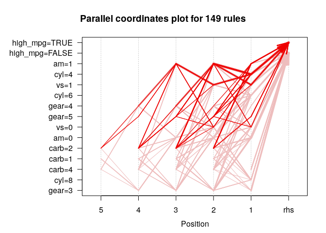

code\_for\_discussion3
================
Jason Grahn
1/21/2019

The instructor has us blindly running the code from <https://blog.revolutionanalytics.com/2015/04/association-rules-and-market-basket-analysis-with-r.html> witout any sort of explanation.

So, I'm running it. But this is a better resource: <http://www.rdatamining.com/examples/association-rules>

going to try running it on mtcars,

Have to load `MTcars` and make get the factor columns
-----------------------------------------------------

``` r
#load out mtcars and make factors
mt.mute <- mtcars %>% 
  mutate(high_mpg = if_else(mpg >= 25, TRUE, FALSE)) %>% 
  arrange(desc(high_mpg)) %>% 
  select(cyl,vs:high_mpg) %>% 
  mutate(cyl = as.factor(cyl),
         vs = as.factor(vs),
         am = as.factor(am),
         gear = as.factor(gear),
         carb = as.factor(carb),
         high_mpg = as.factor(high_mpg))

#and let's just pare down the dataset so we dont get SO MANY rules? 
mt.mute <- head(mt.mute,15)
idx <- sample(1:nrow(mt.mute), 5)

mt.mute[idx, ]
```

    ##    cyl vs am gear carb high_mpg
    ## 11   8  0  0    3    2    FALSE
    ## 14   4  1  0    4    2    FALSE
    ## 6    4  1  1    5    2     TRUE
    ## 4    4  1  1    4    1     TRUE
    ## 2    4  1  1    4    2     TRUE

``` r
summary(mt.mute)
```

    ##  cyl   vs     am    gear  carb   high_mpg
    ##  4:9   0: 5   0:6   3:4   1:6   FALSE:9  
    ##  6:4   1:10   1:9   4:9   2:6   TRUE :6  
    ##  8:2                5:2   3:0            
    ##                           4:3            
    ##                           6:0            
    ##                           8:0

Here's where we load `arules` to find those association rules
-------------------------------------------------------------

``` r
 library(arules)
```

    ## Loading required package: Matrix

    ## 
    ## Attaching package: 'Matrix'

    ## The following object is masked from 'package:tidyr':
    ## 
    ##     expand

    ## 
    ## Attaching package: 'arules'

    ## The following object is masked from 'package:dplyr':
    ## 
    ##     recode

    ## The following objects are masked from 'package:base':
    ## 
    ##     abbreviate, write

``` r
 # find association rules with default settings
rules <- apriori(mt.mute)
```

    ## Apriori
    ## 
    ## Parameter specification:
    ##  confidence minval smax arem  aval originalSupport maxtime support minlen
    ##         0.8    0.1    1 none FALSE            TRUE       5     0.1      1
    ##  maxlen target   ext
    ##      10  rules FALSE
    ## 
    ## Algorithmic control:
    ##  filter tree heap memopt load sort verbose
    ##     0.1 TRUE TRUE  FALSE TRUE    2    TRUE
    ## 
    ## Absolute minimum support count: 1 
    ## 
    ## set item appearances ...[0 item(s)] done [0.00s].
    ## set transactions ...[15 item(s), 15 transaction(s)] done [0.00s].
    ## sorting and recoding items ... [15 item(s)] done [0.00s].
    ## creating transaction tree ... done [0.00s].
    ## checking subsets of size 1 2 3 4 5 6 done [0.00s].
    ## writing ... [532 rule(s)] done [0.00s].
    ## creating S4 object  ... done [0.00s].

``` r
#head(inspect(rules),15)
```

and now we want to make some rules for high\_mpg = TRUE
-------------------------------------------------------

``` r
# rules with rhs containing "high_mpg" only
rules <- apriori(mt.mute,
                 parameter = list(minlen=2, supp=0.005, conf=0.8),
                 appearance = list(rhs=c("high_mpg=TRUE", 
                                         "high_mpg=FALSE"),
                                   default="lhs"),
                 control = list(verbose=F))
rules.sorted <- sort(rules, by="lift")
```

So we find redundant rules if it's possible!

``` r
# find redundant rules
subset.matrix <- is.subset(rules.sorted, rules.sorted)
subset.matrix[lower.tri(subset.matrix, diag=T)] <- NA
```

    ## Warning in `[<-`(`*tmp*`, as.vector(i), value = NA): x[.] <- val: x is
    ## "ngTMatrix", val not in {TRUE, FALSE} is coerced; NA |--> TRUE.

``` r
redundant <- colSums(subset.matrix, na.rm=T) >= 1
```

Ok, so which rules are redundant?

``` r
#putting a head on this because it's rather long
head(which(redundant),10)
```

    ##             {gear=5,high_mpg=TRUE}        {vs=0,gear=5,high_mpg=TRUE} 
    ##                                  1                                  2 
    ##      {gear=5,carb=2,high_mpg=TRUE}       {cyl=4,gear=5,high_mpg=TRUE} 
    ##                                  3                                  4 
    ##        {am=1,gear=5,high_mpg=TRUE}        {vs=1,gear=5,high_mpg=TRUE} 
    ##                                  5                                  6 
    ##         {cyl=4,vs=0,high_mpg=TRUE}        {am=1,carb=2,high_mpg=TRUE} 
    ##                                  7                                  8 
    ## {vs=0,gear=5,carb=2,high_mpg=TRUE}  {cyl=4,vs=0,gear=5,high_mpg=TRUE} 
    ##                                  9                                 10

``` r
#Now let's remove redundant rules
rules.pruned <- rules.sorted[!redundant]

#this can't be head()'d, so no output please. 
inspect(rules.pruned)
```

interpretation

``` r
library(arulesViz)
```

    ## Loading required package: grid

``` r
plot(rules)
```

    ## To reduce overplotting, jitter is added! Use jitter = 0 to prevent jitter.


``` r
plot(rules, method="graph", control=list(type="items"))
```

    ## Warning: Unknown control parameters: type

    ## Available control parameters (with default values):
    ## main  =  Graph for 100 rules
    ## nodeColors    =  c("#66CC6680", "#9999CC80")
    ## nodeCol   =  c("#EE0000FF", "#EE0303FF", "#EE0606FF", "#EE0909FF", "#EE0C0CFF", "#EE0F0FFF", "#EE1212FF", "#EE1515FF", "#EE1818FF", "#EE1B1BFF", "#EE1E1EFF", "#EE2222FF", "#EE2525FF", "#EE2828FF", "#EE2B2BFF", "#EE2E2EFF", "#EE3131FF", "#EE3434FF", "#EE3737FF", "#EE3A3AFF", "#EE3D3DFF", "#EE4040FF", "#EE4444FF", "#EE4747FF", "#EE4A4AFF", "#EE4D4DFF", "#EE5050FF", "#EE5353FF", "#EE5656FF", "#EE5959FF", "#EE5C5CFF", "#EE5F5FFF", "#EE6262FF", "#EE6666FF", "#EE6969FF", "#EE6C6CFF", "#EE6F6FFF", "#EE7272FF", "#EE7575FF",  "#EE7878FF", "#EE7B7BFF", "#EE7E7EFF", "#EE8181FF", "#EE8484FF", "#EE8888FF", "#EE8B8BFF", "#EE8E8EFF", "#EE9191FF", "#EE9494FF", "#EE9797FF", "#EE9999FF", "#EE9B9BFF", "#EE9D9DFF", "#EE9F9FFF", "#EEA0A0FF", "#EEA2A2FF", "#EEA4A4FF", "#EEA5A5FF", "#EEA7A7FF", "#EEA9A9FF", "#EEABABFF", "#EEACACFF", "#EEAEAEFF", "#EEB0B0FF", "#EEB1B1FF", "#EEB3B3FF", "#EEB5B5FF", "#EEB7B7FF", "#EEB8B8FF", "#EEBABAFF", "#EEBCBCFF", "#EEBDBDFF", "#EEBFBFFF", "#EEC1C1FF", "#EEC3C3FF", "#EEC4C4FF", "#EEC6C6FF", "#EEC8C8FF",  "#EEC9C9FF", "#EECBCBFF", "#EECDCDFF", "#EECFCFFF", "#EED0D0FF", "#EED2D2FF", "#EED4D4FF", "#EED5D5FF", "#EED7D7FF", "#EED9D9FF", "#EEDBDBFF", "#EEDCDCFF", "#EEDEDEFF", "#EEE0E0FF", "#EEE1E1FF", "#EEE3E3FF", "#EEE5E5FF", "#EEE7E7FF", "#EEE8E8FF", "#EEEAEAFF", "#EEECECFF", "#EEEEEEFF")
    ## edgeCol   =  c("#474747FF", "#494949FF", "#4B4B4BFF", "#4D4D4DFF", "#4F4F4FFF", "#515151FF", "#535353FF", "#555555FF", "#575757FF", "#595959FF", "#5B5B5BFF", "#5E5E5EFF", "#606060FF", "#626262FF", "#646464FF", "#666666FF", "#686868FF", "#6A6A6AFF", "#6C6C6CFF", "#6E6E6EFF", "#707070FF", "#727272FF", "#747474FF", "#767676FF", "#787878FF", "#7A7A7AFF", "#7C7C7CFF", "#7E7E7EFF", "#808080FF", "#828282FF", "#848484FF", "#868686FF", "#888888FF", "#8A8A8AFF", "#8C8C8CFF", "#8D8D8DFF", "#8F8F8FFF", "#919191FF", "#939393FF",  "#959595FF", "#979797FF", "#999999FF", "#9A9A9AFF", "#9C9C9CFF", "#9E9E9EFF", "#A0A0A0FF", "#A2A2A2FF", "#A3A3A3FF", "#A5A5A5FF", "#A7A7A7FF", "#A9A9A9FF", "#AAAAAAFF", "#ACACACFF", "#AEAEAEFF", "#AFAFAFFF", "#B1B1B1FF", "#B3B3B3FF", "#B4B4B4FF", "#B6B6B6FF", "#B7B7B7FF", "#B9B9B9FF", "#BBBBBBFF", "#BCBCBCFF", "#BEBEBEFF", "#BFBFBFFF", "#C1C1C1FF", "#C2C2C2FF", "#C3C3C4FF", "#C5C5C5FF", "#C6C6C6FF", "#C8C8C8FF", "#C9C9C9FF", "#CACACAFF", "#CCCCCCFF", "#CDCDCDFF", "#CECECEFF", "#CFCFCFFF", "#D1D1D1FF",  "#D2D2D2FF", "#D3D3D3FF", "#D4D4D4FF", "#D5D5D5FF", "#D6D6D6FF", "#D7D7D7FF", "#D8D8D8FF", "#D9D9D9FF", "#DADADAFF", "#DBDBDBFF", "#DCDCDCFF", "#DDDDDDFF", "#DEDEDEFF", "#DEDEDEFF", "#DFDFDFFF", "#E0E0E0FF", "#E0E0E0FF", "#E1E1E1FF", "#E1E1E1FF", "#E2E2E2FF", "#E2E2E2FF", "#E2E2E2FF")
    ## alpha     =  0.5
    ## cex   =  1
    ## itemLabels    =  TRUE
    ## labelCol  =  #000000B3
    ## measureLabels     =  FALSE
    ## precision     =  3
    ## layout    =  NULL
    ## layoutParams  =  list()
    ## arrowSize     =  0.5
    ## engine    =  igraph
    ## plot  =  TRUE
    ## plot_options  =  list()
    ## max   =  100
    ## verbose   =  FALSE

    ## Warning: plot: Too many rules supplied. Only plotting the best 100 rules
    ## using 'support' (change control parameter max if needed)


``` r
plot(rules, method="paracoord", control=list(reorder=TRUE))
```


