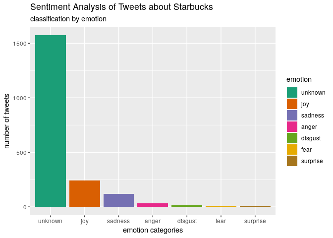
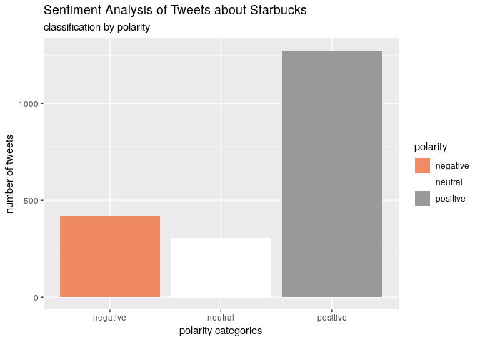

project07
================
Jason Grahn
2/18/2019

Let's do option 2 because it doesn't involve me pasting keys and secrets into my code.

``` r
api_key <- "F3TEqeRrTIdteTWACqrluKXXp" #in the quotes, put your API key 
api_secret <- "7LKsZ94MtUxR0ZWB1hUDhoRCcqFMK66YVywVtsJmnUW93eOMoN" #in the quotes, put your API secret token
token <- "15652379-SFiIlU8bbUXL8o0UU2PBQR4H1cGKJ8vwNV25eNbjv" #in the quotes, put your token 
token_secret <- "9rfPpbf6nfGo4oPUB4s7JsD7knrcJtk0fiuCRfR8Om4Yj" #in the quotes, put your token secret 

setup_twitter_oauth(api_key, 
                    api_secret, 
                    token, 
                    token_secret)
```

    ## [1] "Using direct authentication"

``` r
some_tweets <- searchTwitter("starbucks", 
                             n=2000, 
                             lang="en")
# get the text
some_txt <- sapply(some_tweets, function(x) x$getText())
```

``` r
# remove retweet entities
some_txt <- gsub("(RT|via)((?:\\b\\W*@\\w+)+)", "", some_txt)
# remove at people
some_txt <- gsub("@\\w+", "", some_txt)
# remove punctuation
some_txt <- gsub("[[:punct:]]", "", some_txt)
# remove numbers
some_txt <- gsub("[[:digit:]]", "", some_txt)
# remove html links
some_txt <- gsub("http\\w+", "", some_txt)
# remove unnecessary spaces
some_txt <- gsub("[ \t]{2,}", "", some_txt)
some_txt <- gsub("^\\s+|\\s+$", "", some_txt)
```

``` r
# define "tolower error handling" function
try.error = function(x)
  {
  # create missing value
  y = NA
  # tryCatch error
  try_error = tryCatch(tolower(x), error=function(e) e)
  # if not an error
  if (!inherits(try_error, "error"))
    y = tolower(x)
  # result
  return(y)
}
  
# lower case using try.error with sapply
some_txt <- sapply(some_txt, try.error)
  
# remove NAs in some_txt
some_txt <- some_txt[!is.na(some_txt)]

names(some_txt) = NULL
```

``` r
# classify emotion
class_emo <- classify_emotion(some_txt, algorithm="bayes", prior=1.0)

# get emotion best fit
emotion <- class_emo[,7]

# substitute NA's by "unknown"
emotion[is.na(emotion)] = "unknown"

# classify polarity
class_pol <- classify_polarity(some_txt, algorithm="bayes")

# get polarity best fit
polarity <- class_pol[,4]
```

``` r
# data frame with results
sent_df <- data.frame(text = some_txt, 
                      emotion = emotion,
                      polarity = polarity, 
                      stringsAsFactors=FALSE)

# sort data frame
sent_df = within(sent_df,
                 emotion <- factor(emotion, 
                                   levels=names(sort(table(emotion),
                                                     decreasing=TRUE))))
```

``` r
# plot distribution of emotions
ggplot(sent_df, aes(x=emotion)) +
  geom_bar(aes(y=..count.., fill=emotion)) +
  scale_fill_brewer(palette="Dark2") +
  labs(x="emotion categories", 
       y="number of tweets",
       title = "Sentiment Analysis of Tweets about Starbucks",
       subtitle = "classification by emotion")
```



``` r
# plot distribution of polarity
ggplot(sent_df, aes(x=polarity)) +
  geom_bar(aes(y=..count.., fill=polarity)) +
  scale_fill_brewer(palette="RdGy") +
  labs(x="polarity categories", 
       y="number of tweets",
       title = "Sentiment Analysis of Tweets about Starbucks",
       subtitle = "classification by polarity")
```


