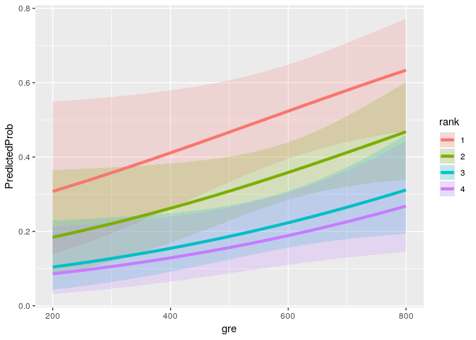

project08
================
Jason Grahn
2/24/2019

``` r
library(readr)
mydata <- read_csv(here::here("project08/binary.csv"))
```

    ##      admit             gre             gpa             rank      
    ##  Min.   :0.0000   Min.   :220.0   Min.   :2.260   Min.   :1.000  
    ##  1st Qu.:0.0000   1st Qu.:520.0   1st Qu.:3.130   1st Qu.:2.000  
    ##  Median :0.0000   Median :580.0   Median :3.395   Median :2.000  
    ##  Mean   :0.3175   Mean   :587.7   Mean   :3.390   Mean   :2.485  
    ##  3rd Qu.:1.0000   3rd Qu.:660.0   3rd Qu.:3.670   3rd Qu.:3.000  
    ##  Max.   :1.0000   Max.   :800.0   Max.   :4.000   Max.   :4.000

    ##       admit         gre         gpa        rank 
    ##   0.4660867 115.5165364   0.3805668   0.9444602

    ##      rank
    ## admit  1  2  3  4
    ##     0 28 97 93 55
    ##     1 33 54 28 12

Here we've built a crosstab for each college rank and the count of those that are admitted to it. There are no **0** cells, so we can proceed.

``` r
mydata$rank <- factor(mydata$rank) 
mylogit <- glm(admit ~ gre + gpa + rank, data = mydata, family = "binomial")
summary(mylogit)
```

    ## 
    ## Call:
    ## glm(formula = admit ~ gre + gpa + rank, family = "binomial", 
    ##     data = mydata)
    ## 
    ## Deviance Residuals: 
    ##     Min       1Q   Median       3Q      Max  
    ## -1.6268  -0.8662  -0.6388   1.1490   2.0790  
    ## 
    ## Coefficients:
    ##              Estimate Std. Error z value Pr(>|z|)    
    ## (Intercept) -3.989979   1.139951  -3.500 0.000465 ***
    ## gre          0.002264   0.001094   2.070 0.038465 *  
    ## gpa          0.804038   0.331819   2.423 0.015388 *  
    ## rank2       -0.675443   0.316490  -2.134 0.032829 *  
    ## rank3       -1.340204   0.345306  -3.881 0.000104 ***
    ## rank4       -1.551464   0.417832  -3.713 0.000205 ***
    ## ---
    ## Signif. codes:  0 '***' 0.001 '**' 0.01 '*' 0.05 '.' 0.1 ' ' 1
    ## 
    ## (Dispersion parameter for binomial family taken to be 1)
    ## 
    ##     Null deviance: 499.98  on 399  degrees of freedom
    ## Residual deviance: 458.52  on 394  degrees of freedom
    ## AIC: 470.52
    ## 
    ## Number of Fisher Scoring iterations: 4

This is the output for the generalized linear model (GLM). We're given the forumula for the model and an evaluation of the model. Rank3 and rank4 are both highly significant at practically 0 alpha; while rank2, gpa, and gre are only significant at .05 alpha.

``` r
## CIs using profiled log-likelihood 
round(confint(mylogit), 4)
```

    ##               2.5 %  97.5 %
    ## (Intercept) -6.2716 -1.7925
    ## gre          0.0001  0.0044
    ## gpa          0.1603  1.4641
    ## rank2       -1.3009 -0.0567
    ## rank3       -2.0277 -0.6704
    ## rank4       -2.4000 -0.7535

``` r
## CIs using standard errors 
round(confint.default(mylogit),4)
```

    ##               2.5 %  97.5 %
    ## (Intercept) -6.2242 -1.7557
    ## gre          0.0001  0.0044
    ## gpa          0.1537  1.4544
    ## rank2       -1.2958 -0.0551
    ## rank3       -2.0170 -0.6634
    ## rank4       -2.3704 -0.7325

Here we have confidence intervals for each of the linear coefficientsthat are provided in the GLM above. With a logistic model we *should* be utilizing the profiled log-likelihood function.

``` r
wald.test(b = coef(mylogit), Sigma = vcov(mylogit), Terms = 4:6)
```

    ## Wald test:
    ## ----------
    ## 
    ## Chi-squared test:
    ## X2 = 20.9, df = 3, P(> X2) = 0.00011

The wald test shows the effect of rank overall. Our chi-squared test statistic is 20.9,and the three degrees of freedom is associated to a p-value of nearly zero (0.00011). This indicates that that the effect of rank is statistically significant.

``` r
l <- cbind(0,0,0,1,-1,0) 
wald.test(b = coef(mylogit), Sigma = vcov(mylogit), L = l)
```

    ## Wald test:
    ## ----------
    ## 
    ## Chi-squared test:
    ## X2 = 5.5, df = 1, P(> X2) = 0.019

Using "l" we've done a different wald test here, that results with a chi-square statistic at 5.5. This has an associated p-value of 0.019. This tells us that difference between rank2 and rank3 is also statistically significant.

``` r
## odds ratios only 
round(exp(coef(mylogit)), 4)
```

    ## (Intercept)         gre         gpa       rank2       rank3       rank4 
    ##      0.0185      1.0023      2.2345      0.5089      0.2618      0.2119

``` r
## odds ratios and 95% CI 
round(exp(cbind(OR = coef(mylogit), confint(mylogit))), 4)
```

    ##                 OR  2.5 % 97.5 %
    ## (Intercept) 0.0185 0.0019 0.1665
    ## gre         1.0023 1.0001 1.0044
    ## gpa         2.2345 1.1739 4.3238
    ## rank2       0.5089 0.2723 0.9448
    ## rank3       0.2618 0.1316 0.5115
    ## rank4       0.2119 0.0907 0.4707

In this block of code we're exponentiating the coefficients in order to interpret them as odds-ratios. This allows us to say that increasing GPA by one unit increases the *odds* of being admitted into one of these schools increases by a 2.23. This is against being not admitted at all.

``` r
newdata1 <- with(mydata, 
                 data.frame(gre = mean(gre), 
                            gpa = mean(gpa), 
                            rank = factor(1:4))) 
## view data frame 
newdata1
```

    ##     gre    gpa rank
    ## 1 587.7 3.3899    1
    ## 2 587.7 3.3899    2
    ## 3 587.7 3.3899    3
    ## 4 587.7 3.3899    4

``` r
newdata1$rankP <- predict(mylogit, newdata = newdata1, type = "response") 
newdata1
```

    ##     gre    gpa rank     rankP
    ## 1 587.7 3.3899    1 0.5166016
    ## 2 587.7 3.3899    2 0.3522846
    ## 3 587.7 3.3899    3 0.2186120
    ## 4 587.7 3.3899    4 0.1846684

To interpret the values in the new dataframe, we have to remember these are probability factors. The probability for being accepted into a school given the mean `gre` and mean `gpa` and coming from a rank1 school is 0.5166016. For students of so-called "lower tier" rank4 schools, the probability is 0.1846684 controlling for the same mean `gre` and `gpa`. One way this can be interpreted is that college is a sociological "classist" issue and should be made free for all based on merit, not the *school* that someone comes from.

``` r
newdata2 <- with(mydata, 
                 data.frame(gre = rep(seq(from = 200, to = 800, length.out = 100), 4), 
                            gpa = mean(gpa), 
                            rank = factor(rep(1:4, each = 100))))
```

``` r
newdata3 <- cbind(newdata2, 
                  predict(mylogit, 
                          newdata = newdata2, 
                          type="link", 
                          se=TRUE)) 

newdata3 <- within(newdata3, { 
  PredictedProb <- plogis(fit) 
  LL <- plogis(fit - (1.96 * se.fit)) 
  UL <- plogis(fit + (1.96 * se.fit)) }) 

## view first few rows of final dataset 
head(newdata3)
```

    ##        gre    gpa rank        fit    se.fit residual.scale        UL
    ## 1 200.0000 3.3899    1 -0.8114870 0.5147714              1 0.5492064
    ## 2 206.0606 3.3899    1 -0.7977632 0.5090986              1 0.5498513
    ## 3 212.1212 3.3899    1 -0.7840394 0.5034491              1 0.5505074
    ## 4 218.1818 3.3899    1 -0.7703156 0.4978239              1 0.5511750
    ## 5 224.2424 3.3899    1 -0.7565919 0.4922237              1 0.5518545
    ## 6 230.3030 3.3899    1 -0.7428681 0.4866494              1 0.5525464
    ##          LL PredictedProb
    ## 1 0.1393812     0.3075737
    ## 2 0.1423880     0.3105042
    ## 3 0.1454429     0.3134499
    ## 4 0.1485460     0.3164108
    ## 5 0.1516973     0.3193867
    ## 6 0.1548966     0.3223773

All we're making here is an expanded data frame, applying the admission prediction probabilities to the dataset.

``` r
ggplot(newdata3, aes(x = gre, y = PredictedProb)) + 
  geom_ribbon(aes(ymin = LL, ymax = UL, fill = rank), alpha = .2) + 
  geom_line(aes(colour = rank), size=1.5)
```



Now we get into some visual fun. With this plot we see the predicted probability for admission increases with `gre` score is true for each rank school. However, rank1 schools have a much higher probability. Confidence intervals generally overlap, which shows us that it's possible for a rank4 school attendee to reach SOME of the admission probability of a rank1 attendee, but only barely, and only at the low end. The Merits of GRE-based admission are nearly copletely lost at the high-end of scores. College admission is a class issue.

``` r
with(mylogit, null.deviance - deviance)
```

    ## [1] 41.45903

``` r
with(mylogit, df.null - df.residual)
```

    ## [1] 5

``` r
with(mylogit, pchisq(null.deviance - deviance, df.null - df.residual, lower.tail = FALSE))
```

    ## [1] 7.578194e-08

The chi-square is 41.4590251 and has 5 degrees of freedom. This provides a p-value of 7.578194210^{-8}. This is obviously much less than any measurable test for fit. The interpretation is that the model fits better than any random selection.

``` r
logLik(mylogit)
```

    ## 'log Lik.' -229.2587 (df=6)
