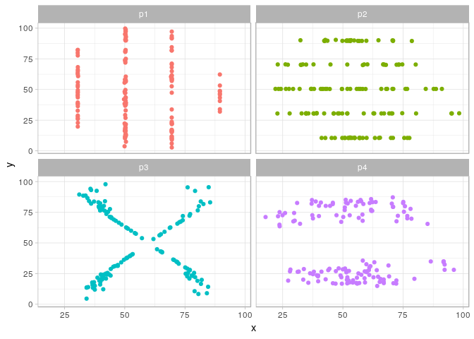

DA420\_PROJECT1\_GRAHN\_V2
================
Jason Grahn
1/11/2019

``` r
#showing the data
head(datasets, 10)
```

    ## # A tibble: 10 x 3
    ##    dataset     x     y
    ##    <chr>   <dbl> <dbl>
    ##  1 p2       53.4  90.2
    ##  2 p2       52.8  90.1
    ##  3 p2       47.1  90.5
    ##  4 p2       42.4  89.5
    ##  5 p2       42.7  90.4
    ##  6 p2       32.4  90.1
    ##  7 p2       32.5  70.2
    ##  8 p2       33.4  70.5
    ##  9 p2       32.7  70.1
    ## 10 p2       23.0  70.4

``` r
tail(datasets, 10)
```

    ## # A tibble: 10 x 3
    ##    dataset     x     y
    ##    <chr>   <dbl> <dbl>
    ##  1 p4       79.7  20.7
    ##  2 p4       64.2  14.9
    ##  3 p4       66.9  20.2
    ##  4 p4       66.9  18.2
    ##  5 p4       39.6  22.7
    ##  6 p4       37.9  26.5
    ##  7 p4       86.5  34.9
    ##  8 p4       50.8  79.0
    ##  9 p4       51.2  85.1
    ## 10 p4       40.9  82.9

``` r
#showing summary stats for mean and standard deviation are nearly identical
summary_stats <- datasets %>%
  group_by(dataset) %>% 
  summarise(mean_x = round(mean(x), 2),
            mean_y = round(mean(y), 2),
            sd_x = round(sd(x), 2),
            sd_y = round(sd(y), 2)) 

summary_stats
```

    ## # A tibble: 4 x 5
    ##   dataset mean_x mean_y  sd_x  sd_y
    ##   <chr>    <dbl>  <dbl> <dbl> <dbl>
    ## 1 p1        54.3   47.8  16.8  26.9
    ## 2 p2        54.3   47.8  16.8  26.9
    ## 3 p3        54.3   47.8  16.8  26.9
    ## 4 p4        54.3   47.8  16.8  26.9

``` r
#showing linear models are the same
lm_v <- datasets %>% 
  filter(dataset %in% c("p1")) %>% 
  group_by(dataset) %>% 
  lm(x ~ y, .)
lm_v
```

    ## 
    ## Call:
    ## lm(formula = x ~ y, data = .)
    ## 
    ## Coefficients:
    ## (Intercept)            y  
    ##    56.33807     -0.04323

``` r
lm_h <- datasets %>% 
  filter(dataset %in% c("p2")) %>% 
  group_by(dataset) %>% 
  lm(x ~ y, .)
lm_h
```

    ## 
    ## Call:
    ## lm(formula = x ~ y, data = .)
    ## 
    ## Coefficients:
    ## (Intercept)            y  
    ##    56.09850     -0.03841

``` r
lm_x <- datasets %>% 
  filter(dataset %in% c("p3")) %>% 
  group_by(dataset) %>% 
  lm(x ~ y, .)
lm_x
```

    ## 
    ## Call:
    ## lm(formula = x ~ y, data = .)
    ## 
    ## Coefficients:
    ## (Intercept)            y  
    ##    56.21394     -0.04084

``` r
lm_hl <- datasets %>% 
  filter(dataset %in% c("p4")) %>% 
  group_by(dataset) %>% 
  lm(x ~ y, .)
```

``` r
#showing the plotting
datasets %>% 
  group_by(dataset) %>%
  ggplot(aes(x = x, y = y)) +
  geom_point(aes(color = dataset)) +
  facet_wrap(~dataset, nrow = 2) +
  theme_light() +
  theme(legend.position="none")
```


