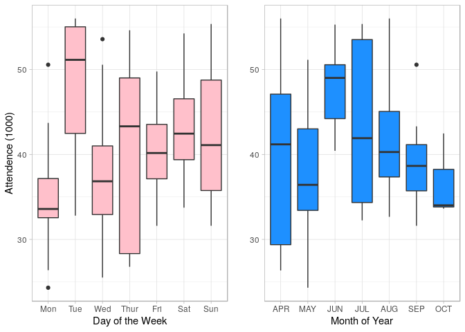
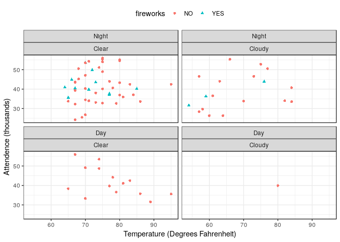
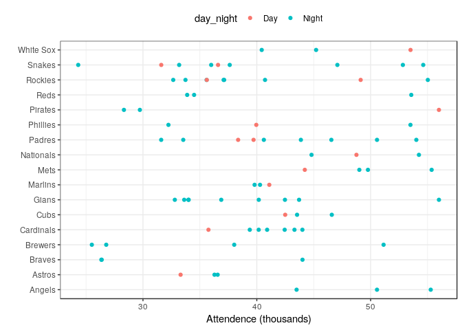
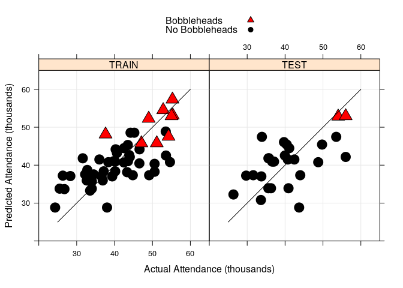
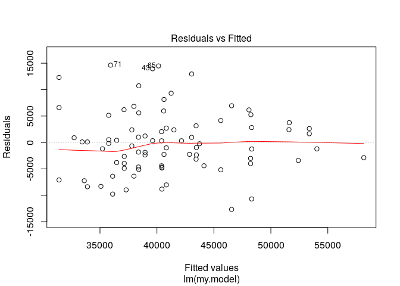
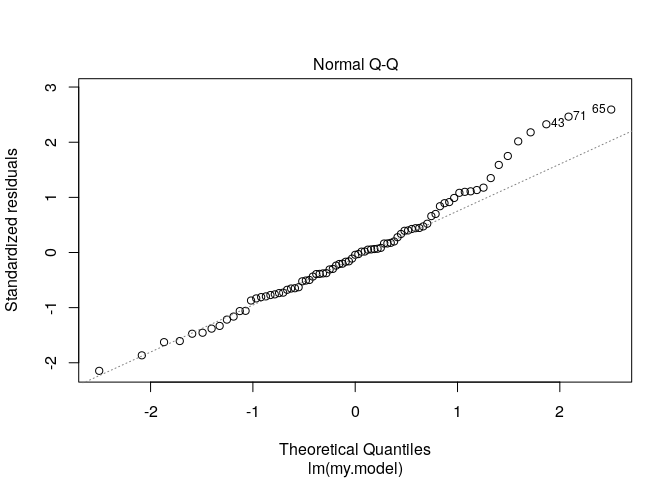
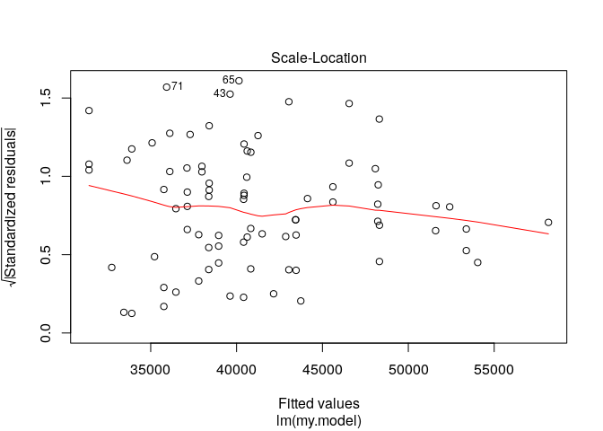
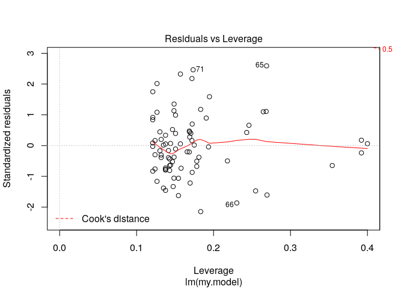
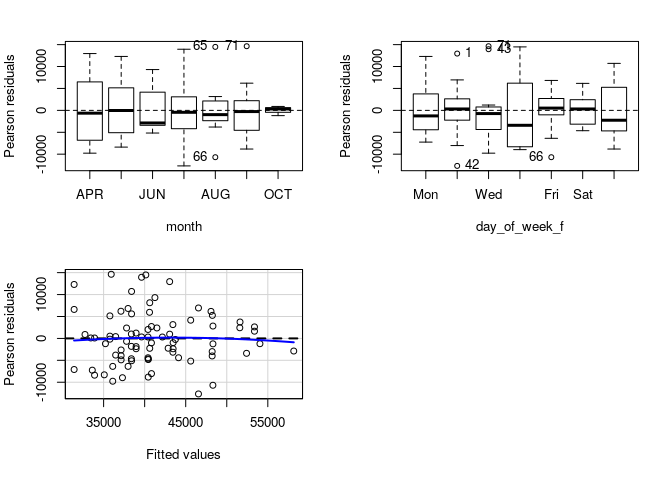

da420\_PROJECT2\_GRAHN
================
Jason Grahn
1/17/2019

Download Dodger.csv

``` r
dodgers <- read_csv("dodgers.csv", 
                    col_types = cols(month = col_factor(levels = c("JAN", "FEB", "MAR", "APR",
                                                                   "MAY", "JUN", "JUL", "AUG",
                                                                   "SEP", "OCT", "NOV", "DEC"))))
glimpse(dodgers)
```

    ## Observations: 81
    ## Variables: 12
    ## $ month       <fct> APR, APR, APR, APR, APR, APR, APR, APR, APR, APR, AP…
    ## $ day         <dbl> 10, 11, 12, 13, 14, 15, 23, 24, 25, 27, 28, 29, 7, 8…
    ## $ attend      <dbl> 56000, 29729, 28328, 31601, 46549, 38359, 26376, 440…
    ## $ day_of_week <chr> "Tuesday", "Wednesday", "Thursday", "Friday", "Satur…
    ## $ opponent    <chr> "Pirates", "Pirates", "Pirates", "Padres", "Padres",…
    ## $ temp        <dbl> 67, 58, 57, 54, 57, 65, 60, 63, 64, 66, 71, 74, 67, …
    ## $ skies       <chr> "Clear", "Cloudy", "Cloudy", "Cloudy", "Cloudy", "Cl…
    ## $ day_night   <chr> "Day", "Night", "Night", "Night", "Night", "Day", "N…
    ## $ cap         <chr> "NO", "NO", "NO", "NO", "NO", "NO", "NO", "NO", "NO"…
    ## $ shirt       <chr> "NO", "NO", "NO", "NO", "NO", "NO", "NO", "NO", "NO"…
    ## $ fireworks   <chr> "NO", "NO", "NO", "YES", "NO", "NO", "NO", "NO", "NO…
    ## $ bobblehead  <chr> "NO", "NO", "NO", "NO", "NO", "NO", "NO", "NO", "NO"…

use R to develop two side-by-side boxplots, as seen in Figure 2.1 and Figure 2.2

``` r
#need to transform full name days to abbreviated; ie "monday" to "mon"
#and turn that, and day/night into factors.
dodgers <- dodgers %>% 
  select(month, attend, day_of_week, opponent, temp, skies, day_night, fireworks, bobblehead) %>% 
  mutate("Attend/1000" = attend/1000,
                              day_of_week_f = case_when(day_of_week == "Monday" ~ "Mon",
                                 day_of_week == "Tuesday" ~ "Tue",
                                 day_of_week == "Wednesday" ~ "Wed",
                                 day_of_week == "Thursday" ~ "Thur",
                                 day_of_week == "Friday" ~ "Fri",
                                 day_of_week == "Saturday" ~ "Sat",
                                 day_of_week == "Sunday" ~ "Sun"),
                              #and need to assign them factor levels
                              day_of_week_f = factor(day_of_week_f, levels = c("Mon", "Tue", "Wed",
                                                                           "Thur", "Fri", "Sat", "Sun")),
                              day_night_f = factor(day_night, levels = c("Night", "Day")))

# boxplots with ggplot using the dodger data
## day of week on X
## attendence in K's on Y
dow_box <- dodgers %>% 
  ggplot(aes(x = day_of_week_f, y = (attend/1000))) +
  geom_boxplot(fill = "pink") +
  theme_light() +
  theme(legend.position="none") +
  labs(y = "Attendence (1000)",
       x = "Day of the Week")
## month on X
## attendence in K's on Y
mon_box <- dodgers %>% 
  ggplot(aes(x = month, y = (attend/1000))) +
  geom_boxplot(fill = "dodgerblue1") +
  theme_light() +
  theme(legend.position="none") +
  labs(y = "", x = "Month of Year")

#put these side by side
cowplot::plot_grid(dow_box, mon_box)
```



and two scatter plots, as seen in Figure 2.3

``` r
#we're analyzing days with fireworks against day / night, clear / cloudy, AND temperature
#fireworks by shape and color
#attendence (K's) on Y
#temp on X
dodgers %>% 
  ggplot(aes(x = temp, 
             y = attend/1000,
             shape = fireworks,
             color = fireworks)) +
  geom_point() +
  theme_bw() +
  theme(legend.position="top") +
  labs(y = "Attendence (thousands)",
       x = "Temperature (Degrees Fahrenheit)") +
  facet_wrap(day_night_f ~ skies)
```



and Figure 2.4

``` r
# scatterplot teams against attendence 
# y axis is opposing teams
# x axis is attendence (K's)
# fill by day/night
dodgers %>% 
  ggplot(aes(x = (attend/1000), y = opponent)) + 
  geom_point(aes(color = day_night)) +
  theme_bw() +
  theme(legend.position="top") +
  labs(y = "",
       x = "Attendence (thousands)")
```



Use R to develop a Regression Model Performance, as seen in Figure 2.5. Examine regression diagnostics for the fitted model. Hint: Look at the Exhibit 2.1 in page 25-27.

``` r
#prediction will predict attendence based on act. attendence, month, and day_of_week_f, bobbleheads
#with a test and a train set

#pseudocode: 
#build a test/train array with 2/3 "test" data obvs and 1/2 "train" obvs
#randomize it 
#union it to dodgers data
# set seed for repeatability of training-and-test split 
# and the seed is always 42 because 42 is the answer to everything
set.seed(42) 

training_test <- c(rep(1,length=trunc((2/3)*nrow(dodgers))),
                   rep(2,length=(nrow(dodgers) - trunc((2/3)*nrow(dodgers)))))

dodgers$training_test <- sample(training_test) # random permutation
dodgers$training_test <- factor(dodgers$training_test,
                                levels=c(1,2), 
                                labels=c("TRAIN","TEST"))

dodgers.train <- dodgers %>% filter(training_test == "TRAIN")
#print(str(dodgers.train)) # check training data frame

dodgers.test <- dodgers %>% filter(training_test == "TEST")
#print(str(dodgers.test)) # check test data frame

# build and save model from filtered "train" data
# specify a simple model with bobblehead entered last
my.model <- {attend ~ month + day_of_week_f + bobblehead}

# fit the model to the training set
train.model.fit <- lm(my.model, data = dodgers.train)
# summary of model fit to the training set
print(summary(train.model.fit))
```

    ## 
    ## Call:
    ## lm(formula = my.model, data = dodgers.train)
    ## 
    ## Residuals:
    ##    Min     1Q Median     3Q    Max 
    ## -10888  -3753  -1002   2400  13802 
    ## 
    ## Coefficients:
    ##                   Estimate Std. Error t value Pr(>|t|)    
    ## (Intercept)          32258       3687   8.750 7.84e-11 ***
    ## monthMAY             -3438       3297  -1.043   0.3034    
    ## monthJUN              8089       3692   2.191   0.0343 *  
    ## monthJUL              5299       3918   1.352   0.1839    
    ## monthAUG              3706       3355   1.104   0.2760    
    ## monthSEP              1029       3568   0.288   0.7745    
    ## monthOCT             -1456       5712  -0.255   0.8001    
    ## day_of_week_fTue      9907       3870   2.560   0.0143 *  
    ## day_of_week_fWed      4975       3433   1.449   0.1550    
    ## day_of_week_fThur     4855       4026   1.206   0.2349    
    ## day_of_week_fFri      5083       3628   1.401   0.1690    
    ## day_of_week_fSat      8208       3428   2.395   0.0214 *  
    ## day_of_week_fSun      8516       3530   2.413   0.0205 *  
    ## bobbleheadYES         7083       3065   2.311   0.0261 *  
    ## ---
    ## Signif. codes:  0 '***' 0.001 '**' 0.01 '*' 0.05 '.' 0.1 ' ' 1
    ## 
    ## Residual standard error: 6768 on 40 degrees of freedom
    ## Multiple R-squared:  0.523,  Adjusted R-squared:  0.3679 
    ## F-statistic: 3.373 on 13 and 40 DF,  p-value: 0.001528

``` r
# training set predictions from the model fit to the training set
dodgers.train$predict_attend <- predict(train.model.fit)
# test set predictions from the model fit to the training set
dodgers.test$predict_attend <- predict(train.model.fit, newdata = dodgers.test)

# compute the proportion of response variance
# accounted for when predicting out-of-sample
cat("\n","Proportion of Test Set Variance Accounted for: ",
round((with(dodgers.test,cor(attend,predict_attend)^2)),digits=3),"\n",sep="")
```

    ## 
    ## Proportion of Test Set Variance Accounted for: 0.335

``` r
# merge the training and test sets for plotting
dodgers.plotting.frame <- rbind(dodgers.train,dodgers.test)

# generate predictive modeling visual for management
group.labels <- c("No Bobbleheads","Bobbleheads")
group.symbols <- c(21,24)
group.colors <- c("black","black")
group.fill <- c("black","red")
xyplot(predict_attend/1000 ~ attend/1000 | training_test,
       data = dodgers.plotting.frame, groups = bobblehead, cex = 2,
       pch = group.symbols, col = group.colors, fill = group.fill,
       layout = c(2, 1), xlim = c(20,65), ylim = c(20,65),
       aspect=1, type = c("p","g"),
       panel=function(x,y, ...)
            {panel.xyplot(x,y,...)
             panel.segments(25,25,60,60,col="black",cex=2)
            },
       strip=function(...) strip.default(..., style=1),
       xlab = "Actual Attendance (thousands)",
       ylab = "Predicted Attendance (thousands)",
       key = list(space = "top",
              text = list(rev(group.labels),col = rev(group.colors)),
              points = list(pch = rev(group.symbols),
              col = rev(group.colors),
              fill = rev(group.fill))))
```



``` r
# use the full data set to obtain an estimate of the increase in
# attendance due to bobbleheads, controlling for other factors
my.model.fit <- lm(my.model, data = dodgers)

# use all available data
print(summary(my.model.fit))
```

    ## 
    ## Call:
    ## lm(formula = my.model, data = dodgers)
    ## 
    ## Residuals:
    ##      Min       1Q   Median       3Q      Max 
    ## -12670.9  -4004.4   -245.7   2819.5  14632.6 
    ## 
    ## Coefficients:
    ##                   Estimate Std. Error t value Pr(>|t|)    
    ## (Intercept)        33621.3     2690.5  12.496  < 2e-16 ***
    ## monthMAY           -2213.7     2445.2  -0.905  0.36853    
    ## monthJUN            7627.9     2915.7   2.616  0.01098 *  
    ## monthJUL            3509.8     2745.4   1.278  0.20551    
    ## monthAUG            2845.0     2560.8   1.111  0.27055    
    ## monthSEP            -184.3     2691.0  -0.069  0.94559    
    ## monthOCT            -889.1     4319.8  -0.206  0.83757    
    ## day_of_week_fTue    9423.9     2864.0   3.290  0.00160 ** 
    ## day_of_week_fWed    2490.4     2683.7   0.928  0.35676    
    ## day_of_week_fThur   3673.9     3597.7   1.021  0.31084    
    ## day_of_week_fFri    4359.0     2681.9   1.625  0.10878    
    ## day_of_week_fSat    6972.1     2720.1   2.563  0.01262 *  
    ## day_of_week_fSun    6998.4     2674.6   2.617  0.01096 *  
    ## bobbleheadYES       7486.0     2477.9   3.021  0.00356 ** 
    ## ---
    ## Signif. codes:  0 '***' 0.001 '**' 0.01 '*' 0.05 '.' 0.1 ' ' 1
    ## 
    ## Residual standard error: 6533 on 67 degrees of freedom
    ## Multiple R-squared:  0.4807, Adjusted R-squared:  0.3799 
    ## F-statistic: 4.771 on 13 and 67 DF,  p-value: 8.77e-06

``` r
# tests statistical significance of the bobblehead promotion
# type I anova computes sums of squares for sequential tests
print(anova(my.model.fit))
```

    ## Analysis of Variance Table
    ## 
    ## Response: attend
    ##               Df     Sum Sq   Mean Sq F value    Pr(>F)    
    ## month          6  946221193 157703532  3.6946 0.0031275 ** 
    ## day_of_week_f  6 1311493419 218582236  5.1208 0.0002213 ***
    ## bobblehead     1  389581557 389581557  9.1269 0.0035640 ** 
    ## Residuals     67 2859880298  42684781                      
    ## ---
    ## Signif. codes:  0 '***' 0.001 '**' 0.01 '*' 0.05 '.' 0.1 ' ' 1

``` r
cat("\n","Estimated Effect of Bobblehead Promotion on Attendance: ",
round(my.model.fit$coefficients[length(my.model.fit$coefficients)],
digits = 0),"\n",sep="")
```

    ## 
    ## Estimated Effect of Bobblehead Promotion on Attendance: 7486

``` r
# standard graphics provide diagnostic plots
plot(my.model.fit)
```



``` r
# additional model diagnostics drawn from the car package

residualPlots(my.model.fit)
```



    ##               Test stat Pr(>|Test stat|)
    ## month                                   
    ## day_of_week_f                           
    ## Tukey test      -0.3992           0.6898

``` r
print(outlierTest(my.model.fit))
```

    ## No Studentized residuals with Bonferonni p < 0.05
    ## Largest |rstudent|:
    ##    rstudent unadjusted p-value Bonferonni p
    ## 65 2.712424          0.0085088      0.68921
