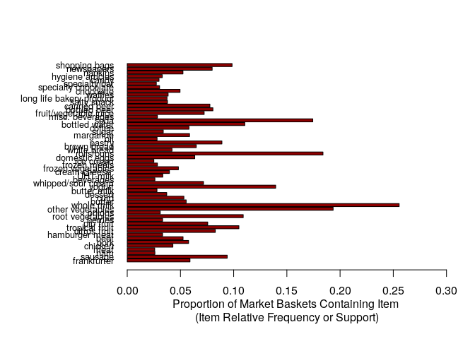
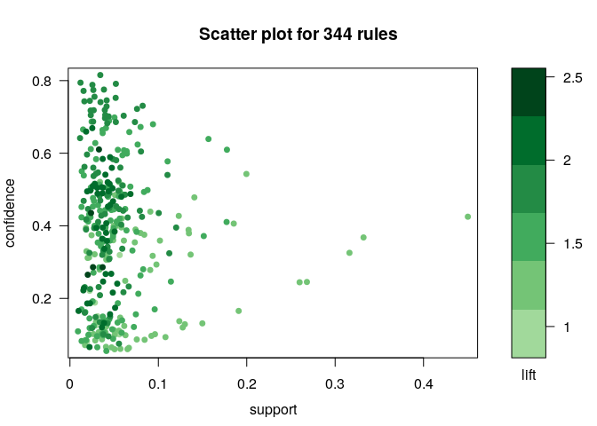
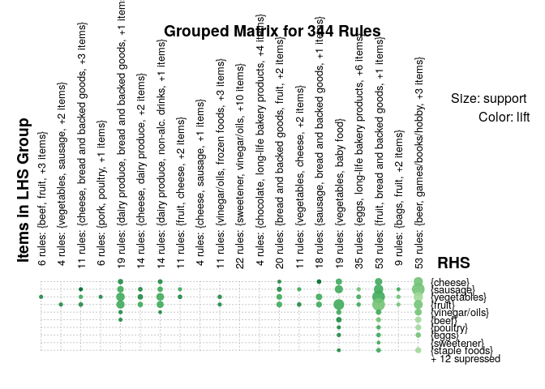
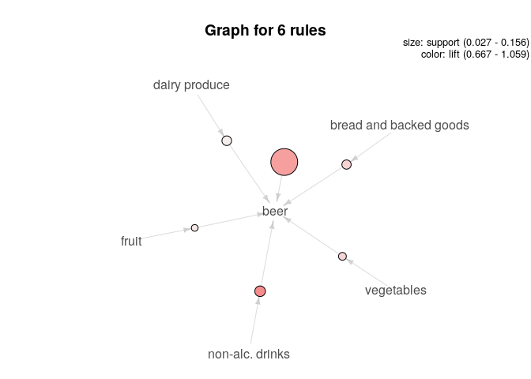

fuck this class
================
Jason Grahn
1/25/2019

Part 1
======

This will be attached separately.

Part 2
======

Consider Exhibit 4.1 in page 50-51. Suppose your client is someone other than the local farmer, a meat producer/butcher, dairy, or brewer perhaps. Determine association rules relevant to your client’s products guided by the market basket model. What recommendations would you make about future marketplace actions?

Analysis
--------

We selected running the market basket analysis for a brewer, and opted to find rules related to "beer".

The results included 6 rules, the strongest of which was for non-alcoholic beer. That is to say, when a consumner purchases non-alcoholic beer, they will also purchase beer. The second highest rule is simply beer by itself. The remaining rules in order are bread and baked goods, vegetables, fruit, and dairy produce.

Given these rules, it makes sense that the brewer investigate producing a non-alcoholic beer of their own if they haven't already. Given the high association of non-alcoholic beer with beer, consumer confidence in a non-alcoholic beer could lead to purchases of the same companies' alcoholic beer as well, as "birds of a feather." The remaining rules indicate purchases of items used for cookouts (bread/baked goods, veggies, fruit, and dairy produce). Dairy produce in this case could be cheeses, while bread and baked goods could related to hotdog and hamburger buns.

Additionally, it makes market-sense for the brewer to align their product with a "friendly" supplier of breads and dairy. Perhaps they might offer coupons or discounts to select grocery stores; when customers purchase a these associated products, they receive a discount on beer. As an alternative, purchasing beer of their brand could enable discounts on select breads and baked products.

Given the relationship of beer to these items, we must also inquire toward the seasonality of the data-set. This merits additional study to determine if decisions made now might only be good for a small window of time during the year.

``` r
# Association Rules for Market Basket Analysis (R)

library(arules)  # association rules
library(arulesViz)  # data visualization of association rules
library(RColorBrewer)  # color palettes for plots

data(Groceries)  # grocery transactions object from arules package

# examine frequency for each item with support greater than 0.025
itemFrequencyPlot(Groceries, support = 0.025, cex.names=0.8, xlim = c(0,0.3),
                  type = "relative", horiz = TRUE, col = "light blue", las = 1,
                  xlab = paste("Proportion of Market Baskets Containing Item",
                               "\n(Item Relative Frequency or Support)"))
```



``` r
# explore possibilities for combining similar items
print(head(itemInfo(Groceries))) 
```

    ##              labels  level2           level1
    ## 1       frankfurter sausage meat and sausage
    ## 2           sausage sausage meat and sausage
    ## 3        liver loaf sausage meat and sausage
    ## 4               ham sausage meat and sausage
    ## 5              meat sausage meat and sausage
    ## 6 finished products sausage meat and sausage

``` r
print(levels(itemInfo(Groceries)[["level1"]]))  # 10 levels... too few 
```

    ##  [1] "canned food"          "detergent"            "drinks"              
    ##  [4] "fresh products"       "fruit and vegetables" "meat and sausage"    
    ##  [7] "non-food"             "perfumery"            "processed food"      
    ## [10] "snacks and candies"

``` r
print(levels(itemInfo(Groceries)[["level2"]]))  # 55 distinct levels
```

    ##  [1] "baby food"                       "bags"                           
    ##  [3] "bakery improver"                 "bathroom cleaner"               
    ##  [5] "beef"                            "beer"                           
    ##  [7] "bread and backed goods"          "candy"                          
    ##  [9] "canned fish"                     "canned fruit/vegetables"        
    ## [11] "cheese"                          "chewing gum"                    
    ## [13] "chocolate"                       "cleaner"                        
    ## [15] "coffee"                          "condiments"                     
    ## [17] "cosmetics"                       "dairy produce"                  
    ## [19] "delicatessen"                    "dental care"                    
    ## [21] "detergent/softener"              "eggs"                           
    ## [23] "fish"                            "frozen foods"                   
    ## [25] "fruit"                           "games/books/hobby"              
    ## [27] "garden"                          "hair care"                      
    ## [29] "hard drinks"                     "health food"                    
    ## [31] "jam/sweet spreads"               "long-life bakery products"      
    ## [33] "meat spreads"                    "non-alc. drinks"                
    ## [35] "non-food house keeping products" "non-food kitchen"               
    ## [37] "packaged fruit/vegetables"       "perfumery"                      
    ## [39] "personal hygiene"                "pet food/care"                  
    ## [41] "pork"                            "poultry"                        
    ## [43] "pudding powder"                  "sausage"                        
    ## [45] "seasonal products"               "shelf-stable dairy"             
    ## [47] "snacks"                          "soap"                           
    ## [49] "soups/sauces"                    "staple foods"                   
    ## [51] "sweetener"                       "tea/cocoa drinks"               
    ## [53] "vegetables"                      "vinegar/oils"                   
    ## [55] "wine"

``` r
# aggregate items using the 55 level2 levels for food categories
# to create a more meaningful set of items
groceries <- aggregate(Groceries, itemInfo(Groceries)[["level2"]])  

#print(dim(groceries)[1])  # 9835 market baskets for shopping trips
#print(dim(groceries)[2])  # 55 final store items (categories)  
itemFrequencyPlot(groceries, support = 0.025, cex.names=1.0, xlim = c(0,0.5),
                  type = "relative", horiz = TRUE, col = "dark blue", las = 1,
                  xlab = paste("Proportion of Market Baskets Containing Item",
                               "\n(Item Relative Frequency or Support)"))
```



``` r
# obtain large set of association rules for items by category and all shoppers
# this is done by setting very low criteria for support and confidence
first.rules <- apriori(groceries, parameter = list(support = 0.001, confidence = 0.05))
```

    ## Apriori
    ## 
    ## Parameter specification:
    ##  confidence minval smax arem  aval originalSupport maxtime support minlen
    ##        0.05    0.1    1 none FALSE            TRUE       5   0.001      1
    ##  maxlen target   ext
    ##      10  rules FALSE
    ## 
    ## Algorithmic control:
    ##  filter tree heap memopt load sort verbose
    ##     0.1 TRUE TRUE  FALSE TRUE    2    TRUE
    ## 
    ## Absolute minimum support count: 9 
    ## 
    ## set item appearances ...[0 item(s)] done [0.00s].
    ## set transactions ...[55 item(s), 9835 transaction(s)] done [0.00s].
    ## sorting and recoding items ... [54 item(s)] done [0.00s].
    ## creating transaction tree ... done [0.00s].
    ## checking subsets of size 1 2 3 4 5 6 7 8 done [0.02s].
    ## writing ... [69921 rule(s)] done [0.01s].
    ## creating S4 object  ... done [0.02s].

``` r
# select association rules using thresholds for support and confidence 
second.rules <- apriori(groceries, parameter = list(support = 0.025, confidence = 0.05))
```

    ## Apriori
    ## 
    ## Parameter specification:
    ##  confidence minval smax arem  aval originalSupport maxtime support minlen
    ##        0.05    0.1    1 none FALSE            TRUE       5   0.025      1
    ##  maxlen target   ext
    ##      10  rules FALSE
    ## 
    ## Algorithmic control:
    ##  filter tree heap memopt load sort verbose
    ##     0.1 TRUE TRUE  FALSE TRUE    2    TRUE
    ## 
    ## Absolute minimum support count: 245 
    ## 
    ## set item appearances ...[0 item(s)] done [0.00s].
    ## set transactions ...[55 item(s), 9835 transaction(s)] done [0.00s].
    ## sorting and recoding items ... [32 item(s)] done [0.00s].
    ## creating transaction tree ... done [0.00s].
    ## checking subsets of size 1 2 3 4 done [0.00s].
    ## writing ... [344 rule(s)] done [0.00s].
    ## creating S4 object  ... done [0.00s].

``` r
# data visualization of association rules in scatter plot
plot(second.rules, 
     control=list(jitter=2, 
                  col = rev(brewer.pal(9, "Greens")[4:9])),
     shading = "lift")
```



``` r
# grouped matrix of rules is too clustered to show anything
plot(second.rules, method="grouped",   
  control=list(col = rev(brewer.pal(9, "Greens")[4:9])))
```



``` r
# select rules with vegetables in consequent (right-hand-side) item subsets
beer.rules <- subset(second.rules, subset = rhs %pin% "beer")
inspect(beer.rules)  # 6 rules
```

    ##     lhs                         rhs    support    confidence lift     
    ## [1] {}                       => {beer} 0.15556685 0.1555669  1.0000000
    ## [2] {fruit}                  => {beer} 0.02724962 0.1093878  0.7031559
    ## [3] {non-alc. drinks}        => {beer} 0.05236401 0.1646946  1.0586741
    ## [4] {vegetables}             => {beer} 0.03406202 0.1247672  0.8020168
    ## [5] {bread and backed goods} => {beer} 0.04372140 0.1265450  0.8134447
    ## [6] {dairy produce}          => {beer} 0.04595831 0.1037411  0.6668587
    ##     count
    ## [1] 1530 
    ## [2]  268 
    ## [3]  515 
    ## [4]  335 
    ## [5]  430 
    ## [6]  452

``` r
# sort by lift and identify the top 10 rules
top.beer.rules <- head(sort(beer.rules, decreasing = TRUE, by = "lift"), 10)
inspect(top.beer.rules) 
```

    ##     lhs                         rhs    support    confidence lift     
    ## [1] {non-alc. drinks}        => {beer} 0.05236401 0.1646946  1.0586741
    ## [2] {}                       => {beer} 0.15556685 0.1555669  1.0000000
    ## [3] {bread and backed goods} => {beer} 0.04372140 0.1265450  0.8134447
    ## [4] {vegetables}             => {beer} 0.03406202 0.1247672  0.8020168
    ## [5] {fruit}                  => {beer} 0.02724962 0.1093878  0.7031559
    ## [6] {dairy produce}          => {beer} 0.04595831 0.1037411  0.6668587
    ##     count
    ## [1]  515 
    ## [2] 1530 
    ## [3]  430 
    ## [4]  335 
    ## [5]  268 
    ## [6]  452

Or visually:

``` r
plot(top.beer.rules, method="grouped",   
  control=list(col = rev(brewer.pal(9, "Greens")[4:9])))
```


``` r
plot(top.beer.rules, method="graph", 
  control=list(type="items"), 
  shading = "lift")
```

    ## Warning: Unknown control parameters: type

    ## Available control parameters (with default values):
    ## main  =  Graph for 6 rules
    ## nodeColors    =  c("#66CC6680", "#9999CC80")
    ## nodeCol   =  c("#EE0000FF", "#EE0303FF", "#EE0606FF", "#EE0909FF", "#EE0C0CFF", "#EE0F0FFF", "#EE1212FF", "#EE1515FF", "#EE1818FF", "#EE1B1BFF", "#EE1E1EFF", "#EE2222FF", "#EE2525FF", "#EE2828FF", "#EE2B2BFF", "#EE2E2EFF", "#EE3131FF", "#EE3434FF", "#EE3737FF", "#EE3A3AFF", "#EE3D3DFF", "#EE4040FF", "#EE4444FF", "#EE4747FF", "#EE4A4AFF", "#EE4D4DFF", "#EE5050FF", "#EE5353FF", "#EE5656FF", "#EE5959FF", "#EE5C5CFF", "#EE5F5FFF", "#EE6262FF", "#EE6666FF", "#EE6969FF", "#EE6C6CFF", "#EE6F6FFF", "#EE7272FF", "#EE7575FF",  "#EE7878FF", "#EE7B7BFF", "#EE7E7EFF", "#EE8181FF", "#EE8484FF", "#EE8888FF", "#EE8B8BFF", "#EE8E8EFF", "#EE9191FF", "#EE9494FF", "#EE9797FF", "#EE9999FF", "#EE9B9BFF", "#EE9D9DFF", "#EE9F9FFF", "#EEA0A0FF", "#EEA2A2FF", "#EEA4A4FF", "#EEA5A5FF", "#EEA7A7FF", "#EEA9A9FF", "#EEABABFF", "#EEACACFF", "#EEAEAEFF", "#EEB0B0FF", "#EEB1B1FF", "#EEB3B3FF", "#EEB5B5FF", "#EEB7B7FF", "#EEB8B8FF", "#EEBABAFF", "#EEBCBCFF", "#EEBDBDFF", "#EEBFBFFF", "#EEC1C1FF", "#EEC3C3FF", "#EEC4C4FF", "#EEC6C6FF", "#EEC8C8FF",  "#EEC9C9FF", "#EECBCBFF", "#EECDCDFF", "#EECFCFFF", "#EED0D0FF", "#EED2D2FF", "#EED4D4FF", "#EED5D5FF", "#EED7D7FF", "#EED9D9FF", "#EEDBDBFF", "#EEDCDCFF", "#EEDEDEFF", "#EEE0E0FF", "#EEE1E1FF", "#EEE3E3FF", "#EEE5E5FF", "#EEE7E7FF", "#EEE8E8FF", "#EEEAEAFF", "#EEECECFF", "#EEEEEEFF")
    ## edgeCol   =  c("#474747FF", "#494949FF", "#4B4B4BFF", "#4D4D4DFF", "#4F4F4FFF", "#515151FF", "#535353FF", "#555555FF", "#575757FF", "#595959FF", "#5B5B5BFF", "#5E5E5EFF", "#606060FF", "#626262FF", "#646464FF", "#666666FF", "#686868FF", "#6A6A6AFF", "#6C6C6CFF", "#6E6E6EFF", "#707070FF", "#727272FF", "#747474FF", "#767676FF", "#787878FF", "#7A7A7AFF", "#7C7C7CFF", "#7E7E7EFF", "#808080FF", "#828282FF", "#848484FF", "#868686FF", "#888888FF", "#8A8A8AFF", "#8C8C8CFF", "#8D8D8DFF", "#8F8F8FFF", "#919191FF", "#939393FF",  "#959595FF", "#979797FF", "#999999FF", "#9A9A9AFF", "#9C9C9CFF", "#9E9E9EFF", "#A0A0A0FF", "#A2A2A2FF", "#A3A3A3FF", "#A5A5A5FF", "#A7A7A7FF", "#A9A9A9FF", "#AAAAAAFF", "#ACACACFF", "#AEAEAEFF", "#AFAFAFFF", "#B1B1B1FF", "#B3B3B3FF", "#B4B4B4FF", "#B6B6B6FF", "#B7B7B7FF", "#B9B9B9FF", "#BBBBBBFF", "#BCBCBCFF", "#BEBEBEFF", "#BFBFBFFF", "#C1C1C1FF", "#C2C2C2FF", "#C3C3C4FF", "#C5C5C5FF", "#C6C6C6FF", "#C8C8C8FF", "#C9C9C9FF", "#CACACAFF", "#CCCCCCFF", "#CDCDCDFF", "#CECECEFF", "#CFCFCFFF", "#D1D1D1FF",  "#D2D2D2FF", "#D3D3D3FF", "#D4D4D4FF", "#D5D5D5FF", "#D6D6D6FF", "#D7D7D7FF", "#D8D8D8FF", "#D9D9D9FF", "#DADADAFF", "#DBDBDBFF", "#DCDCDCFF", "#DDDDDDFF", "#DEDEDEFF", "#DEDEDEFF", "#DFDFDFFF", "#E0E0E0FF", "#E0E0E0FF", "#E1E1E1FF", "#E1E1E1FF", "#E2E2E2FF", "#E2E2E2FF", "#E2E2E2FF")
    ## alpha     =  0.5
    ## cex   =  1
    ## itemLabels    =  TRUE
    ## labelCol  =  #000000B3
    ## measureLabels     =  FALSE
    ## precision     =  3
    ## layout    =  NULL
    ## layoutParams  =  list()
    ## arrowSize     =  0.5
    ## engine    =  igraph
    ## plot  =  TRUE
    ## plot_options  =  list()
    ## max   =  100
    ## verbose   =  FALSE


