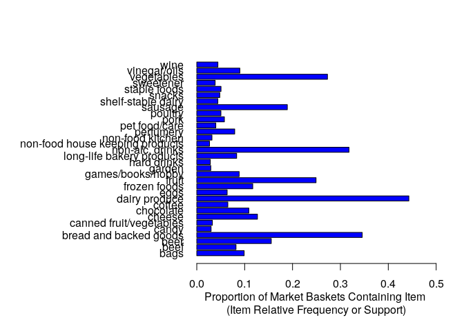

fuck this class
================
Jason Grahn
1/25/2019

``` r
# Traditional Conjoint Analysis (R)

# R preliminaries to get the user-defined function for spine chart: 
# place the spine chart code file <R_utility_program_1.R>
# in your working directory and execute it by
#     source("R_utility_program_1.R")
# Or if you have the R binary file in your working directory, use

# spine chart accommodates up to 45 part-worths on one page
# |part-worth| <= 40 can be plotted directly on the spine chart
# |part-worths| > 40 can be accommodated through standardization

print.digits <- 2  # set number of digits on print and spine chart

library(support.CEs)  # package for survey construction 
```

    ## Loading required package: DoE.base

    ## Loading required package: grid

    ## Loading required package: conf.design

    ## 
    ## Attaching package: 'DoE.base'

    ## The following objects are masked from 'package:stats':
    ## 
    ##     aov, lm

    ## The following object is masked from 'package:graphics':
    ## 
    ##     plot.design

    ## The following object is masked from 'package:base':
    ## 
    ##     lengths

    ## Loading required package: MASS

    ## Loading required package: simex

    ## Loading required package: RCurl

    ## Loading required package: bitops

    ## Loading required package: XML

``` r
# generate a balanced set of product profiles for survey
provider.survey <- Lma.design(attribute.names = 
  list(brand = c("AT&T","T-Mobile","US Cellular","Verizon"), 
  startup = c("$100","$200","$300","$400"), 
  monthly = c("$100","$200","$300","$400"),
  service = c("4G NO","4G YES"), 
  retail = c("Retail NO","Retail YES"),
  apple = c("Apple NO","Apple YES"), 
  samsung = c("Samsung NO","Samsung YES"), 
  google = c("Nexus NO","Nexus YES")), nalternatives = 1, nblocks=1, seed=9999)
```

    ## The columns of the array have been used in order of appearance. 
    ## For designs with relatively few columns, 
    ## the properties can sometimes be substantially improved 
    ## using option columns with min3 or even min34.

``` r
print(questionnaire(provider.survey))  # print survey design for review
```

    ## 
    ## Block 1 
    ##  
    ## Question 1 
    ##         alt.1       
    ## brand   "AT&T"      
    ## startup "$100"      
    ## monthly "$100"      
    ## service "4G NO"     
    ## retail  "Retail NO" 
    ## apple   "Apple NO"  
    ## samsung "Samsung NO"
    ## google  "Nexus NO"  
    ## 
    ## Question 2 
    ##         alt.1        
    ## brand   "Verizon"    
    ## startup "$300"       
    ## monthly "$100"       
    ## service "4G NO"      
    ## retail  "Retail YES" 
    ## apple   "Apple YES"  
    ## samsung "Samsung YES"
    ## google  "Nexus NO"   
    ## 
    ## Question 3 
    ##         alt.1        
    ## brand   "US Cellular"
    ## startup "$400"       
    ## monthly "$200"       
    ## service "4G NO"      
    ## retail  "Retail NO"  
    ## apple   "Apple NO"   
    ## samsung "Samsung YES"
    ## google  "Nexus NO"   
    ## 
    ## Question 4 
    ##         alt.1       
    ## brand   "Verizon"   
    ## startup "$400"      
    ## monthly "$400"      
    ## service "4G YES"    
    ## retail  "Retail YES"
    ## apple   "Apple NO"  
    ## samsung "Samsung NO"
    ## google  "Nexus NO"  
    ## 
    ## Question 5 
    ##         alt.1        
    ## brand   "Verizon"    
    ## startup "$200"       
    ## monthly "$300"       
    ## service "4G NO"      
    ## retail  "Retail NO"  
    ## apple   "Apple NO"   
    ## samsung "Samsung YES"
    ## google  "Nexus YES"  
    ## 
    ## Question 6 
    ##         alt.1       
    ## brand   "Verizon"   
    ## startup "$100"      
    ## monthly "$200"      
    ## service "4G YES"    
    ## retail  "Retail NO" 
    ## apple   "Apple YES" 
    ## samsung "Samsung NO"
    ## google  "Nexus YES" 
    ## 
    ## Question 7 
    ##         alt.1        
    ## brand   "US Cellular"
    ## startup "$300"       
    ## monthly "$300"       
    ## service "4G YES"     
    ## retail  "Retail NO"  
    ## apple   "Apple YES"  
    ## samsung "Samsung NO" 
    ## google  "Nexus NO"   
    ## 
    ## Question 8 
    ##         alt.1       
    ## brand   "AT&T"      
    ## startup "$400"      
    ## monthly "$300"      
    ## service "4G NO"     
    ## retail  "Retail YES"
    ## apple   "Apple YES" 
    ## samsung "Samsung NO"
    ## google  "Nexus YES" 
    ## 
    ## Question 9 
    ##         alt.1        
    ## brand   "AT&T"       
    ## startup "$200"       
    ## monthly "$400"       
    ## service "4G YES"     
    ## retail  "Retail NO"  
    ## apple   "Apple YES"  
    ## samsung "Samsung YES"
    ## google  "Nexus NO"   
    ## 
    ## Question 10 
    ##         alt.1        
    ## brand   "T-Mobile"   
    ## startup "$400"       
    ## monthly "$100"       
    ## service "4G YES"     
    ## retail  "Retail NO"  
    ## apple   "Apple YES"  
    ## samsung "Samsung YES"
    ## google  "Nexus YES"  
    ## 
    ## Question 11 
    ##         alt.1        
    ## brand   "US Cellular"
    ## startup "$100"       
    ## monthly "$400"       
    ## service "4G NO"      
    ## retail  "Retail YES" 
    ## apple   "Apple YES"  
    ## samsung "Samsung YES"
    ## google  "Nexus YES"  
    ## 
    ## Question 12 
    ##         alt.1       
    ## brand   "T-Mobile"  
    ## startup "$200"      
    ## monthly "$200"      
    ## service "4G NO"     
    ## retail  "Retail YES"
    ## apple   "Apple YES" 
    ## samsung "Samsung NO"
    ## google  "Nexus NO"  
    ## 
    ## Question 13 
    ##         alt.1        
    ## brand   "T-Mobile"   
    ## startup "$100"       
    ## monthly "$300"       
    ## service "4G YES"     
    ## retail  "Retail YES" 
    ## apple   "Apple NO"   
    ## samsung "Samsung YES"
    ## google  "Nexus NO"   
    ## 
    ## Question 14 
    ##         alt.1        
    ## brand   "US Cellular"
    ## startup "$200"       
    ## monthly "$100"       
    ## service "4G YES"     
    ## retail  "Retail YES" 
    ## apple   "Apple NO"   
    ## samsung "Samsung NO" 
    ## google  "Nexus YES"  
    ## 
    ## Question 15 
    ##         alt.1       
    ## brand   "T-Mobile"  
    ## startup "$300"      
    ## monthly "$400"      
    ## service "4G NO"     
    ## retail  "Retail NO" 
    ## apple   "Apple NO"  
    ## samsung "Samsung NO"
    ## google  "Nexus YES" 
    ## 
    ## Question 16 
    ##         alt.1        
    ## brand   "AT&T"       
    ## startup "$300"       
    ## monthly "$200"       
    ## service "4G YES"     
    ## retail  "Retail YES" 
    ## apple   "Apple NO"   
    ## samsung "Samsung YES"
    ## google  "Nexus YES"  
    ## 
    ## NULL

``` r
sink("questions_for_survey.txt")  # send survey to external text file
questionnaire(provider.survey)
```

    ## 
    ## Block 1 
    ##  
    ## Question 1 
    ##         alt.1       
    ## brand   "AT&T"      
    ## startup "$100"      
    ## monthly "$100"      
    ## service "4G NO"     
    ## retail  "Retail NO" 
    ## apple   "Apple NO"  
    ## samsung "Samsung NO"
    ## google  "Nexus NO"  
    ## 
    ## Question 2 
    ##         alt.1        
    ## brand   "Verizon"    
    ## startup "$300"       
    ## monthly "$100"       
    ## service "4G NO"      
    ## retail  "Retail YES" 
    ## apple   "Apple YES"  
    ## samsung "Samsung YES"
    ## google  "Nexus NO"   
    ## 
    ## Question 3 
    ##         alt.1        
    ## brand   "US Cellular"
    ## startup "$400"       
    ## monthly "$200"       
    ## service "4G NO"      
    ## retail  "Retail NO"  
    ## apple   "Apple NO"   
    ## samsung "Samsung YES"
    ## google  "Nexus NO"   
    ## 
    ## Question 4 
    ##         alt.1       
    ## brand   "Verizon"   
    ## startup "$400"      
    ## monthly "$400"      
    ## service "4G YES"    
    ## retail  "Retail YES"
    ## apple   "Apple NO"  
    ## samsung "Samsung NO"
    ## google  "Nexus NO"  
    ## 
    ## Question 5 
    ##         alt.1        
    ## brand   "Verizon"    
    ## startup "$200"       
    ## monthly "$300"       
    ## service "4G NO"      
    ## retail  "Retail NO"  
    ## apple   "Apple NO"   
    ## samsung "Samsung YES"
    ## google  "Nexus YES"  
    ## 
    ## Question 6 
    ##         alt.1       
    ## brand   "Verizon"   
    ## startup "$100"      
    ## monthly "$200"      
    ## service "4G YES"    
    ## retail  "Retail NO" 
    ## apple   "Apple YES" 
    ## samsung "Samsung NO"
    ## google  "Nexus YES" 
    ## 
    ## Question 7 
    ##         alt.1        
    ## brand   "US Cellular"
    ## startup "$300"       
    ## monthly "$300"       
    ## service "4G YES"     
    ## retail  "Retail NO"  
    ## apple   "Apple YES"  
    ## samsung "Samsung NO" 
    ## google  "Nexus NO"   
    ## 
    ## Question 8 
    ##         alt.1       
    ## brand   "AT&T"      
    ## startup "$400"      
    ## monthly "$300"      
    ## service "4G NO"     
    ## retail  "Retail YES"
    ## apple   "Apple YES" 
    ## samsung "Samsung NO"
    ## google  "Nexus YES" 
    ## 
    ## Question 9 
    ##         alt.1        
    ## brand   "AT&T"       
    ## startup "$200"       
    ## monthly "$400"       
    ## service "4G YES"     
    ## retail  "Retail NO"  
    ## apple   "Apple YES"  
    ## samsung "Samsung YES"
    ## google  "Nexus NO"   
    ## 
    ## Question 10 
    ##         alt.1        
    ## brand   "T-Mobile"   
    ## startup "$400"       
    ## monthly "$100"       
    ## service "4G YES"     
    ## retail  "Retail NO"  
    ## apple   "Apple YES"  
    ## samsung "Samsung YES"
    ## google  "Nexus YES"  
    ## 
    ## Question 11 
    ##         alt.1        
    ## brand   "US Cellular"
    ## startup "$100"       
    ## monthly "$400"       
    ## service "4G NO"      
    ## retail  "Retail YES" 
    ## apple   "Apple YES"  
    ## samsung "Samsung YES"
    ## google  "Nexus YES"  
    ## 
    ## Question 12 
    ##         alt.1       
    ## brand   "T-Mobile"  
    ## startup "$200"      
    ## monthly "$200"      
    ## service "4G NO"     
    ## retail  "Retail YES"
    ## apple   "Apple YES" 
    ## samsung "Samsung NO"
    ## google  "Nexus NO"  
    ## 
    ## Question 13 
    ##         alt.1        
    ## brand   "T-Mobile"   
    ## startup "$100"       
    ## monthly "$300"       
    ## service "4G YES"     
    ## retail  "Retail YES" 
    ## apple   "Apple NO"   
    ## samsung "Samsung YES"
    ## google  "Nexus NO"   
    ## 
    ## Question 14 
    ##         alt.1        
    ## brand   "US Cellular"
    ## startup "$200"       
    ## monthly "$100"       
    ## service "4G YES"     
    ## retail  "Retail YES" 
    ## apple   "Apple NO"   
    ## samsung "Samsung NO" 
    ## google  "Nexus YES"  
    ## 
    ## Question 15 
    ##         alt.1       
    ## brand   "T-Mobile"  
    ## startup "$300"      
    ## monthly "$400"      
    ## service "4G NO"     
    ## retail  "Retail NO" 
    ## apple   "Apple NO"  
    ## samsung "Samsung NO"
    ## google  "Nexus YES" 
    ## 
    ## Question 16 
    ##         alt.1        
    ## brand   "AT&T"       
    ## startup "$300"       
    ## monthly "$200"       
    ## service "4G YES"     
    ## retail  "Retail YES" 
    ## apple   "Apple NO"   
    ## samsung "Samsung YES"
    ## google  "Nexus YES"

``` r
sink() # send output back to the screen

# user-defined function for plotting descriptive attribute names 
effect.name.map <- function(effect.name) { 
  if(effect.name=="brand") return("Mobile Service Provider")
  if(effect.name=="startup") return("Start-up Cost")
  if(effect.name=="monthly") return("Monthly Cost")
  if(effect.name=="service") return("Offers 4G Service")
  if(effect.name=="retail") return("Has Nearby Retail Store")
  if(effect.name=="apple") return("Sells Apple Products")
  if(effect.name=="samsung") return("Sells Samsung Products")
  if(effect.name=="google") return("Sells Google/Nexus Products")
  } 

# read in conjoint survey profiles with respondent ranks
conjoint.data.frame <- readr::read_csv(here::here("project3/mobile.csv"))
```

    ## Parsed with column specification:
    ## cols(
    ##   brand = col_character(),
    ##   startup = col_character(),
    ##   monthly = col_character(),
    ##   service = col_character(),
    ##   retail = col_character(),
    ##   apple = col_character(),
    ##   samsung = col_character(),
    ##   google = col_character(),
    ##   ranking = col_double()
    ## )

``` r
# set up sum contrasts for effects coding as needed for conjoint analysis
options(contrasts=c("contr.sum","contr.poly"))

# main effects model specification
main.effects.model <- {ranking ~ brand + startup + monthly + service + 
  retail + apple + samsung + google}

# fit linear regression model using main effects only (no interaction terms)
main.effects.model.fit <- lm(main.effects.model, data=conjoint.data.frame)
print(summary(main.effects.model.fit)) 
```

    ## 
    ## Call:
    ## lm.default(formula = main.effects.model, data = conjoint.data.frame)
    ## 
    ## Residuals:
    ##      1      2      3      4      5      6      7      8      9     10 
    ## -0.125  0.125  0.125 -0.125 -0.125  0.125 -0.125  0.125  0.125 -0.125 
    ##     11     12     13     14     15     16 
    ## -0.125 -0.125  0.125  0.125  0.125 -0.125 
    ## 
    ## Coefficients:
    ##               Estimate Std. Error t value Pr(>|t|)   
    ## (Intercept)  8.500e+00  1.250e-01  68.000  0.00936 **
    ## brand1       5.888e-16  2.165e-01   0.000  1.00000   
    ## brand2      -2.500e-01  2.165e-01  -1.155  0.45437   
    ## brand3      -4.447e-16  2.165e-01   0.000  1.00000   
    ## startup1     7.500e-01  2.165e-01   3.464  0.17891   
    ## startup2    -1.268e-17  2.165e-01   0.000  1.00000   
    ## startup3     2.103e-17  2.165e-01   0.000  1.00000   
    ## monthly1     5.000e+00  2.165e-01  23.094  0.02755 * 
    ## monthly2     2.000e+00  2.165e-01   9.238  0.06865 . 
    ## monthly3    -1.250e+00  2.165e-01  -5.774  0.10918   
    ## service1    -1.750e+00  1.250e-01 -14.000  0.04540 * 
    ## retail1      2.500e-01  1.250e-01   2.000  0.29517   
    ## apple1       2.500e-01  1.250e-01   2.000  0.29517   
    ## samsung1    -1.125e+00  1.250e-01  -9.000  0.07045 . 
    ## google1     -7.500e-01  1.250e-01  -6.000  0.10514   
    ## ---
    ## Signif. codes:  0 '***' 0.001 '**' 0.01 '*' 0.05 '.' 0.1 ' ' 1
    ## 
    ## Residual standard error: 0.5 on 1 degrees of freedom
    ## Multiple R-squared:  0.9993, Adjusted R-squared:  0.989 
    ## F-statistic: 97.07 on 14 and 1 DF,  p-value: 0.0794

``` r
# save key list elements of the fitted model as needed for conjoint measures
conjoint.results <- 
  main.effects.model.fit[c("contrasts","xlevels","coefficients")]

conjoint.results$attributes <- names(conjoint.results$contrasts)

# compute and store part-worths in the conjoint.results list structure
part.worths <- conjoint.results$xlevels  # list of same structure as xlevels
end.index.for.coefficient <- 1  # intitialize skipping the intercept
part.worth.vector <- NULL # used for accumulation of part worths
for(index.for.attribute in seq(along=conjoint.results$contrasts)) {
  nlevels <- length(unlist(conjoint.results$xlevels[index.for.attribute]))
  begin.index.for.coefficient <- end.index.for.coefficient + 1
  end.index.for.coefficient <- begin.index.for.coefficient + nlevels -2
  last.part.worth <- -sum(conjoint.results$coefficients[
    begin.index.for.coefficient:end.index.for.coefficient])
  part.worths[index.for.attribute] <- 
    list(as.numeric(c(conjoint.results$coefficients[
      begin.index.for.coefficient:end.index.for.coefficient],
      last.part.worth)))
  part.worth.vector <- 
    c(part.worth.vector,unlist(part.worths[index.for.attribute]))    
  } 
conjoint.results$part.worths <- part.worths

# compute standardized part-worths
standardize <- function(x) {(x - mean(x)) / sd(x)}
conjoint.results$standardized.part.worths <- 
  lapply(conjoint.results$part.worths,standardize)
 
# compute and store part-worth ranges for each attribute 
part.worth.ranges <- conjoint.results$contrasts
for(index.for.attribute in seq(along=conjoint.results$contrasts)) 
  part.worth.ranges[index.for.attribute] <- 
  dist(range(conjoint.results$part.worths[index.for.attribute]))
conjoint.results$part.worth.ranges <- part.worth.ranges

sum.part.worth.ranges <- sum(as.numeric(conjoint.results$part.worth.ranges))

# compute and store importance values for each attribute 
attribute.importance <- conjoint.results$contrasts
for(index.for.attribute in seq(along=conjoint.results$contrasts)) 
  attribute.importance[index.for.attribute] <- 
  (dist(range(conjoint.results$part.worths[index.for.attribute]))/
  sum.part.worth.ranges) * 100
conjoint.results$attribute.importance <- attribute.importance
 
# data frame for ordering attribute names
attribute.name <- names(conjoint.results$contrasts)
attribute.importance <- as.numeric(attribute.importance)
temp.frame <- data.frame(attribute.name,attribute.importance)
conjoint.results$ordered.attributes <- 
  as.character(temp.frame[sort.list(
  temp.frame$attribute.importance,decreasing = TRUE),"attribute.name"])

# respondent internal consistency added to list structure
conjoint.results$internal.consistency <- summary(main.effects.model.fit)$r.squared 
 
# user-defined function for printing conjoint measures
if (print.digits == 2) 
  pretty.print <- function(x) {sprintf("%1.2f",round(x,digits = 2))} 
if (print.digits == 3) 
  pretty.print <- function(x) {sprintf("%1.3f",round(x,digits = 3))} 
 
# report conjoint measures to console 
# use pretty.print to provide nicely formated output
for(k in seq(along=conjoint.results$ordered.attributes)) {
  cat("\n","\n")
  cat(conjoint.results$ordered.attributes[k],"Levels: ",
  unlist(conjoint.results$xlevels[conjoint.results$ordered.attributes[k]]))
  
  cat("\n"," Part-Worths:  ")
  cat(pretty.print(unlist(conjoint.results$part.worths
    [conjoint.results$ordered.attributes[k]])))
    
  cat("\n"," Standardized Part-Worths:  ")
  cat(pretty.print(unlist(conjoint.results$standardized.part.worths
    [conjoint.results$ordered.attributes[k]])))  
    
  cat("\n"," Attribute Importance:  ")
  cat(pretty.print(unlist(conjoint.results$attribute.importance
    [conjoint.results$ordered.attributes[k]])))
  }
```

    ## 
    ##  
    ## monthly Levels:  $100 $200 $300 $400
    ##   Part-Worths:  5.00 2.00 -1.25 -5.75
    ##   Standardized Part-Worths:  1.09 0.43 -0.27 -1.25
    ##   Attribute Importance:  51.19
    ##  
    ## service Levels:  4G NO 4G YES
    ##   Part-Worths:  -1.75 1.75
    ##   Standardized Part-Worths:  -0.71 0.71
    ##   Attribute Importance:  16.67
    ##  
    ## samsung Levels:  Samsung NO Samsung YES
    ##   Part-Worths:  -1.12 1.12
    ##   Standardized Part-Worths:  -0.71 0.71
    ##   Attribute Importance:  10.71
    ##  
    ## startup Levels:  $100 $200 $300 $400
    ##   Part-Worths:  0.75 -0.00 0.00 -0.75
    ##   Standardized Part-Worths:  1.22 -0.00 0.00 -1.22
    ##   Attribute Importance:  7.14
    ##  
    ## google Levels:  Nexus NO Nexus YES
    ##   Part-Worths:  -0.75 0.75
    ##   Standardized Part-Worths:  -0.71 0.71
    ##   Attribute Importance:  7.14
    ##  
    ## brand Levels:  AT&T T-mobile US Cellular Verizon
    ##   Part-Worths:  0.00 -0.25 -0.00 0.25
    ##   Standardized Part-Worths:  0.00 -1.22 -0.00 1.22
    ##   Attribute Importance:  2.38
    ##  
    ## apple Levels:  APPLE NO APPLE YES
    ##   Part-Worths:  0.25 -0.25
    ##   Standardized Part-Worths:  0.71 -0.71
    ##   Attribute Importance:  2.38
    ##  
    ## retail Levels:  Retail NO Retail YES
    ##   Part-Worths:  0.25 -0.25
    ##   Standardized Part-Worths:  0.71 -0.71
    ##   Attribute Importance:  2.38

``` r
# plotting of spine chart begins here
# all graphical output is routed to external pdf file
#pdf(file = "fig_preference_mobile_services_results.pdf", width=8.5, height=11)
spine.chart(conjoint.results)
```



``` r
dev.off()  # close the graphics output device
```

    ## null device 
    ##           1

``` r
# Suggestions for the student:
# Enter your own rankings for the product profiles and generate
# conjoint measures of attribute importance and level part-worths.
# Note that the model fit to the data is a linear main-effects model.
# See if you can build a model with interaction effects for service
# provider attributes.
```
