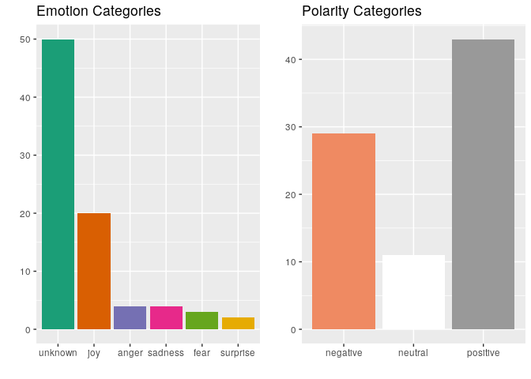
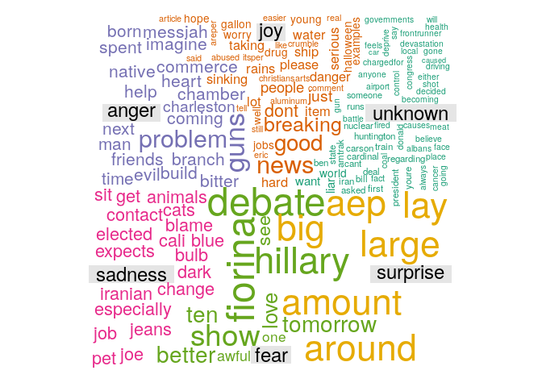

project6
================
Jason Grahn
2/11/2019

``` r
knitr::opts_chunk$set(echo = TRUE, message = FALSE)

## A Tidytext example from https://www.tidytextmining.com/ would be more modern and applicable for student learning. 

## Instead, let's install a bunch of dead packages because this code is old and out of date. 

require(devtools)

# install_url("http://www.omegahat.org/Rstem/Rstem_0.4-1.tar.gz") ## this is a dead URL

# note the original URL is dead too. replace the .org with .net and the download works correctly. 
# install_url("http://www.omegahat.net/Rstem/Rstem_0.4-1.tar.gz")
# install_url("http://cran.r-project.org/src/contrib/Archive/sentiment/sentiment_0.2.tar.gz")
```

``` r
##  It's incredibly bad practice to ship code that asks for packages to be installed. This would be better as a docker image or a use_this:: package.

# install.packages("plyr") 
# install.packages("ggplot2") 
# install.packages("wordcloud") 
# install.packages("RColorBrewer") 
# install.packages("tm") 
# install.packages("SnowballC")

library(tidyverse)
library(wordcloud)
library(RColorBrewer)
library(tm)
library(SnowballC)
library(sentiment)
```

``` r
set.seed(42)
data <- readLines("http://www.r-bloggers.com/wp-content/uploads/2016/01/vent.txt") 
 # from: http://www.wvgazettemail.com/ 
df <- data.frame(data) 
textdata <- df[df$data, ] 
textdata = gsub("[[:punct:]]", "", textdata)
```

``` r
textdata = gsub("[[:punct:]]", "", textdata) 
textdata = gsub("[[:digit:]]", "", textdata) 
textdata = gsub("http\\w+", "", textdata) 
textdata = gsub("[ \t]{2,}", "", textdata) 
textdata = gsub("^\\s+|\\s+$", "", textdata) 

try.error = function(x) { 
  y = NA 
  try_error = tryCatch(tolower(x), error=function(e) e) 
  if (!inherits(try_error, "error")) 
    y = tolower(x) 
  return(y) 
  } 

textdata = sapply(textdata, try.error) 
textdata = textdata[!is.na(textdata)] 
names(textdata) = NULL
```

``` r
class_emo = classify_emotion(textdata, algorithm="bayes", prior=1.0)
emotion = class_emo[,7]
emotion[is.na(emotion)] = "unknown"
class_pol = classify_polarity(textdata, algorithm="bayes")
polarity = class_pol[,4]

sent_df = data.frame(text=textdata, emotion=emotion, polarity=polarity, stringsAsFactors=FALSE)

sent_df = within(sent_df, emotion <- factor(emotion, 
                                            levels=names(sort(table(emotion), 
                                                                       decreasing=TRUE))))
```

``` r
emotion_plot <- ggplot(sent_df, aes(x=emotion)) + 
  geom_bar(aes(y=..count.., fill=emotion)) + 
  scale_fill_brewer(palette="Dark2") + 
  labs(title = "Emotion Categories",
       x="", 
       y="") +
  theme(legend.position = "none")

polarity_plot <- ggplot(sent_df, aes(x=polarity)) +
  geom_bar(aes(y=..count.., fill=polarity)) +
  scale_fill_brewer(palette="RdGy") +
  labs(title="Polarity Categories", 
       x = "",
       y="") +
  theme(legend.position = "none")

cowplot::plot_grid(emotion_plot,polarity_plot)
```



``` r
emos = levels(factor(sent_df$emotion))
nemo = length(emos)
emo.docs = rep("", nemo)

for (i in 1:nemo){ 
  tmp = textdata[emotion == emos[i]] 
  emo.docs[i] = paste(tmp, collapse=" ") 
}

emo.docs = removeWords(emo.docs, stopwords("english"))
corpus = Corpus(VectorSource(emo.docs))
tdm = TermDocumentMatrix(corpus)
tdm = as.matrix(tdm)
colnames(tdm) = emos
```

``` r
comparison.cloud(tdm, 
                 colors = brewer.pal(nemo, "Dark2"),
                 scale = c(3,.5), 
                 random.order = FALSE,
                 title.size = 1.5)
```

    ## Warning in comparison.cloud(tdm, colors = brewer.pal(nemo, "Dark2"), scale
    ## = c(3, : corporations could not be fit on page. It will not be plotted.

    ## Warning in comparison.cloud(tdm, colors = brewer.pal(nemo, "Dark2"), scale
    ## = c(3, : holiday could not be fit on page. It will not be plotted.

    ## Warning in comparison.cloud(tdm, colors = brewer.pal(nemo, "Dark2"), scale
    ## = c(3, : season could not be fit on page. It will not be plotted.

    ## Warning in comparison.cloud(tdm, colors = brewer.pal(nemo, "Dark2"), scale
    ## = c(3, : wonder could not be fit on page. It will not be plotted.

    ## Warning in comparison.cloud(tdm, colors = brewer.pal(nemo, "Dark2"), scale
    ## = c(3, : wonderful could not be fit on page. It will not be plotted.

    ## Warning in comparison.cloud(tdm, colors = brewer.pal(nemo, "Dark2"), scale
    ## = c(3, : isnt could not be fit on page. It will not be plotted.

    ## Warning in comparison.cloud(tdm, colors = brewer.pal(nemo, "Dark2"), scale
    ## = c(3, : workers could not be fit on page. It will not be plotted.

    ## Warning in comparison.cloud(tdm, colors = brewer.pal(nemo, "Dark2"), scale
    ## = c(3, : year could not be fit on page. It will not be plotted.

    ## Warning in comparison.cloud(tdm, colors = brewer.pal(nemo, "Dark2"), scale
    ## = c(3, : every could not be fit on page. It will not be plotted.

    ## Warning in comparison.cloud(tdm, colors = brewer.pal(nemo, "Dark2"), scale
    ## = c(3, : debater could not be fit on page. It will not be plotted.

    ## Warning in comparison.cloud(tdm, colors = brewer.pal(nemo, "Dark2"), scale
    ## = c(3, : dimwitted could not be fit on page. It will not be plotted.

    ## Warning in comparison.cloud(tdm, colors = brewer.pal(nemo, "Dark2"), scale
    ## = c(3, : music could not be fit on page. It will not be plotted.

    ## Warning in comparison.cloud(tdm, colors = brewer.pal(nemo, "Dark2"), scale
    ## = c(3, : pretty could not be fit on page. It will not be plotted.

    ## Warning in comparison.cloud(tdm, colors = brewer.pal(nemo, "Dark2"), scale
    ## = c(3, : rotten could not be fit on page. It will not be plotted.

    ## Warning in comparison.cloud(tdm, colors = brewer.pal(nemo, "Dark2"), scale
    ## = c(3, : second could not be fit on page. It will not be plotted.

    ## Warning in comparison.cloud(tdm, colors = brewer.pal(nemo, "Dark2"), scale
    ## = c(3, : stage could not be fit on page. It will not be plotted.

    ## Warning in comparison.cloud(tdm, colors = brewer.pal(nemo, "Dark2"), scale
    ## = c(3, : much could not be fit on page. It will not be plotted.

    ## Warning in comparison.cloud(tdm, colors = brewer.pal(nemo, "Dark2"), scale
    ## = c(3, : really could not be fit on page. It will not be plotted.

    ## Warning in comparison.cloud(tdm, colors = brewer.pal(nemo, "Dark2"), scale
    ## = c(3, : clear could not be fit on page. It will not be plotted.

    ## Warning in comparison.cloud(tdm, colors = brewer.pal(nemo, "Dark2"), scale
    ## = c(3, : clinton could not be fit on page. It will not be plotted.

    ## Warning in comparison.cloud(tdm, colors = brewer.pal(nemo, "Dark2"), scale
    ## = c(3, : seems could not be fit on page. It will not be plotted.

    ## Warning in comparison.cloud(tdm, colors = brewer.pal(nemo, "Dark2"), scale
    ## = c(3, : light could not be fit on page. It will not be plotted.

    ## Warning in comparison.cloud(tdm, colors = brewer.pal(nemo, "Dark2"), scale
    ## = c(3, : none could not be fit on page. It will not be plotted.

    ## Warning in comparison.cloud(tdm, colors = brewer.pal(nemo, "Dark2"), scale
    ## = c(3, : public could not be fit on page. It will not be plotted.

    ## Warning in comparison.cloud(tdm, colors = brewer.pal(nemo, "Dark2"), scale
    ## = c(3, : rather could not be fit on page. It will not be plotted.

    ## Warning in comparison.cloud(tdm, colors = brewer.pal(nemo, "Dark2"), scale
    ## = c(3, : sorry could not be fit on page. It will not be plotted.

    ## Warning in comparison.cloud(tdm, colors = brewer.pal(nemo, "Dark2"), scale
    ## = c(3, : take could not be fit on page. It will not be plotted.

    ## Warning in comparison.cloud(tdm, colors = brewer.pal(nemo, "Dark2"), scale
    ## = c(3, : washington could not be fit on page. It will not be plotted.

    ## Warning in comparison.cloud(tdm, colors = brewer.pal(nemo, "Dark2"), scale
    ## = c(3, : wear could not be fit on page. It will not be plotted.

    ## Warning in comparison.cloud(tdm, colors = brewer.pal(nemo, "Dark2"), scale
    ## = c(3, : whatsoever could not be fit on page. It will not be plotted.

    ## Warning in comparison.cloud(tdm, colors = brewer.pal(nemo, "Dark2"), scale
    ## = c(3, : manchin could not be fit on page. It will not be plotted.

    ## Warning in comparison.cloud(tdm, colors = brewer.pal(nemo, "Dark2"), scale
    ## = c(3, : needs could not be fit on page. It will not be plotted.

    ## Warning in comparison.cloud(tdm, colors = brewer.pal(nemo, "Dark2"), scale
    ## = c(3, : vote could not be fit on page. It will not be plotted.

    ## Warning in comparison.cloud(tdm, colors = brewer.pal(nemo, "Dark2"), scale
    ## = c(3, : can could not be fit on page. It will not be plotted.

    ## Warning in comparison.cloud(tdm, colors = brewer.pal(nemo, "Dark2"), scale
    ## = c(3, : millions could not be fit on page. It will not be plotted.

    ## Warning in comparison.cloud(tdm, colors = brewer.pal(nemo, "Dark2"), scale
    ## = c(3, : murdered could not be fit on page. It will not be plotted.

    ## Warning in comparison.cloud(tdm, colors = brewer.pal(nemo, "Dark2"), scale
    ## = c(3, : outrage could not be fit on page. It will not be plotted.

    ## Warning in comparison.cloud(tdm, colors = brewer.pal(nemo, "Dark2"), scale
    ## = c(3, : outraged could not be fit on page. It will not be plotted.

    ## Warning in comparison.cloud(tdm, colors = brewer.pal(nemo, "Dark2"), scale
    ## = c(3, : question could not be fit on page. It will not be plotted.

    ## Warning in comparison.cloud(tdm, colors = brewer.pal(nemo, "Dark2"), scale
    ## = c(3, : selfappointed could not be fit on page. It will not be plotted.

    ## Warning in comparison.cloud(tdm, colors = brewer.pal(nemo, "Dark2"), scale
    ## = c(3, : sparring could not be fit on page. It will not be plotted.

    ## Warning in comparison.cloud(tdm, colors = brewer.pal(nemo, "Dark2"), scale
    ## = c(3, : stores could not be fit on page. It will not be plotted.

    ## Warning in comparison.cloud(tdm, colors = brewer.pal(nemo, "Dark2"), scale
    ## = c(3, : virginian could not be fit on page. It will not be plotted.

    ## Warning in comparison.cloud(tdm, colors = brewer.pal(nemo, "Dark2"), scale
    ## = c(3, : walmart could not be fit on page. It will not be plotted.

    ## Warning in comparison.cloud(tdm, colors = brewer.pal(nemo, "Dark2"), scale
    ## = c(3, : wanting could not be fit on page. It will not be plotted.

    ## Warning in comparison.cloud(tdm, colors = brewer.pal(nemo, "Dark2"), scale
    ## = c(3, : wasted could not be fit on page. It will not be plotted.

    ## Warning in comparison.cloud(tdm, colors = brewer.pal(nemo, "Dark2"), scale
    ## = c(3, : wednesday could not be fit on page. It will not be plotted.

    ## Warning in comparison.cloud(tdm, colors = brewer.pal(nemo, "Dark2"), scale
    ## = c(3, : wickedness could not be fit on page. It will not be plotted.

    ## Warning in comparison.cloud(tdm, colors = brewer.pal(nemo, "Dark2"), scale
    ## = c(3, : obama could not be fit on page. It will not be plotted.

    ## Warning in comparison.cloud(tdm, colors = brewer.pal(nemo, "Dark2"), scale
    ## = c(3, : republicans could not be fit on page. It will not be plotted.

    ## Warning in comparison.cloud(tdm, colors = brewer.pal(nemo, "Dark2"), scale
    ## = c(3, : republican could not be fit on page. It will not be plotted.

    ## Warning in comparison.cloud(tdm, colors = brewer.pal(nemo, "Dark2"), scale
    ## = c(3, : party could not be fit on page. It will not be plotted.

    ## Warning in comparison.cloud(tdm, colors = brewer.pal(nemo, "Dark2"), scale
    ## = c(3, : virginia could not be fit on page. It will not be plotted.

    ## Warning in comparison.cloud(tdm, colors = brewer.pal(nemo, "Dark2"), scale
    ## = c(3, : many could not be fit on page. It will not be plotted.

    ## Warning in comparison.cloud(tdm, colors = brewer.pal(nemo, "Dark2"), scale
    ## = c(3, : absolutely could not be fit on page. It will not be plotted.

    ## Warning in comparison.cloud(tdm, colors = brewer.pal(nemo, "Dark2"), scale
    ## = c(3, : night could not be fit on page. It will not be plotted.

    ## Warning in comparison.cloud(tdm, colors = brewer.pal(nemo, "Dark2"), scale
    ## = c(3, : rap could not be fit on page. It will not be plotted.

    ## Warning in comparison.cloud(tdm, colors = brewer.pal(nemo, "Dark2"), scale
    ## = c(3, : country could not be fit on page. It will not be plotted.

    ## Warning in comparison.cloud(tdm, colors = brewer.pal(nemo, "Dark2"), scale
    ## = c(3, : west could not be fit on page. It will not be plotted.

    ## Warning in comparison.cloud(tdm, colors = brewer.pal(nemo, "Dark2"), scale
    ## = c(3, : population could not be fit on page. It will not be plotted.

    ## Warning in comparison.cloud(tdm, colors = brewer.pal(nemo, "Dark2"), scale
    ## = c(3, : simple could not be fit on page. It will not be plotted.

    ## Warning in comparison.cloud(tdm, colors = brewer.pal(nemo, "Dark2"), scale
    ## = c(3, : trump could not be fit on page. It will not be plotted.

    ## Warning in comparison.cloud(tdm, colors = brewer.pal(nemo, "Dark2"), scale
    ## = c(3, : awardsin could not be fit on page. It will not be plotted.

    ## Warning in comparison.cloud(tdm, colors = brewer.pal(nemo, "Dark2"), scale
    ## = c(3, : common could not be fit on page. It will not be plotted.

    ## Warning in comparison.cloud(tdm, colors = brewer.pal(nemo, "Dark2"), scale
    ## = c(3, : data could not be fit on page. It will not be plotted.

    ## Warning in comparison.cloud(tdm, colors = brewer.pal(nemo, "Dark2"), scale
    ## = c(3, : educated could not be fit on page. It will not be plotted.

    ## Warning in comparison.cloud(tdm, colors = brewer.pal(nemo, "Dark2"), scale
    ## = c(3, : elevates could not be fit on page. It will not be plotted.

    ## Warning in comparison.cloud(tdm, colors = brewer.pal(nemo, "Dark2"), scale
    ## = c(3, : emotional could not be fit on page. It will not be plotted.

    ## Warning in comparison.cloud(tdm, colors = brewer.pal(nemo, "Dark2"), scale
    ## = c(3, : experience could not be fit on page. It will not be plotted.

    ## Warning in comparison.cloud(tdm, colors = brewer.pal(nemo, "Dark2"), scale
    ## = c(3, : eyre could not be fit on page. It will not be plotted.

    ## Warning in comparison.cloud(tdm, colors = brewer.pal(nemo, "Dark2"), scale
    ## = c(3, : fragile could not be fit on page. It will not be plotted.

    ## Warning in comparison.cloud(tdm, colors = brewer.pal(nemo, "Dark2"), scale
    ## = c(3, : gazettemail could not be fit on page. It will not be plotted.

    ## Warning in comparison.cloud(tdm, colors = brewer.pal(nemo, "Dark2"), scale
    ## = c(3, : glad could not be fit on page. It will not be plotted.

    ## Warning in comparison.cloud(tdm, colors = brewer.pal(nemo, "Dark2"), scale
    ## = c(3, : grants could not be fit on page. It will not be plotted.

    ## Warning in comparison.cloud(tdm, colors = brewer.pal(nemo, "Dark2"), scale
    ## = c(3, : highly could not be fit on page. It will not be plotted.

    ## Warning in comparison.cloud(tdm, colors = brewer.pal(nemo, "Dark2"), scale
    ## = c(3, : major could not be fit on page. It will not be plotted.

    ## Warning in comparison.cloud(tdm, colors = brewer.pal(nemo, "Dark2"), scale
    ## = c(3, : material could not be fit on page. It will not be plotted.

    ## Warning in comparison.cloud(tdm, colors = brewer.pal(nemo, "Dark2"), scale
    ## = c(3, : mining could not be fit on page. It will not be plotted.

    ## Warning in comparison.cloud(tdm, colors = brewer.pal(nemo, "Dark2"), scale
    ## = c(3, : morissey could not be fit on page. It will not be plotted.

    ## Warning in comparison.cloud(tdm, colors = brewer.pal(nemo, "Dark2"), scale
    ## = c(3, : patrick could not be fit on page. It will not be plotted.

    ## Warning in comparison.cloud(tdm, colors = brewer.pal(nemo, "Dark2"), scale
    ## = c(3, : person could not be fit on page. It will not be plotted.

    ## Warning in comparison.cloud(tdm, colors = brewer.pal(nemo, "Dark2"), scale
    ## = c(3, : presidential could not be fit on page. It will not be plotted.

    ## Warning in comparison.cloud(tdm, colors = brewer.pal(nemo, "Dark2"), scale
    ## = c(3, : prices could not be fit on page. It will not be plotted.

    ## Warning in comparison.cloud(tdm, colors = brewer.pal(nemo, "Dark2"), scale
    ## = c(3, : problems could not be fit on page. It will not be plotted.

    ## Warning in comparison.cloud(tdm, colors = brewer.pal(nemo, "Dark2"), scale
    ## = c(3, : proud could not be fit on page. It will not be plotted.

    ## Warning in comparison.cloud(tdm, colors = brewer.pal(nemo, "Dark2"), scale
    ## = c(3, : prove could not be fit on page. It will not be plotted.

    ## Warning in comparison.cloud(tdm, colors = brewer.pal(nemo, "Dark2"), scale
    ## = c(3, : quit could not be fit on page. It will not be plotted.

    ## Warning in comparison.cloud(tdm, colors = brewer.pal(nemo, "Dark2"), scale
    ## = c(3, : ravenswood could not be fit on page. It will not be plotted.

    ## Warning in comparison.cloud(tdm, colors = brewer.pal(nemo, "Dark2"), scale
    ## = c(3, : readers could not be fit on page. It will not be plotted.

    ## Warning in comparison.cloud(tdm, colors = brewer.pal(nemo, "Dark2"), scale
    ## = c(3, : recognize could not be fit on page. It will not be plotted.

    ## Warning in comparison.cloud(tdm, colors = brewer.pal(nemo, "Dark2"), scale
    ## = c(3, : repeat could not be fit on page. It will not be plotted.

    ## Warning in comparison.cloud(tdm, colors = brewer.pal(nemo, "Dark2"), scale
    ## = c(3, : response could not be fit on page. It will not be plotted.

    ## Warning in comparison.cloud(tdm, colors = brewer.pal(nemo, "Dark2"), scale
    ## = c(3, : road could not be fit on page. It will not be plotted.

    ## Warning in comparison.cloud(tdm, colors = brewer.pal(nemo, "Dark2"), scale
    ## = c(3, : says could not be fit on page. It will not be plotted.

    ## Warning in comparison.cloud(tdm, colors = brewer.pal(nemo, "Dark2"), scale
    ## = c(3, : shows could not be fit on page. It will not be plotted.

    ## Warning in comparison.cloud(tdm, colors = brewer.pal(nemo, "Dark2"), scale
    ## = c(3, : solar could not be fit on page. It will not be plotted.

    ## Warning in comparison.cloud(tdm, colors = brewer.pal(nemo, "Dark2"), scale
    ## = c(3, : south could not be fit on page. It will not be plotted.

    ## Warning in comparison.cloud(tdm, colors = brewer.pal(nemo, "Dark2"), scale
    ## = c(3, : strike could not be fit on page. It will not be plotted.

    ## Warning in comparison.cloud(tdm, colors = brewer.pal(nemo, "Dark2"), scale
    ## = c(3, : system could not be fit on page. It will not be plotted.

    ## Warning in comparison.cloud(tdm, colors = brewer.pal(nemo, "Dark2"), scale
    ## = c(3, : tires could not be fit on page. It will not be plotted.

    ## Warning in comparison.cloud(tdm, colors = brewer.pal(nemo, "Dark2"), scale
    ## = c(3, : tomblin could not be fit on page. It will not be plotted.

    ## Warning in comparison.cloud(tdm, colors = brewer.pal(nemo, "Dark2"), scale
    ## = c(3, : twice could not be fit on page. It will not be plotted.

    ## Warning in comparison.cloud(tdm, colors = brewer.pal(nemo, "Dark2"), scale
    ## = c(3, : understand could not be fit on page. It will not be plotted.

    ## Warning in comparison.cloud(tdm, colors = brewer.pal(nemo, "Dark2"), scale
    ## = c(3, : understanding could not be fit on page. It will not be plotted.

    ## Warning in comparison.cloud(tdm, colors = brewer.pal(nemo, "Dark2"), scale
    ## = c(3, : went could not be fit on page. It will not be plotted.

    ## Warning in comparison.cloud(tdm, colors = brewer.pal(nemo, "Dark2"), scale
    ## = c(3, : work could not be fit on page. It will not be plotted.

    ## Warning in comparison.cloud(tdm, colors = brewer.pal(nemo, "Dark2"), scale
    ## = c(3, : works could not be fit on page. It will not be plotted.

    ## Warning in comparison.cloud(tdm, colors = brewer.pal(nemo, "Dark2"), scale
    ## = c(3, : writer could not be fit on page. It will not be plotted.

    ## Warning in comparison.cloud(tdm, colors = brewer.pal(nemo, "Dark2"), scale
    ## = c(3, : cross could not be fit on page. It will not be plotted.

    ## Warning in comparison.cloud(tdm, colors = brewer.pal(nemo, "Dark2"), scale
    ## = c(3, : enough could not be fit on page. It will not be plotted.

    ## Warning in comparison.cloud(tdm, colors = brewer.pal(nemo, "Dark2"), scale
    ## = c(3, : gasoline could not be fit on page. It will not be plotted.

    ## Warning in comparison.cloud(tdm, colors = brewer.pal(nemo, "Dark2"), scale
    ## = c(3, : give could not be fit on page. It will not be plotted.

    ## Warning in comparison.cloud(tdm, colors = brewer.pal(nemo, "Dark2"), scale
    ## = c(3, : lanes could not be fit on page. It will not be plotted.

    ## Warning in comparison.cloud(tdm, colors = brewer.pal(nemo, "Dark2"), scale
    ## = c(3, : roads could not be fit on page. It will not be plotted.

    ## Warning in comparison.cloud(tdm, colors = brewer.pal(nemo, "Dark2"), scale
    ## = c(3, : sense could not be fit on page. It will not be plotted.

    ## Warning in comparison.cloud(tdm, colors = brewer.pal(nemo, "Dark2"), scale
    ## = c(3, : know could not be fit on page. It will not be plotted.

    ## Warning in comparison.cloud(tdm, colors = brewer.pal(nemo, "Dark2"), scale
    ## = c(3, : read could not be fit on page. It will not be plotted.

    ## Warning in comparison.cloud(tdm, colors = brewer.pal(nemo, "Dark2"), scale
    ## = c(3, : mayor could not be fit on page. It will not be plotted.

    ## Warning in comparison.cloud(tdm, colors = brewer.pal(nemo, "Dark2"), scale
    ## = c(3, : money could not be fit on page. It will not be plotted.

    ## Warning in comparison.cloud(tdm, colors = brewer.pal(nemo, "Dark2"), scale
    ## = c(3, : need could not be fit on page. It will not be plotted.

    ## Warning in comparison.cloud(tdm, colors = brewer.pal(nemo, "Dark2"), scale
    ## = c(3, : oregon could not be fit on page. It will not be plotted.

    ## Warning in comparison.cloud(tdm, colors = brewer.pal(nemo, "Dark2"), scale
    ## = c(3, : organization could not be fit on page. It will not be plotted.

    ## Warning in comparison.cloud(tdm, colors = brewer.pal(nemo, "Dark2"), scale
    ## = c(3, : running could not be fit on page. It will not be plotted.

    ## Warning in comparison.cloud(tdm, colors = brewer.pal(nemo, "Dark2"), scale
    ## = c(3, : sewer could not be fit on page. It will not be plotted.

    ## Warning in comparison.cloud(tdm, colors = brewer.pal(nemo, "Dark2"), scale
    ## = c(3, : since could not be fit on page. It will not be plotted.

    ## Warning in comparison.cloud(tdm, colors = brewer.pal(nemo, "Dark2"), scale
    ## = c(3, : snobbery could not be fit on page. It will not be plotted.

    ## Warning in comparison.cloud(tdm, colors = brewer.pal(nemo, "Dark2"), scale
    ## = c(3, : southern could not be fit on page. It will not be plotted.

    ## Warning in comparison.cloud(tdm, colors = brewer.pal(nemo, "Dark2"), scale
    ## = c(3, : speaks could not be fit on page. It will not be plotted.

    ## Warning in comparison.cloud(tdm, colors = brewer.pal(nemo, "Dark2"), scale
    ## = c(3, : start could not be fit on page. It will not be plotted.

    ## Warning in comparison.cloud(tdm, colors = brewer.pal(nemo, "Dark2"), scale
    ## = c(3, : taxes could not be fit on page. It will not be plotted.

    ## Warning in comparison.cloud(tdm, colors = brewer.pal(nemo, "Dark2"), scale
    ## = c(3, : think could not be fit on page. It will not be plotted.

    ## Warning in comparison.cloud(tdm, colors = brewer.pal(nemo, "Dark2"), scale
    ## = c(3, : traffic could not be fit on page. It will not be plotted.

    ## Warning in comparison.cloud(tdm, colors = brewer.pal(nemo, "Dark2"), scale
    ## = c(3, : volumes could not be fit on page. It will not be plotted.

    ## Warning in comparison.cloud(tdm, colors = brewer.pal(nemo, "Dark2"), scale
    ## = c(3, : welcome could not be fit on page. It will not be plotted.

    ## Warning in comparison.cloud(tdm, colors = brewer.pal(nemo, "Dark2"), scale
    ## = c(3, : women could not be fit on page. It will not be plotted.

    ## Warning in comparison.cloud(tdm, colors = brewer.pal(nemo, "Dark2"), scale
    ## = c(3, : criticizing could not be fit on page. It will not be plotted.

    ## Warning in comparison.cloud(tdm, colors = brewer.pal(nemo, "Dark2"), scale
    ## = c(3, : facts could not be fit on page. It will not be plotted.

    ## Warning in comparison.cloud(tdm, colors = brewer.pal(nemo, "Dark2"), scale
    ## = c(3, : firearms could not be fit on page. It will not be plotted.

    ## Warning in comparison.cloud(tdm, colors = brewer.pal(nemo, "Dark2"), scale
    ## = c(3, : law could not be fit on page. It will not be plotted.

    ## Warning in comparison.cloud(tdm, colors = brewer.pal(nemo, "Dark2"), scale
    ## = c(3, : universitycharleston could not be fit on page. It will not be
    ## plotted.

    ## Warning in comparison.cloud(tdm, colors = brewer.pal(nemo, "Dark2"), scale
    ## = c(3, : using could not be fit on page. It will not be plotted.

    ## Warning in comparison.cloud(tdm, colors = brewer.pal(nemo, "Dark2"), scale
    ## = c(3, : votes could not be fit on page. It will not be plotted.


